```python
import pandas as pd


df = pd.read_csv('s3://crowd-hackathon-bucket/data/raw/simple_crowd_density_encoded.csv', sep=',',
                 parse_dates={'Date-Time': ['Date', 'Time']},
                 infer_datetime_format=True,
                 low_memory=False,
                 na_values=['nan', '?'],
                 index_col='Date-Time')
```

    /tmp/ipykernel_26988/2184464186.py:4: FutureWarning: Support for nested sequences for 'parse_dates' in pd.read_csv is deprecated. Combine the desired columns with pd.to_datetime after parsing instead.
      df = pd.read_csv('s3://crowd-hackathon-bucket/data/raw/simple_crowd_density_encoded.csv', sep=',',
    /tmp/ipykernel_26988/2184464186.py:4: FutureWarning: The argument 'infer_datetime_format' is deprecated and will be removed in a future version. A strict version of it is now the default, see https://pandas.pydata.org/pdeps/0004-consistent-to-datetime-parsing.html. You can safely remove this argument.
      df = pd.read_csv('s3://crowd-hackathon-bucket/data/raw/simple_crowd_density_encoded.csv', sep=',',
    /home/ec2-user/anaconda3/envs/python3/lib/python3.10/site-packages/fsspec/registry.py:298: UserWarning: Your installed version of s3fs is very old and known to cause
    severe performance issues, see also https://github.com/dask/dask/issues/10276
    
    To fix, you should specify a lower version bound on s3fs, or
    update the current installation.
    
      warnings.warn(s3_msg)


```python
print('Number of missing values per column')
df.isnull().sum()
```

    Number of missing values per column


    density                    0
    temperature                0
    rain                       0
    wind_speed                 0
    bus_arrival                0
    weekday_weekend_weekday    0
    weekday_weekend_weekend    0
    day_phase_afternoon        0
    day_phase_early_morning    0
    day_phase_evening          0
    day_phase_morning          0
    day_phase_night            0
    dtype: int64


```python
df.head()
```


<div>
<style scoped>
    .dataframe tbody tr th:only-of-type {
        vertical-align: middle;
    }

    .dataframe tbody tr th {
        vertical-align: top;
    }

    .dataframe thead th {
        text-align: right;
    }
</style>
<table border="1" class="dataframe">
  <thead>
    <tr style="text-align: right;">
      <th></th>
      <th>density</th>
      <th>temperature</th>
      <th>rain</th>
      <th>wind_speed</th>
      <th>bus_arrival</th>
      <th>weekday_weekend_weekday</th>
      <th>weekday_weekend_weekend</th>
      <th>day_phase_afternoon</th>
      <th>day_phase_early_morning</th>
      <th>day_phase_evening</th>
      <th>day_phase_morning</th>
      <th>day_phase_night</th>
    </tr>
    <tr>
      <th>Date-Time</th>
      <th></th>
      <th></th>
      <th></th>
      <th></th>
      <th></th>
      <th></th>
      <th></th>
      <th></th>
      <th></th>
      <th></th>
      <th></th>
      <th></th>
    </tr>
  </thead>
  <tbody>
    <tr>
      <th>2025-09-01 06:00:00</th>
      <td>394</td>
      <td>30.2</td>
      <td>0</td>
      <td>4.9</td>
      <td>1</td>
      <td>True</td>
      <td>False</td>
      <td>False</td>
      <td>True</td>
      <td>False</td>
      <td>False</td>
      <td>False</td>
    </tr>
    <tr>
      <th>2025-09-01 06:05:00</th>
      <td>730</td>
      <td>30.2</td>
      <td>0</td>
      <td>6.6</td>
      <td>0</td>
      <td>True</td>
      <td>False</td>
      <td>False</td>
      <td>True</td>
      <td>False</td>
      <td>False</td>
      <td>False</td>
    </tr>
    <tr>
      <th>2025-09-01 06:10:00</th>
      <td>1029</td>
      <td>29.7</td>
      <td>1</td>
      <td>4.5</td>
      <td>2</td>
      <td>True</td>
      <td>False</td>
      <td>False</td>
      <td>True</td>
      <td>False</td>
      <td>False</td>
      <td>False</td>
    </tr>
    <tr>
      <th>2025-09-01 06:15:00</th>
      <td>1291</td>
      <td>29.0</td>
      <td>0</td>
      <td>6.5</td>
      <td>5</td>
      <td>True</td>
      <td>False</td>
      <td>False</td>
      <td>True</td>
      <td>False</td>
      <td>False</td>
      <td>False</td>
    </tr>
    <tr>
      <th>2025-09-01 06:20:00</th>
      <td>1504</td>
      <td>29.7</td>
      <td>0</td>
      <td>4.7</td>
      <td>6</td>
      <td>True</td>
      <td>False</td>
      <td>False</td>
      <td>True</td>
      <td>False</td>
      <td>False</td>
      <td>False</td>
    </tr>
  </tbody>
</table>
</div>


```python
density_crowd = df['density'].copy()
```


```python
import matplotlib.pyplot as plt
%matplotlib inline


plt.figure(figsize=(12,6))
density_crowd.plot(title='Crowd Density', color='green')
plt.show()
```


    
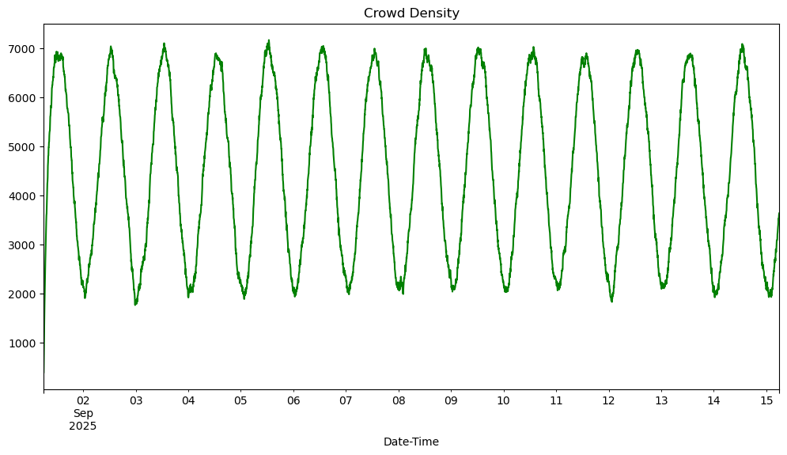
    


```python
# Set frequency to be daily
freq = '5T'
mean_density_crowd_df = density_crowd.resample(freq).mean()

plt.figure(figsize=(12,6))
mean_density_crowd_df.plot(title='Crowd Density per 5 minutes', color='green')
plt.show()
```

    /tmp/ipykernel_26988/317440014.py:3: FutureWarning: 'T' is deprecated and will be removed in a future version, please use 'min' instead.
      mean_density_crowd_df = density_crowd.resample(freq).mean()


    
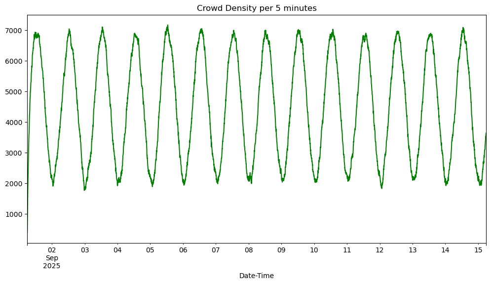
    


```python
def create_10h_time_series_list(df, start_time='06:00', end_time='22:00', freq='5T'):
    """
    Splits the input series into a list of 16-hour (06:00-22:00) time series, each sampled at 5-minute intervals.
    Returns a list of pd.Series, one for each day.
    """
    # Calculate number of samples in 16 hours (06:00-22:00)
    n_per_day = int(((pd.to_timedelta(end_time) - pd.to_timedelta(start_time)).total_seconds() // 60) / 5) + 1
    time_series_list = []
    # Group by date
    for date, group in df.groupby(df.index.date):
        # Filter for the time window
        day_data = group.between_time(start_time, end_time)
        if len(day_data) == n_per_day:
            time_series_list.append(day_data.squeeze())
    return time_series_list
```


```python
time_series_list = create_10h_time_series_list(density_crowd, start_time='06:00:00', end_time='22:30:00', freq='5T')

plt.figure(figsize=(12,6))
for ts in time_series_list:
    ts.plot()
plt.title('10-hour Time Series (5-minute intervals, 06:00-22:00)')
plt.xlabel('Time')
plt.ylabel('Crowd Density')
plt.show()
```


    
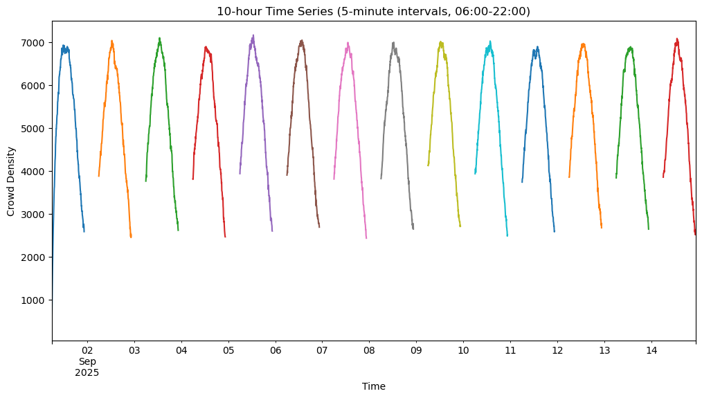
    


```python
print('Numer of values per column')
df.count()
```

    Numer of values per column


    density                    4032
    temperature                4032
    rain                       4032
    wind_speed                 4032
    bus_arrival                4032
    weekday_weekend_weekday    4032
    weekday_weekend_weekend    4032
    day_phase_afternoon        4032
    day_phase_early_morning    4032
    day_phase_evening          4032
    day_phase_morning          4032
    day_phase_night            4032
    dtype: int64


```python
train_length = 120  # First 10 hours (5-min intervals)
test_length = 78    # Last 6.5 hours (5-min intervals)

training_list = []
test_list = []
for ts in time_series_list:
    training_list.append(ts.iloc[:train_length])
    test_list.append(ts.iloc[train_length:train_length+test_length])

for i, ts in enumerate(training_list):
    print(f'Training set {i} has shape {ts.shape} (first 10 hours)')
for i, ts in enumerate(test_list):
    print(f'Test set {i} has shape {ts.shape} (last 6.5 hours)')
```

    Training set 0 has shape (120,) (first 10 hours)
    Training set 1 has shape (120,) (first 10 hours)
    Training set 2 has shape (120,) (first 10 hours)
    Training set 3 has shape (120,) (first 10 hours)
    Training set 4 has shape (120,) (first 10 hours)
    Training set 5 has shape (120,) (first 10 hours)
    Training set 6 has shape (120,) (first 10 hours)
    Training set 7 has shape (120,) (first 10 hours)
    Training set 8 has shape (120,) (first 10 hours)
    Training set 9 has shape (120,) (first 10 hours)
    Training set 10 has shape (120,) (first 10 hours)
    Training set 11 has shape (120,) (first 10 hours)
    Training set 12 has shape (120,) (first 10 hours)
    Training set 13 has shape (120,) (first 10 hours)
    Test set 0 has shape (78,) (last 6.5 hours)
    Test set 1 has shape (78,) (last 6.5 hours)
    Test set 2 has shape (78,) (last 6.5 hours)
    Test set 3 has shape (78,) (last 6.5 hours)
    Test set 4 has shape (78,) (last 6.5 hours)
    Test set 5 has shape (78,) (last 6.5 hours)
    Test set 6 has shape (78,) (last 6.5 hours)
    Test set 7 has shape (78,) (last 6.5 hours)
    Test set 8 has shape (78,) (last 6.5 hours)
    Test set 9 has shape (78,) (last 6.5 hours)
    Test set 10 has shape (78,) (last 6.5 hours)
    Test set 11 has shape (78,) (last 6.5 hours)
    Test set 12 has shape (78,) (last 6.5 hours)
    Test set 13 has shape (78,) (last 6.5 hours)


```python
plt.figure(figsize=(12,6))
time_series_list[0].plot(label='test', lw=3)
training_list[0].plot(label='train', ls=':', lw=3)
plt.legend()
plt.show()
```


    
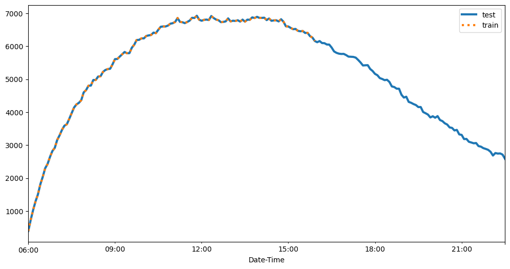
    


```python
import json
import os


def write_json_dataset(time_series_list, data_dir, filename):
    if not os.path.exists(data_dir):
       os.makedirs(data_dir)

    with open(os.path.join(data_dir, filename), 'wb') as f:
        for ts in time_series_list:
            json_line = json.dumps({
                'start': str(ts.index[0]),
                'target': list(ts)
            }) + '\n'
            f.write(json_line.encode('utf-8'))
```


```python
local_data_dir = 'crowd_density_json_data'

write_json_dataset(training_list, local_data_dir, 'train.json')
write_json_dataset(time_series_list, local_data_dir, 'test.json')
```


```python
import boto3
import sagemaker


session = sagemaker.Session(default_bucket='crowd-hackathon-bucket')
role = sagemaker.get_execution_role()

s3_bucket = session.default_bucket()
s3_prefix = 'deepar-crowd-density'

print('Instantiated session with default bucket {}'.format(s3_bucket))

train_path = session.upload_data(os.path.join(local_data_dir, 'train.json'), bucket=s3_bucket, key_prefix=s3_prefix)
test_path = session.upload_data(os.path.join(local_data_dir, 'test.json'), bucket=s3_bucket, key_prefix=s3_prefix)

print('Training data are stored in {}'.format(train_path))
print('Test data are stored in {}'.format(test_path))
```

    sagemaker.config INFO - Not applying SDK defaults from location: /etc/xdg/sagemaker/config.yaml
    sagemaker.config INFO - Not applying SDK defaults from location: /home/ec2-user/.config/sagemaker/config.yaml
    Instantiated session with default bucket crowd-hackathon-bucket
    Training data are stored in s3://crowd-hackathon-bucket/deepar-crowd-density/train.json
    Test data are stored in s3://crowd-hackathon-bucket/deepar-crowd-density/test.json


```python
from sagemaker.amazon.amazon_estimator import get_image_uri
from sagemaker.estimator import Estimator


s3_output_path = 's3://{}/{}'.format(s3_bucket, s3_prefix)
image_name = get_image_uri(boto3.Session().region_name, 'forecasting-deepar')
estimator = Estimator(sagemaker_session=session,
                      image_uri=image_name,
                      role=role,
                      train_instance_count=1,
                      train_instance_type='ml.m5.large',
                      output_path=s3_output_path)
```

    The method get_image_uri has been renamed in sagemaker>=2.
    See: https://sagemaker.readthedocs.io/en/stable/v2.html for details.
    train_instance_count has been renamed in sagemaker>=2.
    See: https://sagemaker.readthedocs.io/en/stable/v2.html for details.
    train_instance_type has been renamed in sagemaker>=2.
    See: https://sagemaker.readthedocs.io/en/stable/v2.html for details.


```python
hyperparameters = {
    'epochs': '100',
    'mini_batch_size': '64',
    'learning_rate': '0.004',
    'context_length': '30',      # Keep this - don't increase!
    'prediction_length': '78',
    'num_layers': '3',           # Increase from 2
    'num_cells': '120',          # Increase from 50  
    'dropout_rate': '0.15',      # Add regularization
    'early_stopping_patience': '15'
}
estimator.set_hyperparameters(**hyperparameters)
```


```python
estimator.fit(inputs={
    'train': train_path,
    'test': test_path
})
```

    INFO:sagemaker.telemetry.telemetry_logging:SageMaker Python SDK will collect telemetry to help us better understand our user's needs, diagnose issues, and deliver additional features.
    To opt out of telemetry, please disable via TelemetryOptOut parameter in SDK defaults config. For more information, refer to https://sagemaker.readthedocs.io/en/stable/overview.html#configuring-and-using-defaults-with-the-sagemaker-python-sdk.
    INFO:sagemaker:Creating training-job with name: forecasting-deepar-2025-09-21-00-31-29-343


    2025-09-21 00:31:33 Starting - Starting the training job...
    2025-09-21 00:31:47 Starting - Preparing the instances for training...
    2025-09-21 00:32:08 Downloading - Downloading input data...
    2025-09-21 00:32:48 Downloading - Downloading the training image.........
    2025-09-21 00:34:30 Training - Training image download completed. Training in progress..Docker entrypoint called with argument(s): train
    Running default environment configuration script
    Running custom environment configuration script
    /opt/amazon/lib/python3.9/site-packages/mxnet/model.py:97: SyntaxWarning: "is" with a literal. Did you mean "=="?
      if num_device is 1 and 'dist' not in kvstore:
    [09/21/2025 00:34:33 INFO 140609638106944] Reading default configuration from /opt/amazon/lib/python3.9/site-packages/algorithm/resources/default-input.json: {'_kvstore': 'auto', '_num_gpus': 'auto', '_num_kv_servers': 'auto', '_tuning_objective_metric': '', 'cardinality': 'auto', 'dropout_rate': '0.10', 'early_stopping_patience': '', 'embedding_dimension': '10', 'learning_rate': '0.001', 'likelihood': 'student-t', 'mini_batch_size': '128', 'num_cells': '40', 'num_dynamic_feat': 'auto', 'num_eval_samples': '100', 'num_layers': '2', 'test_quantiles': '[0.1, 0.2, 0.3, 0.4, 0.5, 0.6, 0.7, 0.8, 0.9]'}
    [09/21/2025 00:34:33 INFO 140609638106944] Merging with provided configuration from /opt/ml/input/config/hyperparameters.json: {'context_length': '30', 'dropout_rate': '0.15', 'early_stopping_patience': '15', 'epochs': '100', 'learning_rate': '0.004', 'mini_batch_size': '64', 'num_cells': '120', 'num_layers': '3', 'prediction_length': '78', 'time_freq': '5min'}
    [09/21/2025 00:34:33 INFO 140609638106944] Final configuration: {'_kvstore': 'auto', '_num_gpus': 'auto', '_num_kv_servers': 'auto', '_tuning_objective_metric': '', 'cardinality': 'auto', 'dropout_rate': '0.15', 'early_stopping_patience': '15', 'embedding_dimension': '10', 'learning_rate': '0.004', 'likelihood': 'student-t', 'mini_batch_size': '64', 'num_cells': '120', 'num_dynamic_feat': 'auto', 'num_eval_samples': '100', 'num_layers': '3', 'test_quantiles': '[0.1, 0.2, 0.3, 0.4, 0.5, 0.6, 0.7, 0.8, 0.9]', 'context_length': '30', 'epochs': '100', 'prediction_length': '78', 'time_freq': '5min'}
    Process 7 is a worker.
    [09/21/2025 00:34:33 INFO 140609638106944] Detected entry point for worker worker
    [09/21/2025 00:34:33 INFO 140609638106944] Using early stopping with patience 15
    [09/21/2025 00:34:33 INFO 140609638106944] random_seed is None
    [09/21/2025 00:34:33 INFO 140609638106944] [cardinality=auto] `cat` field was NOT found in the file `/opt/ml/input/data/train/train.json` and will NOT be used for training.
    [09/21/2025 00:34:33 INFO 140609638106944] [num_dynamic_feat=auto] `dynamic_feat` field was NOT found in the file `/opt/ml/input/data/train/train.json` and will NOT be used for training.
    [09/21/2025 00:34:33 INFO 140609638106944] Training set statistics:
    [09/21/2025 00:34:33 INFO 140609638106944] Integer time series
    [09/21/2025 00:34:33 INFO 140609638106944] number of time series: 14
    [09/21/2025 00:34:33 INFO 140609638106944] number of observations: 1680
    [09/21/2025 00:34:33 INFO 140609638106944] mean target length: 120.0
    [09/21/2025 00:34:33 INFO 140609638106944] min/mean/max target: 394.0/5996.770238095238/7165.0
    [09/21/2025 00:34:33 INFO 140609638106944] mean abs(target): 5996.770238095238
    [09/21/2025 00:34:33 INFO 140609638106944] contains missing values: no
    [09/21/2025 00:34:33 INFO 140609638106944] Small number of time series. Doing 46 passes over dataset with prob 0.9937888198757764 per epoch.
    [09/21/2025 00:34:33 INFO 140609638106944] Test set statistics:
    [09/21/2025 00:34:33 INFO 140609638106944] Integer time series
    [09/21/2025 00:34:33 INFO 140609638106944] number of time series: 14
    [09/21/2025 00:34:33 INFO 140609638106944] number of observations: 2786
    [09/21/2025 00:34:33 INFO 140609638106944] mean target length: 199.0
    [09/21/2025 00:34:33 INFO 140609638106944] min/mean/max target: 394.0/5343.589734386217/7165.0
    [09/21/2025 00:34:33 INFO 140609638106944] mean abs(target): 5343.589734386217
    [09/21/2025 00:34:33 INFO 140609638106944] contains missing values: no
    [09/21/2025 00:34:33 INFO 140609638106944] #memory_usage::<batchbuffer> = 1.59423828125 mb
    /opt/amazon/python3.9/lib/python3.9/subprocess.py:941: RuntimeWarning: line buffering (buffering=1) isn't supported in binary mode, the default buffer size will be used
      self.stdout = io.open(c2pread, 'rb', bufsize)
    [09/21/2025 00:34:33 INFO 140609638106944] nvidia-smi: took 0.042 seconds to run.
    [09/21/2025 00:34:33 INFO 140609638106944] nvidia-smi identified 0 GPUs.
    [09/21/2025 00:34:33 INFO 140609638106944] Number of GPUs being used: 0
    [09/21/2025 00:34:33 INFO 140609638106944] Create Store: local
    #metrics {"StartTime": 1758414873.9575799, "EndTime": 1758414874.222298, "Dimensions": {"Algorithm": "AWS/DeepAR", "Host": "algo-1", "Operation": "training"}, "Metrics": {"get_graph.time": {"sum": 263.700008392334, "count": 1, "min": 263.700008392334, "max": 263.700008392334}}}
    [09/21/2025 00:34:34 INFO 140609638106944] Number of GPUs being used: 0
    [09/21/2025 00:34:34 INFO 140609638106944] #memory_usage::<model> = 203 mb
    #metrics {"StartTime": 1758414874.222386, "EndTime": 1758414874.7616208, "Dimensions": {"Algorithm": "AWS/DeepAR", "Host": "algo-1", "Operation": "training"}, "Metrics": {"initialize.time": {"sum": 803.9028644561768, "count": 1, "min": 803.9028644561768, "max": 803.9028644561768}}}
    [00:34:35] /opt/brazil-pkg-cache/packages/AIAlgorithmsMXNet/AIAlgorithmsMXNet-1.3.x_Cuda_11.1.x.485.0/AL2_x86_64/generic-flavor/src/src/operator/nn/mkldnn/mkldnn_base.cc:74: Allocate 30720 bytes with malloc directly
    [09/21/2025 00:34:36 INFO 140609638106944] Epoch[0] Batch[0] avg_epoch_loss=10.618319
    [09/21/2025 00:34:36 INFO 140609638106944] #quality_metric: host=algo-1, epoch=0, batch=0 train loss <loss>=10.618318557739258
    [09/21/2025 00:34:41 INFO 140609638106944] Epoch[0] Batch[5] avg_epoch_loss=9.515551
    [09/21/2025 00:34:41 INFO 140609638106944] #quality_metric: host=algo-1, epoch=0, batch=5 train loss <loss>=9.51555061340332
    [09/21/2025 00:34:41 INFO 140609638106944] Epoch[0] Batch [5]#011Speed: 57.34 samples/sec#011loss=9.515551
    [09/21/2025 00:34:46 INFO 140609638106944] processed a total of 614 examples
    #metrics {"StartTime": 1758414874.7618234, "EndTime": 1758414886.4081483, "Dimensions": {"Algorithm": "AWS/DeepAR", "Host": "algo-1", "Operation": "training"}, "Metrics": {"epochs": {"sum": 100.0, "count": 1, "min": 100, "max": 100}, "update.time": {"sum": 11646.183252334595, "count": 1, "min": 11646.183252334595, "max": 11646.183252334595}}}
    [09/21/2025 00:34:46 INFO 140609638106944] #throughput_metric: host=algo-1, train throughput=52.72058460850805 records/second
    [09/21/2025 00:34:46 INFO 140609638106944] #progress_metric: host=algo-1, completed 1.0 % of epochs
    [09/21/2025 00:34:46 INFO 140609638106944] #quality_metric: host=algo-1, epoch=0, train loss <loss>=9.22887454032898
    [09/21/2025 00:34:46 INFO 140609638106944] best epoch loss so far
    [09/21/2025 00:34:46 INFO 140609638106944] Saved checkpoint to "/opt/ml/model/state_bfa0c1a6-c57b-44d1-a367-33dd76a6dc0f-0000.params"
    #metrics {"StartTime": 1758414886.40823, "EndTime": 1758414886.45997, "Dimensions": {"Algorithm": "AWS/DeepAR", "Host": "algo-1", "Operation": "training"}, "Metrics": {"state.serialize.time": {"sum": 50.6746768951416, "count": 1, "min": 50.6746768951416, "max": 50.6746768951416}}}
    [09/21/2025 00:34:47 INFO 140609638106944] Epoch[1] Batch[0] avg_epoch_loss=9.692423
    [09/21/2025 00:34:47 INFO 140609638106944] #quality_metric: host=algo-1, epoch=1, batch=0 train loss <loss>=9.692422866821289
    [09/21/2025 00:34:52 INFO 140609638106944] Epoch[1] Batch[5] avg_epoch_loss=9.164863
    [09/21/2025 00:34:52 INFO 140609638106944] #quality_metric: host=algo-1, epoch=1, batch=5 train loss <loss>=9.164863427480062
    [09/21/2025 00:34:52 INFO 140609638106944] Epoch[1] Batch [5]#011Speed: 61.36 samples/sec#011loss=9.164863
    [09/21/2025 00:34:58 INFO 140609638106944] Epoch[1] Batch[10] avg_epoch_loss=9.098472
    [09/21/2025 00:34:58 INFO 140609638106944] #quality_metric: host=algo-1, epoch=1, batch=10 train loss <loss>=9.018802833557128
    [09/21/2025 00:34:58 INFO 140609638106944] Epoch[1] Batch [10]#011Speed: 58.12 samples/sec#011loss=9.018803
    [09/21/2025 00:34:58 INFO 140609638106944] processed a total of 666 examples
    #metrics {"StartTime": 1758414886.4600992, "EndTime": 1758414898.3268292, "Dimensions": {"Algorithm": "AWS/DeepAR", "Host": "algo-1", "Operation": "training"}, "Metrics": {"update.time": {"sum": 11866.666316986084, "count": 1, "min": 11866.666316986084, "max": 11866.666316986084}}}
    [09/21/2025 00:34:58 INFO 140609638106944] #throughput_metric: host=algo-1, train throughput=56.123147248783745 records/second
    [09/21/2025 00:34:58 INFO 140609638106944] #progress_metric: host=algo-1, completed 2.0 % of epochs
    [09/21/2025 00:34:58 INFO 140609638106944] #quality_metric: host=algo-1, epoch=1, train loss <loss>=9.098472248424184
    [09/21/2025 00:34:58 INFO 140609638106944] best epoch loss so far
    [09/21/2025 00:34:58 INFO 140609638106944] Saved checkpoint to "/opt/ml/model/state_d179f87e-b068-40e1-8cbc-9f967a892a7f-0000.params"
    #metrics {"StartTime": 1758414898.3268933, "EndTime": 1758414898.4033694, "Dimensions": {"Algorithm": "AWS/DeepAR", "Host": "algo-1", "Operation": "training"}, "Metrics": {"state.serialize.time": {"sum": 76.10511779785156, "count": 1, "min": 76.10511779785156, "max": 76.10511779785156}}}
    [09/21/2025 00:34:59 INFO 140609638106944] Epoch[2] Batch[0] avg_epoch_loss=8.744850
    [09/21/2025 00:34:59 INFO 140609638106944] #quality_metric: host=algo-1, epoch=2, batch=0 train loss <loss>=8.744850158691406
    [09/21/2025 00:35:05 INFO 140609638106944] Epoch[2] Batch[5] avg_epoch_loss=8.620414
    [09/21/2025 00:35:05 INFO 140609638106944] #quality_metric: host=algo-1, epoch=2, batch=5 train loss <loss>=8.620413621266684
    [09/21/2025 00:35:05 INFO 140609638106944] Epoch[2] Batch [5]#011Speed: 56.77 samples/sec#011loss=8.620414
    [09/21/2025 00:35:10 INFO 140609638106944] Epoch[2] Batch[10] avg_epoch_loss=8.361717
    [09/21/2025 00:35:10 INFO 140609638106944] #quality_metric: host=algo-1, epoch=2, batch=10 train loss <loss>=8.051280212402343
    [09/21/2025 00:35:10 INFO 140609638106944] Epoch[2] Batch [10]#011Speed: 60.89 samples/sec#011loss=8.051280
    [09/21/2025 00:35:10 INFO 140609638106944] processed a total of 656 examples
    #metrics {"StartTime": 1758414898.4034672, "EndTime": 1758414910.5141098, "Dimensions": {"Algorithm": "AWS/DeepAR", "Host": "algo-1", "Operation": "training"}, "Metrics": {"update.time": {"sum": 12110.35943031311, "count": 1, "min": 12110.35943031311, "max": 12110.35943031311}}}
    [09/21/2025 00:35:10 INFO 140609638106944] #throughput_metric: host=algo-1, train throughput=54.16805490845487 records/second
    [09/21/2025 00:35:10 INFO 140609638106944] #progress_metric: host=algo-1, completed 3.0 % of epochs
    [09/21/2025 00:35:10 INFO 140609638106944] #quality_metric: host=algo-1, epoch=2, train loss <loss>=8.361716617237438
    [09/21/2025 00:35:10 INFO 140609638106944] best epoch loss so far
    [09/21/2025 00:35:10 INFO 140609638106944] Saved checkpoint to "/opt/ml/model/state_e5376359-d74b-4161-b00e-38029dae94aa-0000.params"
    #metrics {"StartTime": 1758414910.5141778, "EndTime": 1758414910.559767, "Dimensions": {"Algorithm": "AWS/DeepAR", "Host": "algo-1", "Operation": "training"}, "Metrics": {"state.serialize.time": {"sum": 44.62146759033203, "count": 1, "min": 44.62146759033203, "max": 44.62146759033203}}}
    [09/21/2025 00:35:11 INFO 140609638106944] Epoch[3] Batch[0] avg_epoch_loss=7.341119
    [09/21/2025 00:35:11 INFO 140609638106944] #quality_metric: host=algo-1, epoch=3, batch=0 train loss <loss>=7.341118812561035
    [09/21/2025 00:35:16 INFO 140609638106944] Epoch[3] Batch[5] avg_epoch_loss=7.507392
    [09/21/2025 00:35:16 INFO 140609638106944] #quality_metric: host=algo-1, epoch=3, batch=5 train loss <loss>=7.507392168045044
    [09/21/2025 00:35:16 INFO 140609638106944] Epoch[3] Batch [5]#011Speed: 61.47 samples/sec#011loss=7.507392
    [09/21/2025 00:35:22 INFO 140609638106944] Epoch[3] Batch[10] avg_epoch_loss=7.326418
    [09/21/2025 00:35:22 INFO 140609638106944] #quality_metric: host=algo-1, epoch=3, batch=10 train loss <loss>=7.109248542785645
    [09/21/2025 00:35:22 INFO 140609638106944] Epoch[3] Batch [10]#011Speed: 61.26 samples/sec#011loss=7.109249
    [09/21/2025 00:35:22 INFO 140609638106944] processed a total of 703 examples
    #metrics {"StartTime": 1758414910.559926, "EndTime": 1758414922.1479044, "Dimensions": {"Algorithm": "AWS/DeepAR", "Host": "algo-1", "Operation": "training"}, "Metrics": {"update.time": {"sum": 11587.882041931152, "count": 1, "min": 11587.882041931152, "max": 11587.882041931152}}}
    [09/21/2025 00:35:22 INFO 140609638106944] #throughput_metric: host=algo-1, train throughput=60.666181147225366 records/second
    [09/21/2025 00:35:22 INFO 140609638106944] #progress_metric: host=algo-1, completed 4.0 % of epochs
    [09/21/2025 00:35:22 INFO 140609638106944] #quality_metric: host=algo-1, epoch=3, train loss <loss>=7.326417792927135
    [09/21/2025 00:35:22 INFO 140609638106944] best epoch loss so far
    [09/21/2025 00:35:22 INFO 140609638106944] Saved checkpoint to "/opt/ml/model/state_1c577f78-2b65-457d-96b9-1e66991c9886-0000.params"
    #metrics {"StartTime": 1758414922.1479893, "EndTime": 1758414922.1902113, "Dimensions": {"Algorithm": "AWS/DeepAR", "Host": "algo-1", "Operation": "training"}, "Metrics": {"state.serialize.time": {"sum": 41.55993461608887, "count": 1, "min": 41.55993461608887, "max": 41.55993461608887}}}
    [09/21/2025 00:35:23 INFO 140609638106944] Epoch[4] Batch[0] avg_epoch_loss=6.993089
    [09/21/2025 00:35:23 INFO 140609638106944] #quality_metric: host=algo-1, epoch=4, batch=0 train loss <loss>=6.993089199066162
    [09/21/2025 00:35:28 INFO 140609638106944] Epoch[4] Batch[5] avg_epoch_loss=6.996031
    [09/21/2025 00:35:28 INFO 140609638106944] #quality_metric: host=algo-1, epoch=4, batch=5 train loss <loss>=6.996031125386556
    [09/21/2025 00:35:28 INFO 140609638106944] Epoch[4] Batch [5]#011Speed: 59.43 samples/sec#011loss=6.996031
    [09/21/2025 00:35:33 INFO 140609638106944] Epoch[4] Batch[10] avg_epoch_loss=6.884294
    [09/21/2025 00:35:33 INFO 140609638106944] #quality_metric: host=algo-1, epoch=4, batch=10 train loss <loss>=6.750210380554199
    [09/21/2025 00:35:33 INFO 140609638106944] Epoch[4] Batch [10]#011Speed: 61.42 samples/sec#011loss=6.750210
    [09/21/2025 00:35:33 INFO 140609638106944] processed a total of 679 examples
    #metrics {"StartTime": 1758414922.190314, "EndTime": 1758414933.946817, "Dimensions": {"Algorithm": "AWS/DeepAR", "Host": "algo-1", "Operation": "training"}, "Metrics": {"update.time": {"sum": 11756.427764892578, "count": 1, "min": 11756.427764892578, "max": 11756.427764892578}}}
    [09/21/2025 00:35:33 INFO 140609638106944] #throughput_metric: host=algo-1, train throughput=57.75503831888291 records/second
    [09/21/2025 00:35:33 INFO 140609638106944] #progress_metric: host=algo-1, completed 5.0 % of epochs
    [09/21/2025 00:35:33 INFO 140609638106944] #quality_metric: host=algo-1, epoch=4, train loss <loss>=6.88429442319003
    [09/21/2025 00:35:33 INFO 140609638106944] best epoch loss so far
    [09/21/2025 00:35:33 INFO 140609638106944] Saved checkpoint to "/opt/ml/model/state_aff9c48d-13a0-42ff-9269-924c70ee21de-0000.params"
    #metrics {"StartTime": 1758414933.9468896, "EndTime": 1758414933.98971, "Dimensions": {"Algorithm": "AWS/DeepAR", "Host": "algo-1", "Operation": "training"}, "Metrics": {"state.serialize.time": {"sum": 41.9001579284668, "count": 1, "min": 41.9001579284668, "max": 41.9001579284668}}}
    [09/21/2025 00:35:35 INFO 140609638106944] Epoch[5] Batch[0] avg_epoch_loss=7.579134
    [09/21/2025 00:35:35 INFO 140609638106944] #quality_metric: host=algo-1, epoch=5, batch=0 train loss <loss>=7.579133987426758
    [09/21/2025 00:35:40 INFO 140609638106944] Epoch[5] Batch[5] avg_epoch_loss=7.031077
    [09/21/2025 00:35:40 INFO 140609638106944] #quality_metric: host=algo-1, epoch=5, batch=5 train loss <loss>=7.031076908111572
    [09/21/2025 00:35:40 INFO 140609638106944] Epoch[5] Batch [5]#011Speed: 60.78 samples/sec#011loss=7.031077
    [09/21/2025 00:35:45 INFO 140609638106944] Epoch[5] Batch[10] avg_epoch_loss=6.861970
    [09/21/2025 00:35:45 INFO 140609638106944] #quality_metric: host=algo-1, epoch=5, batch=10 train loss <loss>=6.659041404724121
    [09/21/2025 00:35:45 INFO 140609638106944] Epoch[5] Batch [10]#011Speed: 61.14 samples/sec#011loss=6.659041
    [09/21/2025 00:35:46 INFO 140609638106944] processed a total of 711 examples
    #metrics {"StartTime": 1758414933.9898145, "EndTime": 1758414946.7159457, "Dimensions": {"Algorithm": "AWS/DeepAR", "Host": "algo-1", "Operation": "training"}, "Metrics": {"update.time": {"sum": 12726.059436798096, "count": 1, "min": 12726.059436798096, "max": 12726.059436798096}}}
    [09/21/2025 00:35:46 INFO 140609638106944] #throughput_metric: host=algo-1, train throughput=55.86859543624516 records/second
    [09/21/2025 00:35:46 INFO 140609638106944] #progress_metric: host=algo-1, completed 6.0 % of epochs
    [09/21/2025 00:35:46 INFO 140609638106944] #quality_metric: host=algo-1, epoch=5, train loss <loss>=6.86927862962087
    [09/21/2025 00:35:46 INFO 140609638106944] best epoch loss so far
    [09/21/2025 00:35:46 INFO 140609638106944] Saved checkpoint to "/opt/ml/model/state_795b537d-af44-4dca-b741-233e8ce5a051-0000.params"
    #metrics {"StartTime": 1758414946.716139, "EndTime": 1758414946.765994, "Dimensions": {"Algorithm": "AWS/DeepAR", "Host": "algo-1", "Operation": "training"}, "Metrics": {"state.serialize.time": {"sum": 48.82407188415527, "count": 1, "min": 48.82407188415527, "max": 48.82407188415527}}}
    [09/21/2025 00:35:47 INFO 140609638106944] Epoch[6] Batch[0] avg_epoch_loss=6.668849
    [09/21/2025 00:35:47 INFO 140609638106944] #quality_metric: host=algo-1, epoch=6, batch=0 train loss <loss>=6.668849468231201
    [09/21/2025 00:35:53 INFO 140609638106944] Epoch[6] Batch[5] avg_epoch_loss=6.788386
    [09/21/2025 00:35:53 INFO 140609638106944] #quality_metric: host=algo-1, epoch=6, batch=5 train loss <loss>=6.788386344909668
    [09/21/2025 00:35:53 INFO 140609638106944] Epoch[6] Batch [5]#011Speed: 61.34 samples/sec#011loss=6.788386
    [09/21/2025 00:35:58 INFO 140609638106944] Epoch[6] Batch[10] avg_epoch_loss=6.755881
    [09/21/2025 00:35:58 INFO 140609638106944] #quality_metric: host=algo-1, epoch=6, batch=10 train loss <loss>=6.71687536239624
    [09/21/2025 00:35:58 INFO 140609638106944] Epoch[6] Batch [10]#011Speed: 61.17 samples/sec#011loss=6.716875
    [09/21/2025 00:35:58 INFO 140609638106944] processed a total of 677 examples
    #metrics {"StartTime": 1758414946.7660592, "EndTime": 1758414958.3655205, "Dimensions": {"Algorithm": "AWS/DeepAR", "Host": "algo-1", "Operation": "training"}, "Metrics": {"update.time": {"sum": 11599.33614730835, "count": 1, "min": 11599.33614730835, "max": 11599.33614730835}}}
    [09/21/2025 00:35:58 INFO 140609638106944] #throughput_metric: host=algo-1, train throughput=58.36403674844796 records/second
    [09/21/2025 00:35:58 INFO 140609638106944] #progress_metric: host=algo-1, completed 7.0 % of epochs
    [09/21/2025 00:35:58 INFO 140609638106944] #quality_metric: host=algo-1, epoch=6, train loss <loss>=6.75588135285811
    [09/21/2025 00:35:58 INFO 140609638106944] best epoch loss so far
    [09/21/2025 00:35:58 INFO 140609638106944] Saved checkpoint to "/opt/ml/model/state_e85dab7b-0a17-4786-9593-1374418baf2e-0000.params"
    #metrics {"StartTime": 1758414958.3655865, "EndTime": 1758414958.4099586, "Dimensions": {"Algorithm": "AWS/DeepAR", "Host": "algo-1", "Operation": "training"}, "Metrics": {"state.serialize.time": {"sum": 43.4412956237793, "count": 1, "min": 43.4412956237793, "max": 43.4412956237793}}}
    [09/21/2025 00:35:59 INFO 140609638106944] Epoch[7] Batch[0] avg_epoch_loss=6.323892
    [09/21/2025 00:35:59 INFO 140609638106944] #quality_metric: host=algo-1, epoch=7, batch=0 train loss <loss>=6.323891639709473
    [09/21/2025 00:36:04 INFO 140609638106944] Epoch[7] Batch[5] avg_epoch_loss=6.674035
    [09/21/2025 00:36:04 INFO 140609638106944] #quality_metric: host=algo-1, epoch=7, batch=5 train loss <loss>=6.67403507232666
    [09/21/2025 00:36:04 INFO 140609638106944] Epoch[7] Batch [5]#011Speed: 59.03 samples/sec#011loss=6.674035
    [09/21/2025 00:36:09 INFO 140609638106944] processed a total of 623 examples
    #metrics {"StartTime": 1758414958.410058, "EndTime": 1758414969.1838362, "Dimensions": {"Algorithm": "AWS/DeepAR", "Host": "algo-1", "Operation": "training"}, "Metrics": {"update.time": {"sum": 10773.691892623901, "count": 1, "min": 10773.691892623901, "max": 10773.691892623901}}}
    [09/21/2025 00:36:09 INFO 140609638106944] #throughput_metric: host=algo-1, train throughput=57.825285608251065 records/second
    [09/21/2025 00:36:09 INFO 140609638106944] #progress_metric: host=algo-1, completed 8.0 % of epochs
    [09/21/2025 00:36:09 INFO 140609638106944] #quality_metric: host=algo-1, epoch=7, train loss <loss>=6.790063142776489
    [09/21/2025 00:36:09 INFO 140609638106944] loss did not improve
    [09/21/2025 00:36:10 INFO 140609638106944] Epoch[8] Batch[0] avg_epoch_loss=6.574790
    [09/21/2025 00:36:10 INFO 140609638106944] #quality_metric: host=algo-1, epoch=8, batch=0 train loss <loss>=6.5747904777526855
    [09/21/2025 00:36:15 INFO 140609638106944] Epoch[8] Batch[5] avg_epoch_loss=6.520799
    [09/21/2025 00:36:15 INFO 140609638106944] #quality_metric: host=algo-1, epoch=8, batch=5 train loss <loss>=6.520798524220784
    [09/21/2025 00:36:15 INFO 140609638106944] Epoch[8] Batch [5]#011Speed: 61.34 samples/sec#011loss=6.520799
    [09/21/2025 00:36:20 INFO 140609638106944] Epoch[8] Batch[10] avg_epoch_loss=6.550843
    [09/21/2025 00:36:20 INFO 140609638106944] #quality_metric: host=algo-1, epoch=8, batch=10 train loss <loss>=6.586895847320557
    [09/21/2025 00:36:20 INFO 140609638106944] Epoch[8] Batch [10]#011Speed: 61.56 samples/sec#011loss=6.586896
    [09/21/2025 00:36:20 INFO 140609638106944] processed a total of 681 examples
    #metrics {"StartTime": 1758414969.1839375, "EndTime": 1758414980.7429776, "Dimensions": {"Algorithm": "AWS/DeepAR", "Host": "algo-1", "Operation": "training"}, "Metrics": {"update.time": {"sum": 11558.176517486572, "count": 1, "min": 11558.176517486572, "max": 11558.176517486572}}}
    [09/21/2025 00:36:20 INFO 140609638106944] #throughput_metric: host=algo-1, train throughput=58.91864433287694 records/second
    [09/21/2025 00:36:20 INFO 140609638106944] #progress_metric: host=algo-1, completed 9.0 % of epochs
    [09/21/2025 00:36:20 INFO 140609638106944] #quality_metric: host=algo-1, epoch=8, train loss <loss>=6.550842761993408
    [09/21/2025 00:36:20 INFO 140609638106944] best epoch loss so far
    [09/21/2025 00:36:20 INFO 140609638106944] Saved checkpoint to "/opt/ml/model/state_d5df0083-1a53-4f2d-ad15-4bfe360eb2d8-0000.params"
    #metrics {"StartTime": 1758414980.7430553, "EndTime": 1758414980.794197, "Dimensions": {"Algorithm": "AWS/DeepAR", "Host": "algo-1", "Operation": "training"}, "Metrics": {"state.serialize.time": {"sum": 50.248146057128906, "count": 1, "min": 50.248146057128906, "max": 50.248146057128906}}}
    [09/21/2025 00:36:21 INFO 140609638106944] Epoch[9] Batch[0] avg_epoch_loss=6.860190
    [09/21/2025 00:36:21 INFO 140609638106944] #quality_metric: host=algo-1, epoch=9, batch=0 train loss <loss>=6.860190391540527
    [09/21/2025 00:36:27 INFO 140609638106944] Epoch[9] Batch[5] avg_epoch_loss=6.621311
    [09/21/2025 00:36:27 INFO 140609638106944] #quality_metric: host=algo-1, epoch=9, batch=5 train loss <loss>=6.621311108271281
    [09/21/2025 00:36:27 INFO 140609638106944] Epoch[9] Batch [5]#011Speed: 61.21 samples/sec#011loss=6.621311
    [09/21/2025 00:36:32 INFO 140609638106944] Epoch[9] Batch[10] avg_epoch_loss=6.406363
    [09/21/2025 00:36:32 INFO 140609638106944] #quality_metric: host=algo-1, epoch=9, batch=10 train loss <loss>=6.1484246253967285
    [09/21/2025 00:36:32 INFO 140609638106944] Epoch[9] Batch [10]#011Speed: 61.36 samples/sec#011loss=6.148425
    [09/21/2025 00:36:32 INFO 140609638106944] processed a total of 697 examples
    #metrics {"StartTime": 1758414980.7942698, "EndTime": 1758414992.3854084, "Dimensions": {"Algorithm": "AWS/DeepAR", "Host": "algo-1", "Operation": "training"}, "Metrics": {"update.time": {"sum": 11590.98505973816, "count": 1, "min": 11590.98505973816, "max": 11590.98505973816}}}
    [09/21/2025 00:36:32 INFO 140609638106944] #throughput_metric: host=algo-1, train throughput=60.132326955746194 records/second
    [09/21/2025 00:36:32 INFO 140609638106944] #progress_metric: host=algo-1, completed 10.0 % of epochs
    [09/21/2025 00:36:32 INFO 140609638106944] #quality_metric: host=algo-1, epoch=9, train loss <loss>=6.406362706964666
    [09/21/2025 00:36:32 INFO 140609638106944] best epoch loss so far
    [09/21/2025 00:36:32 INFO 140609638106944] Saved checkpoint to "/opt/ml/model/state_23d8b9f4-1f40-4282-8786-0394e7e05b1e-0000.params"
    #metrics {"StartTime": 1758414992.3854845, "EndTime": 1758414992.4288006, "Dimensions": {"Algorithm": "AWS/DeepAR", "Host": "algo-1", "Operation": "training"}, "Metrics": {"state.serialize.time": {"sum": 42.732954025268555, "count": 1, "min": 42.732954025268555, "max": 42.732954025268555}}}
    [09/21/2025 00:36:33 INFO 140609638106944] Epoch[10] Batch[0] avg_epoch_loss=6.211546
    [09/21/2025 00:36:33 INFO 140609638106944] #quality_metric: host=algo-1, epoch=10, batch=0 train loss <loss>=6.211546421051025
    [09/21/2025 00:36:38 INFO 140609638106944] Epoch[10] Batch[5] avg_epoch_loss=6.783678
    [09/21/2025 00:36:38 INFO 140609638106944] #quality_metric: host=algo-1, epoch=10, batch=5 train loss <loss>=6.783677816390991
    [09/21/2025 00:36:38 INFO 140609638106944] Epoch[10] Batch [5]#011Speed: 60.26 samples/sec#011loss=6.783678
    [09/21/2025 00:36:44 INFO 140609638106944] Epoch[10] Batch[10] avg_epoch_loss=6.518485
    [09/21/2025 00:36:44 INFO 140609638106944] #quality_metric: host=algo-1, epoch=10, batch=10 train loss <loss>=6.200253295898437
    [09/21/2025 00:36:44 INFO 140609638106944] Epoch[10] Batch [10]#011Speed: 61.36 samples/sec#011loss=6.200253
    [09/21/2025 00:36:44 INFO 140609638106944] processed a total of 671 examples
    #metrics {"StartTime": 1758414992.4289014, "EndTime": 1758415004.1141562, "Dimensions": {"Algorithm": "AWS/DeepAR", "Host": "algo-1", "Operation": "training"}, "Metrics": {"update.time": {"sum": 11685.164451599121, "count": 1, "min": 11685.164451599121, "max": 11685.164451599121}}}
    [09/21/2025 00:36:44 INFO 140609638106944] #throughput_metric: host=algo-1, train throughput=57.42254616466868 records/second
    [09/21/2025 00:36:44 INFO 140609638106944] #progress_metric: host=algo-1, completed 11.0 % of epochs
    [09/21/2025 00:36:44 INFO 140609638106944] #quality_metric: host=algo-1, epoch=10, train loss <loss>=6.518484852530739
    [09/21/2025 00:36:44 INFO 140609638106944] loss did not improve
    [09/21/2025 00:36:45 INFO 140609638106944] Epoch[11] Batch[0] avg_epoch_loss=6.138691
    [09/21/2025 00:36:45 INFO 140609638106944] #quality_metric: host=algo-1, epoch=11, batch=0 train loss <loss>=6.138690948486328
    [09/21/2025 00:36:50 INFO 140609638106944] Epoch[11] Batch[5] avg_epoch_loss=6.556221
    [09/21/2025 00:36:50 INFO 140609638106944] #quality_metric: host=algo-1, epoch=11, batch=5 train loss <loss>=6.556220769882202
    [09/21/2025 00:36:50 INFO 140609638106944] Epoch[11] Batch [5]#011Speed: 61.38 samples/sec#011loss=6.556221
    [09/21/2025 00:36:55 INFO 140609638106944] Epoch[11] Batch[10] avg_epoch_loss=6.904855
    [09/21/2025 00:36:55 INFO 140609638106944] #quality_metric: host=algo-1, epoch=11, batch=10 train loss <loss>=7.323216915130615
    [09/21/2025 00:36:55 INFO 140609638106944] Epoch[11] Batch [10]#011Speed: 61.64 samples/sec#011loss=7.323217
    [09/21/2025 00:36:55 INFO 140609638106944] processed a total of 674 examples
    #metrics {"StartTime": 1758415004.1142192, "EndTime": 1758415015.6627126, "Dimensions": {"Algorithm": "AWS/DeepAR", "Host": "algo-1", "Operation": "training"}, "Metrics": {"update.time": {"sum": 11547.733306884766, "count": 1, "min": 11547.733306884766, "max": 11547.733306884766}}}
    [09/21/2025 00:36:55 INFO 140609638106944] #throughput_metric: host=algo-1, train throughput=58.36581581467501 records/second
    [09/21/2025 00:36:55 INFO 140609638106944] #progress_metric: host=algo-1, completed 12.0 % of epochs
    [09/21/2025 00:36:55 INFO 140609638106944] #quality_metric: host=algo-1, epoch=11, train loss <loss>=6.904855381358754
    [09/21/2025 00:36:55 INFO 140609638106944] loss did not improve
    [09/21/2025 00:36:56 INFO 140609638106944] Epoch[12] Batch[0] avg_epoch_loss=7.363278
    [09/21/2025 00:36:56 INFO 140609638106944] #quality_metric: host=algo-1, epoch=12, batch=0 train loss <loss>=7.363277912139893
    [09/21/2025 00:37:02 INFO 140609638106944] Epoch[12] Batch[5] avg_epoch_loss=7.360351
    [09/21/2025 00:37:02 INFO 140609638106944] #quality_metric: host=algo-1, epoch=12, batch=5 train loss <loss>=7.360350688298543
    [09/21/2025 00:37:02 INFO 140609638106944] Epoch[12] Batch [5]#011Speed: 58.50 samples/sec#011loss=7.360351
    [09/21/2025 00:37:07 INFO 140609638106944] Epoch[12] Batch[10] avg_epoch_loss=7.379368
    [09/21/2025 00:37:07 INFO 140609638106944] #quality_metric: host=algo-1, epoch=12, batch=10 train loss <loss>=7.402188301086426
    [09/21/2025 00:37:07 INFO 140609638106944] Epoch[12] Batch [10]#011Speed: 59.79 samples/sec#011loss=7.402188
    [09/21/2025 00:37:07 INFO 140609638106944] processed a total of 675 examples
    #metrics {"StartTime": 1758415015.6627948, "EndTime": 1758415027.6560307, "Dimensions": {"Algorithm": "AWS/DeepAR", "Host": "algo-1", "Operation": "training"}, "Metrics": {"update.time": {"sum": 11992.582082748413, "count": 1, "min": 11992.582082748413, "max": 11992.582082748413}}}
    [09/21/2025 00:37:07 INFO 140609638106944] #throughput_metric: host=algo-1, train throughput=56.28414176170283 records/second
    [09/21/2025 00:37:07 INFO 140609638106944] #progress_metric: host=algo-1, completed 13.0 % of epochs
    [09/21/2025 00:37:07 INFO 140609638106944] #quality_metric: host=algo-1, epoch=12, train loss <loss>=7.379367785020308
    [09/21/2025 00:37:07 INFO 140609638106944] loss did not improve
    [09/21/2025 00:37:08 INFO 140609638106944] Epoch[13] Batch[0] avg_epoch_loss=7.175128
    [09/21/2025 00:37:08 INFO 140609638106944] #quality_metric: host=algo-1, epoch=13, batch=0 train loss <loss>=7.1751275062561035
    [09/21/2025 00:37:14 INFO 140609638106944] Epoch[13] Batch[5] avg_epoch_loss=7.074335
    [09/21/2025 00:37:14 INFO 140609638106944] #quality_metric: host=algo-1, epoch=13, batch=5 train loss <loss>=7.074335098266602
    [09/21/2025 00:37:14 INFO 140609638106944] Epoch[13] Batch [5]#011Speed: 61.40 samples/sec#011loss=7.074335
    [09/21/2025 00:37:18 INFO 140609638106944] processed a total of 629 examples
    #metrics {"StartTime": 1758415027.6561055, "EndTime": 1758415038.1998444, "Dimensions": {"Algorithm": "AWS/DeepAR", "Host": "algo-1", "Operation": "training"}, "Metrics": {"update.time": {"sum": 10542.937517166138, "count": 1, "min": 10542.937517166138, "max": 10542.937517166138}}}
    [09/21/2025 00:37:18 INFO 140609638106944] #throughput_metric: host=algo-1, train throughput=59.659512795583964 records/second
    [09/21/2025 00:37:18 INFO 140609638106944] #progress_metric: host=algo-1, completed 14.0 % of epochs
    [09/21/2025 00:37:18 INFO 140609638106944] #quality_metric: host=algo-1, epoch=13, train loss <loss>=6.8926365852355955
    [09/21/2025 00:37:18 INFO 140609638106944] loss did not improve
    [09/21/2025 00:37:19 INFO 140609638106944] Epoch[14] Batch[0] avg_epoch_loss=6.573397
    [09/21/2025 00:37:19 INFO 140609638106944] #quality_metric: host=algo-1, epoch=14, batch=0 train loss <loss>=6.573397159576416
    [09/21/2025 00:37:24 INFO 140609638106944] Epoch[14] Batch[5] avg_epoch_loss=6.386075
    [09/21/2025 00:37:24 INFO 140609638106944] #quality_metric: host=algo-1, epoch=14, batch=5 train loss <loss>=6.386074940363566
    [09/21/2025 00:37:24 INFO 140609638106944] Epoch[14] Batch [5]#011Speed: 61.46 samples/sec#011loss=6.386075
    [09/21/2025 00:37:29 INFO 140609638106944] Epoch[14] Batch[10] avg_epoch_loss=6.530218
    [09/21/2025 00:37:29 INFO 140609638106944] #quality_metric: host=algo-1, epoch=14, batch=10 train loss <loss>=6.703189849853516
    [09/21/2025 00:37:29 INFO 140609638106944] Epoch[14] Batch [10]#011Speed: 61.48 samples/sec#011loss=6.703190
    [09/21/2025 00:37:29 INFO 140609638106944] processed a total of 656 examples
    #metrics {"StartTime": 1758415038.1999404, "EndTime": 1758415049.772077, "Dimensions": {"Algorithm": "AWS/DeepAR", "Host": "algo-1", "Operation": "training"}, "Metrics": {"update.time": {"sum": 11571.461915969849, "count": 1, "min": 11571.461915969849, "max": 11571.461915969849}}}
    [09/21/2025 00:37:29 INFO 140609638106944] #throughput_metric: host=algo-1, train throughput=56.69038753952824 records/second
    [09/21/2025 00:37:29 INFO 140609638106944] #progress_metric: host=algo-1, completed 15.0 % of epochs
    [09/21/2025 00:37:29 INFO 140609638106944] #quality_metric: host=algo-1, epoch=14, train loss <loss>=6.5302180810408155
    [09/21/2025 00:37:29 INFO 140609638106944] loss did not improve
    [09/21/2025 00:37:30 INFO 140609638106944] Epoch[15] Batch[0] avg_epoch_loss=6.740427
    [09/21/2025 00:37:30 INFO 140609638106944] #quality_metric: host=algo-1, epoch=15, batch=0 train loss <loss>=6.740427494049072
    [09/21/2025 00:37:36 INFO 140609638106944] Epoch[15] Batch[5] avg_epoch_loss=6.303363
    [09/21/2025 00:37:36 INFO 140609638106944] #quality_metric: host=algo-1, epoch=15, batch=5 train loss <loss>=6.303362925847371
    [09/21/2025 00:37:36 INFO 140609638106944] Epoch[15] Batch [5]#011Speed: 61.01 samples/sec#011loss=6.303363
    [09/21/2025 00:37:40 INFO 140609638106944] processed a total of 591 examples
    #metrics {"StartTime": 1758415049.7722032, "EndTime": 1758415060.3715208, "Dimensions": {"Algorithm": "AWS/DeepAR", "Host": "algo-1", "Operation": "training"}, "Metrics": {"update.time": {"sum": 10598.69933128357, "count": 1, "min": 10598.69933128357, "max": 10598.69933128357}}}
    [09/21/2025 00:37:40 INFO 140609638106944] #throughput_metric: host=algo-1, train throughput=55.76084044131177 records/second
    [09/21/2025 00:37:40 INFO 140609638106944] #progress_metric: host=algo-1, completed 16.0 % of epochs
    [09/21/2025 00:37:40 INFO 140609638106944] #quality_metric: host=algo-1, epoch=15, train loss <loss>=6.2242638111114506
    [09/21/2025 00:37:40 INFO 140609638106944] best epoch loss so far
    [09/21/2025 00:37:40 INFO 140609638106944] Saved checkpoint to "/opt/ml/model/state_33562d7e-bdd9-43d4-b770-bf7594bd15f2-0000.params"
    #metrics {"StartTime": 1758415060.3715928, "EndTime": 1758415060.4230444, "Dimensions": {"Algorithm": "AWS/DeepAR", "Host": "algo-1", "Operation": "training"}, "Metrics": {"state.serialize.time": {"sum": 50.33516883850098, "count": 1, "min": 50.33516883850098, "max": 50.33516883850098}}}
    [09/21/2025 00:37:41 INFO 140609638106944] Epoch[16] Batch[0] avg_epoch_loss=6.569332
    [09/21/2025 00:37:41 INFO 140609638106944] #quality_metric: host=algo-1, epoch=16, batch=0 train loss <loss>=6.569332122802734
    [09/21/2025 00:37:46 INFO 140609638106944] Epoch[16] Batch[5] avg_epoch_loss=6.425649
    [09/21/2025 00:37:46 INFO 140609638106944] #quality_metric: host=algo-1, epoch=16, batch=5 train loss <loss>=6.42564860979716
    [09/21/2025 00:37:46 INFO 140609638106944] Epoch[16] Batch [5]#011Speed: 61.17 samples/sec#011loss=6.425649
    [09/21/2025 00:37:50 INFO 140609638106944] processed a total of 625 examples
    #metrics {"StartTime": 1758415060.423192, "EndTime": 1758415070.9758596, "Dimensions": {"Algorithm": "AWS/DeepAR", "Host": "algo-1", "Operation": "training"}, "Metrics": {"update.time": {"sum": 10552.568435668945, "count": 1, "min": 10552.568435668945, "max": 10552.568435668945}}}
    [09/21/2025 00:37:50 INFO 140609638106944] #throughput_metric: host=algo-1, train throughput=59.22657116394116 records/second
    [09/21/2025 00:37:50 INFO 140609638106944] #progress_metric: host=algo-1, completed 17.0 % of epochs
    [09/21/2025 00:37:50 INFO 140609638106944] #quality_metric: host=algo-1, epoch=16, train loss <loss>=6.41349949836731
    [09/21/2025 00:37:50 INFO 140609638106944] loss did not improve
    [09/21/2025 00:37:52 INFO 140609638106944] Epoch[17] Batch[0] avg_epoch_loss=6.745833
    [09/21/2025 00:37:52 INFO 140609638106944] #quality_metric: host=algo-1, epoch=17, batch=0 train loss <loss>=6.745833396911621
    [09/21/2025 00:37:57 INFO 140609638106944] Epoch[17] Batch[5] avg_epoch_loss=6.367745
    [09/21/2025 00:37:57 INFO 140609638106944] #quality_metric: host=algo-1, epoch=17, batch=5 train loss <loss>=6.3677449226379395
    [09/21/2025 00:37:57 INFO 140609638106944] Epoch[17] Batch [5]#011Speed: 61.75 samples/sec#011loss=6.367745
    [09/21/2025 00:38:02 INFO 140609638106944] Epoch[17] Batch[10] avg_epoch_loss=6.285991
    [09/21/2025 00:38:02 INFO 140609638106944] #quality_metric: host=algo-1, epoch=17, batch=10 train loss <loss>=6.187887382507324
    [09/21/2025 00:38:02 INFO 140609638106944] Epoch[17] Batch [10]#011Speed: 59.26 samples/sec#011loss=6.187887
    [09/21/2025 00:38:02 INFO 140609638106944] processed a total of 653 examples
    #metrics {"StartTime": 1758415070.9759324, "EndTime": 1758415082.7163525, "Dimensions": {"Algorithm": "AWS/DeepAR", "Host": "algo-1", "Operation": "training"}, "Metrics": {"update.time": {"sum": 11739.3958568573, "count": 1, "min": 11739.3958568573, "max": 11739.3958568573}}}
    [09/21/2025 00:38:02 INFO 140609638106944] #throughput_metric: host=algo-1, train throughput=55.62378258263574 records/second
    [09/21/2025 00:38:02 INFO 140609638106944] #progress_metric: host=algo-1, completed 18.0 % of epochs
    [09/21/2025 00:38:02 INFO 140609638106944] #quality_metric: host=algo-1, epoch=17, train loss <loss>=6.285991495305842
    [09/21/2025 00:38:02 INFO 140609638106944] loss did not improve
    [09/21/2025 00:38:03 INFO 140609638106944] Epoch[18] Batch[0] avg_epoch_loss=7.140300
    [09/21/2025 00:38:03 INFO 140609638106944] #quality_metric: host=algo-1, epoch=18, batch=0 train loss <loss>=7.1402997970581055
    [09/21/2025 00:38:09 INFO 140609638106944] Epoch[18] Batch[5] avg_epoch_loss=6.481664
    [09/21/2025 00:38:09 INFO 140609638106944] #quality_metric: host=algo-1, epoch=18, batch=5 train loss <loss>=6.481664419174194
    [09/21/2025 00:38:09 INFO 140609638106944] Epoch[18] Batch [5]#011Speed: 60.78 samples/sec#011loss=6.481664
    [09/21/2025 00:38:13 INFO 140609638106944] processed a total of 632 examples
    #metrics {"StartTime": 1758415082.7164435, "EndTime": 1758415093.3070152, "Dimensions": {"Algorithm": "AWS/DeepAR", "Host": "algo-1", "Operation": "training"}, "Metrics": {"update.time": {"sum": 10589.826583862305, "count": 1, "min": 10589.826583862305, "max": 10589.826583862305}}}
    [09/21/2025 00:38:13 INFO 140609638106944] #throughput_metric: host=algo-1, train throughput=59.67904633843133 records/second
    [09/21/2025 00:38:13 INFO 140609638106944] #progress_metric: host=algo-1, completed 19.0 % of epochs
    [09/21/2025 00:38:13 INFO 140609638106944] #quality_metric: host=algo-1, epoch=18, train loss <loss>=6.341175651550293
    [09/21/2025 00:38:13 INFO 140609638106944] loss did not improve
    [09/21/2025 00:38:14 INFO 140609638106944] Epoch[19] Batch[0] avg_epoch_loss=6.798938
    [09/21/2025 00:38:14 INFO 140609638106944] #quality_metric: host=algo-1, epoch=19, batch=0 train loss <loss>=6.798938274383545
    [09/21/2025 00:38:19 INFO 140609638106944] Epoch[19] Batch[5] avg_epoch_loss=6.341663
    [09/21/2025 00:38:19 INFO 140609638106944] #quality_metric: host=algo-1, epoch=19, batch=5 train loss <loss>=6.341662645339966
    [09/21/2025 00:38:19 INFO 140609638106944] Epoch[19] Batch [5]#011Speed: 61.52 samples/sec#011loss=6.341663
    [09/21/2025 00:38:23 INFO 140609638106944] processed a total of 612 examples
    #metrics {"StartTime": 1758415093.3070905, "EndTime": 1758415103.8109758, "Dimensions": {"Algorithm": "AWS/DeepAR", "Host": "algo-1", "Operation": "training"}, "Metrics": {"update.time": {"sum": 10503.167390823364, "count": 1, "min": 10503.167390823364, "max": 10503.167390823364}}}
    [09/21/2025 00:38:23 INFO 140609638106944] #throughput_metric: host=algo-1, train throughput=58.267505108224675 records/second
    [09/21/2025 00:38:23 INFO 140609638106944] #progress_metric: host=algo-1, completed 20.0 % of epochs
    [09/21/2025 00:38:23 INFO 140609638106944] #quality_metric: host=algo-1, epoch=19, train loss <loss>=6.178172254562378
    [09/21/2025 00:38:23 INFO 140609638106944] best epoch loss so far
    [09/21/2025 00:38:23 INFO 140609638106944] Saved checkpoint to "/opt/ml/model/state_70458886-821d-464f-af96-186a5b14446b-0000.params"
    #metrics {"StartTime": 1758415103.81105, "EndTime": 1758415103.8812752, "Dimensions": {"Algorithm": "AWS/DeepAR", "Host": "algo-1", "Operation": "training"}, "Metrics": {"state.serialize.time": {"sum": 69.1826343536377, "count": 1, "min": 69.1826343536377, "max": 69.1826343536377}}}
    [09/21/2025 00:38:25 INFO 140609638106944] Epoch[20] Batch[0] avg_epoch_loss=6.037879
    [09/21/2025 00:38:25 INFO 140609638106944] #quality_metric: host=algo-1, epoch=20, batch=0 train loss <loss>=6.037879467010498
    [09/21/2025 00:38:30 INFO 140609638106944] Epoch[20] Batch[5] avg_epoch_loss=6.231363
    [09/21/2025 00:38:30 INFO 140609638106944] #quality_metric: host=algo-1, epoch=20, batch=5 train loss <loss>=6.231362978617351
    [09/21/2025 00:38:30 INFO 140609638106944] Epoch[20] Batch [5]#011Speed: 61.60 samples/sec#011loss=6.231363
    [09/21/2025 00:38:34 INFO 140609638106944] processed a total of 628 examples
    #metrics {"StartTime": 1758415103.8813412, "EndTime": 1758415114.4426303, "Dimensions": {"Algorithm": "AWS/DeepAR", "Host": "algo-1", "Operation": "training"}, "Metrics": {"update.time": {"sum": 10561.23161315918, "count": 1, "min": 10561.23161315918, "max": 10561.23161315918}}}
    [09/21/2025 00:38:34 INFO 140609638106944] #throughput_metric: host=algo-1, train throughput=59.46137922200902 records/second
    [09/21/2025 00:38:34 INFO 140609638106944] #progress_metric: host=algo-1, completed 21.0 % of epochs
    [09/21/2025 00:38:34 INFO 140609638106944] #quality_metric: host=algo-1, epoch=20, train loss <loss>=6.180427694320679
    [09/21/2025 00:38:34 INFO 140609638106944] loss did not improve
    [09/21/2025 00:38:35 INFO 140609638106944] Epoch[21] Batch[0] avg_epoch_loss=6.011934
    [09/21/2025 00:38:35 INFO 140609638106944] #quality_metric: host=algo-1, epoch=21, batch=0 train loss <loss>=6.011934280395508
    [09/21/2025 00:38:40 INFO 140609638106944] Epoch[21] Batch[5] avg_epoch_loss=5.982839
    [09/21/2025 00:38:40 INFO 140609638106944] #quality_metric: host=algo-1, epoch=21, batch=5 train loss <loss>=5.982839107513428
    [09/21/2025 00:38:40 INFO 140609638106944] Epoch[21] Batch [5]#011Speed: 61.07 samples/sec#011loss=5.982839
    [09/21/2025 00:38:44 INFO 140609638106944] processed a total of 627 examples
    #metrics {"StartTime": 1758415114.442821, "EndTime": 1758415124.9900146, "Dimensions": {"Algorithm": "AWS/DeepAR", "Host": "algo-1", "Operation": "training"}, "Metrics": {"update.time": {"sum": 10546.217918395996, "count": 1, "min": 10546.217918395996, "max": 10546.217918395996}}}
    [09/21/2025 00:38:44 INFO 140609638106944] #throughput_metric: host=algo-1, train throughput=59.45095584603975 records/second
    [09/21/2025 00:38:44 INFO 140609638106944] #progress_metric: host=algo-1, completed 22.0 % of epochs
    [09/21/2025 00:38:44 INFO 140609638106944] #quality_metric: host=algo-1, epoch=21, train loss <loss>=6.0753669261932375
    [09/21/2025 00:38:44 INFO 140609638106944] best epoch loss so far
    [09/21/2025 00:38:45 INFO 140609638106944] Saved checkpoint to "/opt/ml/model/state_15a61f4a-4da8-4561-93c6-f79e7dcd90e8-0000.params"
    #metrics {"StartTime": 1758415124.9902203, "EndTime": 1758415125.0333877, "Dimensions": {"Algorithm": "AWS/DeepAR", "Host": "algo-1", "Operation": "training"}, "Metrics": {"state.serialize.time": {"sum": 41.991472244262695, "count": 1, "min": 41.991472244262695, "max": 41.991472244262695}}}
    [09/21/2025 00:38:46 INFO 140609638106944] Epoch[22] Batch[0] avg_epoch_loss=6.001309
    [09/21/2025 00:38:46 INFO 140609638106944] #quality_metric: host=algo-1, epoch=22, batch=0 train loss <loss>=6.001308917999268
    [09/21/2025 00:38:51 INFO 140609638106944] Epoch[22] Batch[5] avg_epoch_loss=5.980171
    [09/21/2025 00:38:51 INFO 140609638106944] #quality_metric: host=algo-1, epoch=22, batch=5 train loss <loss>=5.980170567830403
    [09/21/2025 00:38:51 INFO 140609638106944] Epoch[22] Batch [5]#011Speed: 61.67 samples/sec#011loss=5.980171
    [09/21/2025 00:38:56 INFO 140609638106944] Epoch[22] Batch[10] avg_epoch_loss=6.130955
    [09/21/2025 00:38:56 INFO 140609638106944] #quality_metric: host=algo-1, epoch=22, batch=10 train loss <loss>=6.311895561218262
    [09/21/2025 00:38:56 INFO 140609638106944] Epoch[22] Batch [10]#011Speed: 61.62 samples/sec#011loss=6.311896
    [09/21/2025 00:38:56 INFO 140609638106944] processed a total of 689 examples
    #metrics {"StartTime": 1758415125.033451, "EndTime": 1758415136.5608244, "Dimensions": {"Algorithm": "AWS/DeepAR", "Host": "algo-1", "Operation": "training"}, "Metrics": {"update.time": {"sum": 11527.30107307434, "count": 1, "min": 11527.30107307434, "max": 11527.30107307434}}}
    [09/21/2025 00:38:56 INFO 140609638106944] #throughput_metric: host=algo-1, train throughput=59.77049861230292 records/second
    [09/21/2025 00:38:56 INFO 140609638106944] #progress_metric: host=algo-1, completed 23.0 % of epochs
    [09/21/2025 00:38:56 INFO 140609638106944] #quality_metric: host=algo-1, epoch=22, train loss <loss>=6.130954655733976
    [09/21/2025 00:38:56 INFO 140609638106944] loss did not improve
    [09/21/2025 00:38:57 INFO 140609638106944] Epoch[23] Batch[0] avg_epoch_loss=6.016717
    [09/21/2025 00:38:57 INFO 140609638106944] #quality_metric: host=algo-1, epoch=23, batch=0 train loss <loss>=6.016716957092285
    [09/21/2025 00:39:03 INFO 140609638106944] Epoch[23] Batch[5] avg_epoch_loss=5.917771
    [09/21/2025 00:39:03 INFO 140609638106944] #quality_metric: host=algo-1, epoch=23, batch=5 train loss <loss>=5.917771180470784
    [09/21/2025 00:39:03 INFO 140609638106944] Epoch[23] Batch [5]#011Speed: 59.51 samples/sec#011loss=5.917771
    [09/21/2025 00:39:08 INFO 140609638106944] Epoch[23] Batch[10] avg_epoch_loss=5.910131
    [09/21/2025 00:39:08 INFO 140609638106944] #quality_metric: host=algo-1, epoch=23, batch=10 train loss <loss>=5.900963211059571
    [09/21/2025 00:39:08 INFO 140609638106944] Epoch[23] Batch [10]#011Speed: 61.11 samples/sec#011loss=5.900963
    [09/21/2025 00:39:08 INFO 140609638106944] processed a total of 675 examples
    #metrics {"StartTime": 1758415136.5609097, "EndTime": 1758415148.3176732, "Dimensions": {"Algorithm": "AWS/DeepAR", "Host": "algo-1", "Operation": "training"}, "Metrics": {"update.time": {"sum": 11756.199836730957, "count": 1, "min": 11756.199836730957, "max": 11756.199836730957}}}
    [09/21/2025 00:39:08 INFO 140609638106944] #throughput_metric: host=algo-1, train throughput=57.41593888196427 records/second
    [09/21/2025 00:39:08 INFO 140609638106944] #progress_metric: host=algo-1, completed 24.0 % of epochs
    [09/21/2025 00:39:08 INFO 140609638106944] #quality_metric: host=algo-1, epoch=23, train loss <loss>=5.910131194374778
    [09/21/2025 00:39:08 INFO 140609638106944] best epoch loss so far
    [09/21/2025 00:39:08 INFO 140609638106944] Saved checkpoint to "/opt/ml/model/state_84bf572a-be3a-4fbd-9f82-0f1c25517c5a-0000.params"
    #metrics {"StartTime": 1758415148.317753, "EndTime": 1758415148.3594398, "Dimensions": {"Algorithm": "AWS/DeepAR", "Host": "algo-1", "Operation": "training"}, "Metrics": {"state.serialize.time": {"sum": 41.05949401855469, "count": 1, "min": 41.05949401855469, "max": 41.05949401855469}}}
    [09/21/2025 00:39:09 INFO 140609638106944] Epoch[24] Batch[0] avg_epoch_loss=6.481403
    [09/21/2025 00:39:09 INFO 140609638106944] #quality_metric: host=algo-1, epoch=24, batch=0 train loss <loss>=6.48140287399292
    [09/21/2025 00:39:14 INFO 140609638106944] Epoch[24] Batch[5] avg_epoch_loss=6.248155
    [09/21/2025 00:39:14 INFO 140609638106944] #quality_metric: host=algo-1, epoch=24, batch=5 train loss <loss>=6.2481545607248945
    [09/21/2025 00:39:14 INFO 140609638106944] Epoch[24] Batch [5]#011Speed: 61.21 samples/sec#011loss=6.248155
    [09/21/2025 00:39:18 INFO 140609638106944] processed a total of 617 examples
    #metrics {"StartTime": 1758415148.359544, "EndTime": 1758415158.9265518, "Dimensions": {"Algorithm": "AWS/DeepAR", "Host": "algo-1", "Operation": "training"}, "Metrics": {"update.time": {"sum": 10566.940307617188, "count": 1, "min": 10566.940307617188, "max": 10566.940307617188}}}
    [09/21/2025 00:39:18 INFO 140609638106944] #throughput_metric: host=algo-1, train throughput=58.38901483494018 records/second
    [09/21/2025 00:39:18 INFO 140609638106944] #progress_metric: host=algo-1, completed 25.0 % of epochs
    [09/21/2025 00:39:18 INFO 140609638106944] #quality_metric: host=algo-1, epoch=24, train loss <loss>=6.072807455062867
    [09/21/2025 00:39:18 INFO 140609638106944] loss did not improve
    [09/21/2025 00:39:20 INFO 140609638106944] Epoch[25] Batch[0] avg_epoch_loss=5.761160
    [09/21/2025 00:39:20 INFO 140609638106944] #quality_metric: host=algo-1, epoch=25, batch=0 train loss <loss>=5.761159896850586
    [09/21/2025 00:39:25 INFO 140609638106944] Epoch[25] Batch[5] avg_epoch_loss=6.116266
    [09/21/2025 00:39:25 INFO 140609638106944] #quality_metric: host=algo-1, epoch=25, batch=5 train loss <loss>=6.116265694300334
    [09/21/2025 00:39:25 INFO 140609638106944] Epoch[25] Batch [5]#011Speed: 61.74 samples/sec#011loss=6.116266
    [09/21/2025 00:39:29 INFO 140609638106944] processed a total of 628 examples
    #metrics {"StartTime": 1758415158.9266293, "EndTime": 1758415169.4161243, "Dimensions": {"Algorithm": "AWS/DeepAR", "Host": "algo-1", "Operation": "training"}, "Metrics": {"update.time": {"sum": 10489.018201828003, "count": 1, "min": 10489.018201828003, "max": 10489.018201828003}}}
    [09/21/2025 00:39:29 INFO 140609638106944] #throughput_metric: host=algo-1, train throughput=59.87053602438369 records/second
    [09/21/2025 00:39:29 INFO 140609638106944] #progress_metric: host=algo-1, completed 26.0 % of epochs
    [09/21/2025 00:39:29 INFO 140609638106944] #quality_metric: host=algo-1, epoch=25, train loss <loss>=5.94890866279602
    [09/21/2025 00:39:29 INFO 140609638106944] loss did not improve
    [09/21/2025 00:39:30 INFO 140609638106944] Epoch[26] Batch[0] avg_epoch_loss=6.836329
    [09/21/2025 00:39:30 INFO 140609638106944] #quality_metric: host=algo-1, epoch=26, batch=0 train loss <loss>=6.836329460144043
    [09/21/2025 00:39:35 INFO 140609638106944] Epoch[26] Batch[5] avg_epoch_loss=6.376447
    [09/21/2025 00:39:35 INFO 140609638106944] #quality_metric: host=algo-1, epoch=26, batch=5 train loss <loss>=6.376446882883708
    [09/21/2025 00:39:35 INFO 140609638106944] Epoch[26] Batch [5]#011Speed: 61.50 samples/sec#011loss=6.376447
    [09/21/2025 00:39:39 INFO 140609638106944] processed a total of 613 examples
    #metrics {"StartTime": 1758415169.4163659, "EndTime": 1758415179.9839258, "Dimensions": {"Algorithm": "AWS/DeepAR", "Host": "algo-1", "Operation": "training"}, "Metrics": {"update.time": {"sum": 10566.694021224976, "count": 1, "min": 10566.694021224976, "max": 10566.694021224976}}}
    [09/21/2025 00:39:39 INFO 140609638106944] #throughput_metric: host=algo-1, train throughput=58.01174296822275 records/second
    [09/21/2025 00:39:39 INFO 140609638106944] #progress_metric: host=algo-1, completed 27.0 % of epochs
    [09/21/2025 00:39:39 INFO 140609638106944] #quality_metric: host=algo-1, epoch=26, train loss <loss>=6.21880350112915
    [09/21/2025 00:39:39 INFO 140609638106944] loss did not improve
    [09/21/2025 00:39:41 INFO 140609638106944] Epoch[27] Batch[0] avg_epoch_loss=5.682174
    [09/21/2025 00:39:41 INFO 140609638106944] #quality_metric: host=algo-1, epoch=27, batch=0 train loss <loss>=5.682173728942871
    [09/21/2025 00:39:46 INFO 140609638106944] Epoch[27] Batch[5] avg_epoch_loss=5.886381
    [09/21/2025 00:39:46 INFO 140609638106944] #quality_metric: host=algo-1, epoch=27, batch=5 train loss <loss>=5.886380513509114
    [09/21/2025 00:39:46 INFO 140609638106944] Epoch[27] Batch [5]#011Speed: 61.30 samples/sec#011loss=5.886381
    [09/21/2025 00:39:50 INFO 140609638106944] processed a total of 640 examples
    #metrics {"StartTime": 1758415179.9840076, "EndTime": 1758415190.5072284, "Dimensions": {"Algorithm": "AWS/DeepAR", "Host": "algo-1", "Operation": "training"}, "Metrics": {"update.time": {"sum": 10522.364854812622, "count": 1, "min": 10522.364854812622, "max": 10522.364854812622}}}
    [09/21/2025 00:39:50 INFO 140609638106944] #throughput_metric: host=algo-1, train throughput=60.82155579252085 records/second
    [09/21/2025 00:39:50 INFO 140609638106944] #progress_metric: host=algo-1, completed 28.0 % of epochs
    [09/21/2025 00:39:50 INFO 140609638106944] #quality_metric: host=algo-1, epoch=27, train loss <loss>=6.010086917877198
    [09/21/2025 00:39:50 INFO 140609638106944] loss did not improve
    [09/21/2025 00:39:51 INFO 140609638106944] Epoch[28] Batch[0] avg_epoch_loss=5.621234
    [09/21/2025 00:39:51 INFO 140609638106944] #quality_metric: host=algo-1, epoch=28, batch=0 train loss <loss>=5.62123441696167
    [09/21/2025 00:39:56 INFO 140609638106944] Epoch[28] Batch[5] avg_epoch_loss=5.879155
    [09/21/2025 00:39:56 INFO 140609638106944] #quality_metric: host=algo-1, epoch=28, batch=5 train loss <loss>=5.879155238469441
    [09/21/2025 00:39:56 INFO 140609638106944] Epoch[28] Batch [5]#011Speed: 61.66 samples/sec#011loss=5.879155
    [09/21/2025 00:40:01 INFO 140609638106944] processed a total of 608 examples
    #metrics {"StartTime": 1758415190.507405, "EndTime": 1758415201.0450563, "Dimensions": {"Algorithm": "AWS/DeepAR", "Host": "algo-1", "Operation": "training"}, "Metrics": {"update.time": {"sum": 10536.9713306427, "count": 1, "min": 10536.9713306427, "max": 10536.9713306427}}}
    [09/21/2025 00:40:01 INFO 140609638106944] #throughput_metric: host=algo-1, train throughput=57.70075316032695 records/second
    [09/21/2025 00:40:01 INFO 140609638106944] #progress_metric: host=algo-1, completed 29.0 % of epochs
    [09/21/2025 00:40:01 INFO 140609638106944] #quality_metric: host=algo-1, epoch=28, train loss <loss>=5.936451578140259
    [09/21/2025 00:40:01 INFO 140609638106944] loss did not improve
    [09/21/2025 00:40:02 INFO 140609638106944] Epoch[29] Batch[0] avg_epoch_loss=5.789531
    [09/21/2025 00:40:02 INFO 140609638106944] #quality_metric: host=algo-1, epoch=29, batch=0 train loss <loss>=5.7895307540893555
    [09/21/2025 00:40:07 INFO 140609638106944] Epoch[29] Batch[5] avg_epoch_loss=5.943995
    [09/21/2025 00:40:07 INFO 140609638106944] #quality_metric: host=algo-1, epoch=29, batch=5 train loss <loss>=5.943995078404744
    [09/21/2025 00:40:07 INFO 140609638106944] Epoch[29] Batch [5]#011Speed: 60.65 samples/sec#011loss=5.943995
    [09/21/2025 00:40:13 INFO 140609638106944] Epoch[29] Batch[10] avg_epoch_loss=5.832443
    [09/21/2025 00:40:13 INFO 140609638106944] #quality_metric: host=algo-1, epoch=29, batch=10 train loss <loss>=5.698579883575439
    [09/21/2025 00:40:13 INFO 140609638106944] Epoch[29] Batch [10]#011Speed: 61.19 samples/sec#011loss=5.698580
    [09/21/2025 00:40:13 INFO 140609638106944] processed a total of 646 examples
    #metrics {"StartTime": 1758415201.0451684, "EndTime": 1758415213.1078875, "Dimensions": {"Algorithm": "AWS/DeepAR", "Host": "algo-1", "Operation": "training"}, "Metrics": {"update.time": {"sum": 12062.005281448364, "count": 1, "min": 12062.005281448364, "max": 12062.005281448364}}}
    [09/21/2025 00:40:13 INFO 140609638106944] #throughput_metric: host=algo-1, train throughput=53.55585752877323 records/second
    [09/21/2025 00:40:13 INFO 140609638106944] #progress_metric: host=algo-1, completed 30.0 % of epochs
    [09/21/2025 00:40:13 INFO 140609638106944] #quality_metric: host=algo-1, epoch=29, train loss <loss>=5.832442717118696
    [09/21/2025 00:40:13 INFO 140609638106944] best epoch loss so far
    [09/21/2025 00:40:13 INFO 140609638106944] Saved checkpoint to "/opt/ml/model/state_443af05d-dd4a-4dc1-b225-0205af282b0f-0000.params"
    #metrics {"StartTime": 1758415213.1079679, "EndTime": 1758415213.1520345, "Dimensions": {"Algorithm": "AWS/DeepAR", "Host": "algo-1", "Operation": "training"}, "Metrics": {"state.serialize.time": {"sum": 42.9689884185791, "count": 1, "min": 42.9689884185791, "max": 42.9689884185791}}}
    [09/21/2025 00:40:14 INFO 140609638106944] Epoch[30] Batch[0] avg_epoch_loss=5.752541
    [09/21/2025 00:40:14 INFO 140609638106944] #quality_metric: host=algo-1, epoch=30, batch=0 train loss <loss>=5.752540588378906
    [09/21/2025 00:40:19 INFO 140609638106944] Epoch[30] Batch[5] avg_epoch_loss=5.917845
    [09/21/2025 00:40:19 INFO 140609638106944] #quality_metric: host=algo-1, epoch=30, batch=5 train loss <loss>=5.917845010757446
    [09/21/2025 00:40:19 INFO 140609638106944] Epoch[30] Batch [5]#011Speed: 61.38 samples/sec#011loss=5.917845
    [09/21/2025 00:40:23 INFO 140609638106944] processed a total of 640 examples
    #metrics {"StartTime": 1758415213.152119, "EndTime": 1758415223.6654441, "Dimensions": {"Algorithm": "AWS/DeepAR", "Host": "algo-1", "Operation": "training"}, "Metrics": {"update.time": {"sum": 10513.075351715088, "count": 1, "min": 10513.075351715088, "max": 10513.075351715088}}}
    [09/21/2025 00:40:23 INFO 140609638106944] #throughput_metric: host=algo-1, train throughput=60.87596149600559 records/second
    [09/21/2025 00:40:23 INFO 140609638106944] #progress_metric: host=algo-1, completed 31.0 % of epochs
    [09/21/2025 00:40:23 INFO 140609638106944] #quality_metric: host=algo-1, epoch=30, train loss <loss>=5.94714879989624
    [09/21/2025 00:40:23 INFO 140609638106944] loss did not improve
    [09/21/2025 00:40:24 INFO 140609638106944] Epoch[31] Batch[0] avg_epoch_loss=5.713569
    [09/21/2025 00:40:24 INFO 140609638106944] #quality_metric: host=algo-1, epoch=31, batch=0 train loss <loss>=5.713569164276123
    [09/21/2025 00:40:30 INFO 140609638106944] Epoch[31] Batch[5] avg_epoch_loss=5.935860
    [09/21/2025 00:40:30 INFO 140609638106944] #quality_metric: host=algo-1, epoch=31, batch=5 train loss <loss>=5.935860474904378
    [09/21/2025 00:40:30 INFO 140609638106944] Epoch[31] Batch [5]#011Speed: 61.66 samples/sec#011loss=5.935860
    [09/21/2025 00:40:35 INFO 140609638106944] Epoch[31] Batch[10] avg_epoch_loss=5.878377
    [09/21/2025 00:40:35 INFO 140609638106944] #quality_metric: host=algo-1, epoch=31, batch=10 train loss <loss>=5.8093976974487305
    [09/21/2025 00:40:35 INFO 140609638106944] Epoch[31] Batch [10]#011Speed: 61.27 samples/sec#011loss=5.809398
    [09/21/2025 00:40:35 INFO 140609638106944] processed a total of 669 examples
    #metrics {"StartTime": 1758415223.6655166, "EndTime": 1758415235.3197753, "Dimensions": {"Algorithm": "AWS/DeepAR", "Host": "algo-1", "Operation": "training"}, "Metrics": {"update.time": {"sum": 11653.256177902222, "count": 1, "min": 11653.256177902222, "max": 11653.256177902222}}}
    [09/21/2025 00:40:35 INFO 140609638106944] #throughput_metric: host=algo-1, train throughput=57.408273742017 records/second
    [09/21/2025 00:40:35 INFO 140609638106944] #progress_metric: host=algo-1, completed 32.0 % of epochs
    [09/21/2025 00:40:35 INFO 140609638106944] #quality_metric: host=algo-1, epoch=31, train loss <loss>=5.87837739424272
    [09/21/2025 00:40:35 INFO 140609638106944] loss did not improve
    [09/21/2025 00:40:36 INFO 140609638106944] Epoch[32] Batch[0] avg_epoch_loss=5.550270
    [09/21/2025 00:40:36 INFO 140609638106944] #quality_metric: host=algo-1, epoch=32, batch=0 train loss <loss>=5.550269603729248
    [09/21/2025 00:40:41 INFO 140609638106944] Epoch[32] Batch[5] avg_epoch_loss=5.960068
    [09/21/2025 00:40:41 INFO 140609638106944] #quality_metric: host=algo-1, epoch=32, batch=5 train loss <loss>=5.960067669550578
    [09/21/2025 00:40:41 INFO 140609638106944] Epoch[32] Batch [5]#011Speed: 61.19 samples/sec#011loss=5.960068
    [09/21/2025 00:40:46 INFO 140609638106944] Epoch[32] Batch[10] avg_epoch_loss=5.781867
    [09/21/2025 00:40:46 INFO 140609638106944] #quality_metric: host=algo-1, epoch=32, batch=10 train loss <loss>=5.568025779724121
    [09/21/2025 00:40:46 INFO 140609638106944] Epoch[32] Batch [10]#011Speed: 61.57 samples/sec#011loss=5.568026
    [09/21/2025 00:40:46 INFO 140609638106944] processed a total of 666 examples
    #metrics {"StartTime": 1758415235.3198555, "EndTime": 1758415246.901511, "Dimensions": {"Algorithm": "AWS/DeepAR", "Host": "algo-1", "Operation": "training"}, "Metrics": {"update.time": {"sum": 11581.139087677002, "count": 1, "min": 11581.139087677002, "max": 11581.139087677002}}}
    [09/21/2025 00:40:46 INFO 140609638106944] #throughput_metric: host=algo-1, train throughput=57.50668330940624 records/second
    [09/21/2025 00:40:46 INFO 140609638106944] #progress_metric: host=algo-1, completed 33.0 % of epochs
    [09/21/2025 00:40:46 INFO 140609638106944] #quality_metric: host=algo-1, epoch=32, train loss <loss>=5.781866810538552
    [09/21/2025 00:40:46 INFO 140609638106944] best epoch loss so far
    [09/21/2025 00:40:46 INFO 140609638106944] Saved checkpoint to "/opt/ml/model/state_e506c781-a27f-4849-b024-aee04354de9f-0000.params"
    #metrics {"StartTime": 1758415246.9015908, "EndTime": 1758415246.9441066, "Dimensions": {"Algorithm": "AWS/DeepAR", "Host": "algo-1", "Operation": "training"}, "Metrics": {"state.serialize.time": {"sum": 41.88704490661621, "count": 1, "min": 41.88704490661621, "max": 41.88704490661621}}}
    [09/21/2025 00:40:48 INFO 140609638106944] Epoch[33] Batch[0] avg_epoch_loss=5.530986
    [09/21/2025 00:40:48 INFO 140609638106944] #quality_metric: host=algo-1, epoch=33, batch=0 train loss <loss>=5.530986309051514
    [09/21/2025 00:40:53 INFO 140609638106944] Epoch[33] Batch[5] avg_epoch_loss=6.060975
    [09/21/2025 00:40:53 INFO 140609638106944] #quality_metric: host=algo-1, epoch=33, batch=5 train loss <loss>=6.0609753131866455
    [09/21/2025 00:40:53 INFO 140609638106944] Epoch[33] Batch [5]#011Speed: 61.84 samples/sec#011loss=6.060975
    [09/21/2025 00:40:58 INFO 140609638106944] Epoch[33] Batch[10] avg_epoch_loss=6.056701
    [09/21/2025 00:40:58 INFO 140609638106944] #quality_metric: host=algo-1, epoch=33, batch=10 train loss <loss>=6.051572704315186
    [09/21/2025 00:40:58 INFO 140609638106944] Epoch[33] Batch [10]#011Speed: 61.25 samples/sec#011loss=6.051573
    [09/21/2025 00:40:58 INFO 140609638106944] processed a total of 682 examples
    #metrics {"StartTime": 1758415246.9442074, "EndTime": 1758415258.4845157, "Dimensions": {"Algorithm": "AWS/DeepAR", "Host": "algo-1", "Operation": "training"}, "Metrics": {"update.time": {"sum": 11540.235996246338, "count": 1, "min": 11540.235996246338, "max": 11540.235996246338}}}
    [09/21/2025 00:40:58 INFO 140609638106944] #throughput_metric: host=algo-1, train throughput=59.096922627657605 records/second
    [09/21/2025 00:40:58 INFO 140609638106944] #progress_metric: host=algo-1, completed 34.0 % of epochs
    [09/21/2025 00:40:58 INFO 140609638106944] #quality_metric: host=algo-1, epoch=33, train loss <loss>=6.056701400063255
    [09/21/2025 00:40:58 INFO 140609638106944] loss did not improve
    [09/21/2025 00:40:59 INFO 140609638106944] Epoch[34] Batch[0] avg_epoch_loss=5.757001
    [09/21/2025 00:40:59 INFO 140609638106944] #quality_metric: host=algo-1, epoch=34, batch=0 train loss <loss>=5.757000923156738
    [09/21/2025 00:41:05 INFO 140609638106944] Epoch[34] Batch[5] avg_epoch_loss=5.818816
    [09/21/2025 00:41:05 INFO 140609638106944] #quality_metric: host=algo-1, epoch=34, batch=5 train loss <loss>=5.818816026051839
    [09/21/2025 00:41:05 INFO 140609638106944] Epoch[34] Batch [5]#011Speed: 58.88 samples/sec#011loss=5.818816
    [09/21/2025 00:41:10 INFO 140609638106944] Epoch[34] Batch[10] avg_epoch_loss=5.923805
    [09/21/2025 00:41:10 INFO 140609638106944] #quality_metric: host=algo-1, epoch=34, batch=10 train loss <loss>=6.049791145324707
    [09/21/2025 00:41:10 INFO 140609638106944] Epoch[34] Batch [10]#011Speed: 61.48 samples/sec#011loss=6.049791
    [09/21/2025 00:41:10 INFO 140609638106944] processed a total of 650 examples
    #metrics {"StartTime": 1758415258.4846005, "EndTime": 1758415270.2903628, "Dimensions": {"Algorithm": "AWS/DeepAR", "Host": "algo-1", "Operation": "training"}, "Metrics": {"update.time": {"sum": 11804.92115020752, "count": 1, "min": 11804.92115020752, "max": 11804.92115020752}}}
    [09/21/2025 00:41:10 INFO 140609638106944] #throughput_metric: host=algo-1, train throughput=55.061025131240875 records/second
    [09/21/2025 00:41:10 INFO 140609638106944] #progress_metric: host=algo-1, completed 35.0 % of epochs
    [09/21/2025 00:41:10 INFO 140609638106944] #quality_metric: host=algo-1, epoch=34, train loss <loss>=5.923804716630415
    [09/21/2025 00:41:10 INFO 140609638106944] loss did not improve
    [09/21/2025 00:41:11 INFO 140609638106944] Epoch[35] Batch[0] avg_epoch_loss=5.710287
    [09/21/2025 00:41:11 INFO 140609638106944] #quality_metric: host=algo-1, epoch=35, batch=0 train loss <loss>=5.710286617279053
    [09/21/2025 00:41:16 INFO 140609638106944] Epoch[35] Batch[5] avg_epoch_loss=5.845115
    [09/21/2025 00:41:16 INFO 140609638106944] #quality_metric: host=algo-1, epoch=35, batch=5 train loss <loss>=5.845115025838216
    [09/21/2025 00:41:16 INFO 140609638106944] Epoch[35] Batch [5]#011Speed: 61.23 samples/sec#011loss=5.845115
    [09/21/2025 00:41:21 INFO 140609638106944] Epoch[35] Batch[10] avg_epoch_loss=5.845260
    [09/21/2025 00:41:21 INFO 140609638106944] #quality_metric: host=algo-1, epoch=35, batch=10 train loss <loss>=5.845433616638184
    [09/21/2025 00:41:21 INFO 140609638106944] Epoch[35] Batch [10]#011Speed: 61.44 samples/sec#011loss=5.845434
    [09/21/2025 00:41:21 INFO 140609638106944] processed a total of 651 examples
    #metrics {"StartTime": 1758415270.2904696, "EndTime": 1758415281.8847084, "Dimensions": {"Algorithm": "AWS/DeepAR", "Host": "algo-1", "Operation": "training"}, "Metrics": {"update.time": {"sum": 11593.323469161987, "count": 1, "min": 11593.323469161987, "max": 11593.323469161987}}}
    [09/21/2025 00:41:21 INFO 140609638106944] #throughput_metric: host=algo-1, train throughput=56.15240298859584 records/second
    [09/21/2025 00:41:21 INFO 140609638106944] #progress_metric: host=algo-1, completed 36.0 % of epochs
    [09/21/2025 00:41:21 INFO 140609638106944] #quality_metric: host=algo-1, epoch=35, train loss <loss>=5.845259839838201
    [09/21/2025 00:41:21 INFO 140609638106944] loss did not improve
    [09/21/2025 00:41:23 INFO 140609638106944] Epoch[36] Batch[0] avg_epoch_loss=5.515553
    [09/21/2025 00:41:23 INFO 140609638106944] #quality_metric: host=algo-1, epoch=36, batch=0 train loss <loss>=5.515552520751953
    [09/21/2025 00:41:28 INFO 140609638106944] Epoch[36] Batch[5] avg_epoch_loss=6.027572
    [09/21/2025 00:41:28 INFO 140609638106944] #quality_metric: host=algo-1, epoch=36, batch=5 train loss <loss>=6.027572393417358
    [09/21/2025 00:41:28 INFO 140609638106944] Epoch[36] Batch [5]#011Speed: 61.72 samples/sec#011loss=6.027572
    [09/21/2025 00:41:33 INFO 140609638106944] Epoch[36] Batch[10] avg_epoch_loss=5.824010
    [09/21/2025 00:41:33 INFO 140609638106944] #quality_metric: host=algo-1, epoch=36, batch=10 train loss <loss>=5.579734420776367
    [09/21/2025 00:41:33 INFO 140609638106944] Epoch[36] Batch [10]#011Speed: 61.57 samples/sec#011loss=5.579734
    [09/21/2025 00:41:33 INFO 140609638106944] processed a total of 648 examples
    #metrics {"StartTime": 1758415281.8847756, "EndTime": 1758415293.4136257, "Dimensions": {"Algorithm": "AWS/DeepAR", "Host": "algo-1", "Operation": "training"}, "Metrics": {"update.time": {"sum": 11528.0442237854, "count": 1, "min": 11528.0442237854, "max": 11528.0442237854}}}
    [09/21/2025 00:41:33 INFO 140609638106944] #throughput_metric: host=algo-1, train throughput=56.21017933839851 records/second
    [09/21/2025 00:41:33 INFO 140609638106944] #progress_metric: host=algo-1, completed 37.0 % of epochs
    [09/21/2025 00:41:33 INFO 140609638106944] #quality_metric: host=algo-1, epoch=36, train loss <loss>=5.824009678580544
    [09/21/2025 00:41:33 INFO 140609638106944] loss did not improve
    [09/21/2025 00:41:34 INFO 140609638106944] Epoch[37] Batch[0] avg_epoch_loss=5.514540
    [09/21/2025 00:41:34 INFO 140609638106944] #quality_metric: host=algo-1, epoch=37, batch=0 train loss <loss>=5.51453971862793
    [09/21/2025 00:41:39 INFO 140609638106944] Epoch[37] Batch[5] avg_epoch_loss=6.110728
    [09/21/2025 00:41:39 INFO 140609638106944] #quality_metric: host=algo-1, epoch=37, batch=5 train loss <loss>=6.1107282638549805
    [09/21/2025 00:41:39 INFO 140609638106944] Epoch[37] Batch [5]#011Speed: 60.73 samples/sec#011loss=6.110728
    [09/21/2025 00:41:45 INFO 140609638106944] Epoch[37] Batch[10] avg_epoch_loss=5.912864
    [09/21/2025 00:41:45 INFO 140609638106944] #quality_metric: host=algo-1, epoch=37, batch=10 train loss <loss>=5.675426006317139
    [09/21/2025 00:41:45 INFO 140609638106944] Epoch[37] Batch [10]#011Speed: 61.21 samples/sec#011loss=5.675426
    [09/21/2025 00:41:45 INFO 140609638106944] processed a total of 689 examples
    #metrics {"StartTime": 1758415293.413693, "EndTime": 1758415305.0486596, "Dimensions": {"Algorithm": "AWS/DeepAR", "Host": "algo-1", "Operation": "training"}, "Metrics": {"update.time": {"sum": 11634.101390838623, "count": 1, "min": 11634.101390838623, "max": 11634.101390838623}}}
    [09/21/2025 00:41:45 INFO 140609638106944] #throughput_metric: host=algo-1, train throughput=59.221775043257836 records/second
    [09/21/2025 00:41:45 INFO 140609638106944] #progress_metric: host=algo-1, completed 38.0 % of epochs
    [09/21/2025 00:41:45 INFO 140609638106944] #quality_metric: host=algo-1, epoch=37, train loss <loss>=5.912863601337779
    [09/21/2025 00:41:45 INFO 140609638106944] loss did not improve
    [09/21/2025 00:41:46 INFO 140609638106944] Epoch[38] Batch[0] avg_epoch_loss=5.611806
    [09/21/2025 00:41:46 INFO 140609638106944] #quality_metric: host=algo-1, epoch=38, batch=0 train loss <loss>=5.611806392669678
    [09/21/2025 00:41:51 INFO 140609638106944] Epoch[38] Batch[5] avg_epoch_loss=5.849279
    [09/21/2025 00:41:51 INFO 140609638106944] #quality_metric: host=algo-1, epoch=38, batch=5 train loss <loss>=5.849279324213664
    [09/21/2025 00:41:51 INFO 140609638106944] Epoch[38] Batch [5]#011Speed: 61.15 samples/sec#011loss=5.849279
    [09/21/2025 00:41:56 INFO 140609638106944] Epoch[38] Batch[10] avg_epoch_loss=5.902537
    [09/21/2025 00:41:56 INFO 140609638106944] #quality_metric: host=algo-1, epoch=38, batch=10 train loss <loss>=5.966447067260742
    [09/21/2025 00:41:56 INFO 140609638106944] Epoch[38] Batch [10]#011Speed: 61.56 samples/sec#011loss=5.966447
    [09/21/2025 00:41:56 INFO 140609638106944] processed a total of 690 examples
    #metrics {"StartTime": 1758415305.0487528, "EndTime": 1758415316.6487439, "Dimensions": {"Algorithm": "AWS/DeepAR", "Host": "algo-1", "Operation": "training"}, "Metrics": {"update.time": {"sum": 11599.206686019897, "count": 1, "min": 11599.206686019897, "max": 11599.206686019897}}}
    [09/21/2025 00:41:56 INFO 140609638106944] #throughput_metric: host=algo-1, train throughput=59.48592450809728 records/second
    [09/21/2025 00:41:56 INFO 140609638106944] #progress_metric: host=algo-1, completed 39.0 % of epochs
    [09/21/2025 00:41:56 INFO 140609638106944] #quality_metric: host=algo-1, epoch=38, train loss <loss>=5.902537389235063
    [09/21/2025 00:41:56 INFO 140609638106944] loss did not improve
    [09/21/2025 00:41:57 INFO 140609638106944] Epoch[39] Batch[0] avg_epoch_loss=5.491928
    [09/21/2025 00:41:57 INFO 140609638106944] #quality_metric: host=algo-1, epoch=39, batch=0 train loss <loss>=5.491927623748779
    [09/21/2025 00:42:03 INFO 140609638106944] Epoch[39] Batch[5] avg_epoch_loss=6.142112
    [09/21/2025 00:42:03 INFO 140609638106944] #quality_metric: host=algo-1, epoch=39, batch=5 train loss <loss>=6.142112493515015
    [09/21/2025 00:42:03 INFO 140609638106944] Epoch[39] Batch [5]#011Speed: 59.46 samples/sec#011loss=6.142112
    [09/21/2025 00:42:07 INFO 140609638106944] processed a total of 596 examples
    #metrics {"StartTime": 1758415316.6488812, "EndTime": 1758415327.381384, "Dimensions": {"Algorithm": "AWS/DeepAR", "Host": "algo-1", "Operation": "training"}, "Metrics": {"update.time": {"sum": 10731.944799423218, "count": 1, "min": 10731.944799423218, "max": 10731.944799423218}}}
    [09/21/2025 00:42:07 INFO 140609638106944] #throughput_metric: host=algo-1, train throughput=55.53296460421748 records/second
    [09/21/2025 00:42:07 INFO 140609638106944] #progress_metric: host=algo-1, completed 40.0 % of epochs
    [09/21/2025 00:42:07 INFO 140609638106944] #quality_metric: host=algo-1, epoch=39, train loss <loss>=6.141783046722412
    [09/21/2025 00:42:07 INFO 140609638106944] loss did not improve
    [09/21/2025 00:42:08 INFO 140609638106944] Epoch[40] Batch[0] avg_epoch_loss=6.118365
    [09/21/2025 00:42:08 INFO 140609638106944] #quality_metric: host=algo-1, epoch=40, batch=0 train loss <loss>=6.118365287780762
    [09/21/2025 00:42:13 INFO 140609638106944] Epoch[40] Batch[5] avg_epoch_loss=5.988315
    [09/21/2025 00:42:13 INFO 140609638106944] #quality_metric: host=algo-1, epoch=40, batch=5 train loss <loss>=5.9883153438568115
    [09/21/2025 00:42:13 INFO 140609638106944] Epoch[40] Batch [5]#011Speed: 61.56 samples/sec#011loss=5.988315
    [09/21/2025 00:42:17 INFO 140609638106944] processed a total of 634 examples
    #metrics {"StartTime": 1758415327.3817594, "EndTime": 1758415337.8934011, "Dimensions": {"Algorithm": "AWS/DeepAR", "Host": "algo-1", "Operation": "training"}, "Metrics": {"update.time": {"sum": 10510.849952697754, "count": 1, "min": 10510.849952697754, "max": 10510.849952697754}}}
    [09/21/2025 00:42:17 INFO 140609638106944] #throughput_metric: host=algo-1, train throughput=60.31799950986881 records/second
    [09/21/2025 00:42:17 INFO 140609638106944] #progress_metric: host=algo-1, completed 41.0 % of epochs
    [09/21/2025 00:42:17 INFO 140609638106944] #quality_metric: host=algo-1, epoch=40, train loss <loss>=5.957304191589356
    [09/21/2025 00:42:17 INFO 140609638106944] loss did not improve
    [09/21/2025 00:42:19 INFO 140609638106944] Epoch[41] Batch[0] avg_epoch_loss=6.916836
    [09/21/2025 00:42:19 INFO 140609638106944] #quality_metric: host=algo-1, epoch=41, batch=0 train loss <loss>=6.916835784912109
    [09/21/2025 00:42:24 INFO 140609638106944] Epoch[41] Batch[5] avg_epoch_loss=6.891184
    [09/21/2025 00:42:24 INFO 140609638106944] #quality_metric: host=algo-1, epoch=41, batch=5 train loss <loss>=6.891183535257976
    [09/21/2025 00:42:24 INFO 140609638106944] Epoch[41] Batch [5]#011Speed: 61.74 samples/sec#011loss=6.891184
    [09/21/2025 00:42:29 INFO 140609638106944] Epoch[41] Batch[10] avg_epoch_loss=6.767642
    [09/21/2025 00:42:29 INFO 140609638106944] #quality_metric: host=algo-1, epoch=41, batch=10 train loss <loss>=6.619391918182373
    [09/21/2025 00:42:29 INFO 140609638106944] Epoch[41] Batch [10]#011Speed: 61.70 samples/sec#011loss=6.619392
    [09/21/2025 00:42:29 INFO 140609638106944] processed a total of 670 examples
    #metrics {"StartTime": 1758415337.8934743, "EndTime": 1758415349.3999352, "Dimensions": {"Algorithm": "AWS/DeepAR", "Host": "algo-1", "Operation": "training"}, "Metrics": {"update.time": {"sum": 11505.436420440674, "count": 1, "min": 11505.436420440674, "max": 11505.436420440674}}}
    [09/21/2025 00:42:29 INFO 140609638106944] #throughput_metric: host=algo-1, train throughput=58.232490059731646 records/second
    [09/21/2025 00:42:29 INFO 140609638106944] #progress_metric: host=algo-1, completed 42.0 % of epochs
    [09/21/2025 00:42:29 INFO 140609638106944] #quality_metric: host=algo-1, epoch=41, train loss <loss>=6.767641891132701
    [09/21/2025 00:42:29 INFO 140609638106944] loss did not improve
    [09/21/2025 00:42:30 INFO 140609638106944] Epoch[42] Batch[0] avg_epoch_loss=6.489053
    [09/21/2025 00:42:30 INFO 140609638106944] #quality_metric: host=algo-1, epoch=42, batch=0 train loss <loss>=6.489052772521973
    [09/21/2025 00:42:35 INFO 140609638106944] Epoch[42] Batch[5] avg_epoch_loss=6.686672
    [09/21/2025 00:42:35 INFO 140609638106944] #quality_metric: host=algo-1, epoch=42, batch=5 train loss <loss>=6.686672290166219
    [09/21/2025 00:42:35 INFO 140609638106944] Epoch[42] Batch [5]#011Speed: 61.19 samples/sec#011loss=6.686672
    [09/21/2025 00:42:41 INFO 140609638106944] Epoch[42] Batch[10] avg_epoch_loss=6.639575
    [09/21/2025 00:42:41 INFO 140609638106944] #quality_metric: host=algo-1, epoch=42, batch=10 train loss <loss>=6.583057498931884
    [09/21/2025 00:42:41 INFO 140609638106944] Epoch[42] Batch [10]#011Speed: 61.12 samples/sec#011loss=6.583057
    [09/21/2025 00:42:41 INFO 140609638106944] processed a total of 677 examples
    #metrics {"StartTime": 1758415349.4000227, "EndTime": 1758415361.0128238, "Dimensions": {"Algorithm": "AWS/DeepAR", "Host": "algo-1", "Operation": "training"}, "Metrics": {"update.time": {"sum": 11612.090826034546, "count": 1, "min": 11612.090826034546, "max": 11612.090826034546}}}
    [09/21/2025 00:42:41 INFO 140609638106944] #throughput_metric: host=algo-1, train throughput=58.30080401922971 records/second
    [09/21/2025 00:42:41 INFO 140609638106944] #progress_metric: host=algo-1, completed 43.0 % of epochs
    [09/21/2025 00:42:41 INFO 140609638106944] #quality_metric: host=algo-1, epoch=42, train loss <loss>=6.6395746577869765
    [09/21/2025 00:42:41 INFO 140609638106944] loss did not improve
    [09/21/2025 00:42:42 INFO 140609638106944] Epoch[43] Batch[0] avg_epoch_loss=6.564788
    [09/21/2025 00:42:42 INFO 140609638106944] #quality_metric: host=algo-1, epoch=43, batch=0 train loss <loss>=6.564787864685059
    [09/21/2025 00:42:47 INFO 140609638106944] Epoch[43] Batch[5] avg_epoch_loss=6.101441
    [09/21/2025 00:42:47 INFO 140609638106944] #quality_metric: host=algo-1, epoch=43, batch=5 train loss <loss>=6.101440668106079
    [09/21/2025 00:42:47 INFO 140609638106944] Epoch[43] Batch [5]#011Speed: 61.90 samples/sec#011loss=6.101441
    [09/21/2025 00:42:52 INFO 140609638106944] Epoch[43] Batch[10] avg_epoch_loss=5.960092
    [09/21/2025 00:42:52 INFO 140609638106944] #quality_metric: host=algo-1, epoch=43, batch=10 train loss <loss>=5.79047269821167
    [09/21/2025 00:42:52 INFO 140609638106944] Epoch[43] Batch [10]#011Speed: 61.75 samples/sec#011loss=5.790473
    [09/21/2025 00:42:52 INFO 140609638106944] processed a total of 652 examples
    #metrics {"StartTime": 1758415361.0128922, "EndTime": 1758415372.5317929, "Dimensions": {"Algorithm": "AWS/DeepAR", "Host": "algo-1", "Operation": "training"}, "Metrics": {"update.time": {"sum": 11518.01323890686, "count": 1, "min": 11518.01323890686, "max": 11518.01323890686}}}
    [09/21/2025 00:42:52 INFO 140609638106944] #throughput_metric: host=algo-1, train throughput=56.60611417838068 records/second
    [09/21/2025 00:42:52 INFO 140609638106944] #progress_metric: host=algo-1, completed 44.0 % of epochs
    [09/21/2025 00:42:52 INFO 140609638106944] #quality_metric: host=algo-1, epoch=43, train loss <loss>=5.960091590881348
    [09/21/2025 00:42:52 INFO 140609638106944] loss did not improve
    [09/21/2025 00:42:53 INFO 140609638106944] Epoch[44] Batch[0] avg_epoch_loss=6.754299
    [09/21/2025 00:42:53 INFO 140609638106944] #quality_metric: host=algo-1, epoch=44, batch=0 train loss <loss>=6.754298686981201
    [09/21/2025 00:42:58 INFO 140609638106944] Epoch[44] Batch[5] avg_epoch_loss=6.460091
    [09/21/2025 00:42:58 INFO 140609638106944] #quality_metric: host=algo-1, epoch=44, batch=5 train loss <loss>=6.460090716679891
    [09/21/2025 00:42:58 INFO 140609638106944] Epoch[44] Batch [5]#011Speed: 61.75 samples/sec#011loss=6.460091
    [09/21/2025 00:43:04 INFO 140609638106944] Epoch[44] Batch[10] avg_epoch_loss=6.173656
    [09/21/2025 00:43:04 INFO 140609638106944] #quality_metric: host=algo-1, epoch=44, batch=10 train loss <loss>=5.829934406280517
    [09/21/2025 00:43:04 INFO 140609638106944] Epoch[44] Batch [10]#011Speed: 59.16 samples/sec#011loss=5.829934
    [09/21/2025 00:43:04 INFO 140609638106944] processed a total of 677 examples
    #metrics {"StartTime": 1758415372.5319068, "EndTime": 1758415384.2779033, "Dimensions": {"Algorithm": "AWS/DeepAR", "Host": "algo-1", "Operation": "training"}, "Metrics": {"update.time": {"sum": 11744.888544082642, "count": 1, "min": 11744.888544082642, "max": 11744.888544082642}}}
    [09/21/2025 00:43:04 INFO 140609638106944] #throughput_metric: host=algo-1, train throughput=57.641503353285096 records/second
    [09/21/2025 00:43:04 INFO 140609638106944] #progress_metric: host=algo-1, completed 45.0 % of epochs
    [09/21/2025 00:43:04 INFO 140609638106944] #quality_metric: host=algo-1, epoch=44, train loss <loss>=6.173656030134722
    [09/21/2025 00:43:04 INFO 140609638106944] loss did not improve
    [09/21/2025 00:43:05 INFO 140609638106944] Epoch[45] Batch[0] avg_epoch_loss=6.011336
    [09/21/2025 00:43:05 INFO 140609638106944] #quality_metric: host=algo-1, epoch=45, batch=0 train loss <loss>=6.011336326599121
    [09/21/2025 00:43:10 INFO 140609638106944] Epoch[45] Batch[5] avg_epoch_loss=5.841532
    [09/21/2025 00:43:10 INFO 140609638106944] #quality_metric: host=algo-1, epoch=45, batch=5 train loss <loss>=5.8415318330128985
    [09/21/2025 00:43:10 INFO 140609638106944] Epoch[45] Batch [5]#011Speed: 61.39 samples/sec#011loss=5.841532
    [09/21/2025 00:43:14 INFO 140609638106944] processed a total of 631 examples
    #metrics {"StartTime": 1758415384.2779856, "EndTime": 1758415394.808169, "Dimensions": {"Algorithm": "AWS/DeepAR", "Host": "algo-1", "Operation": "training"}, "Metrics": {"update.time": {"sum": 10529.63137626648, "count": 1, "min": 10529.63137626648, "max": 10529.63137626648}}}
    [09/21/2025 00:43:14 INFO 140609638106944] #throughput_metric: host=algo-1, train throughput=59.925401213558025 records/second
    [09/21/2025 00:43:14 INFO 140609638106944] #progress_metric: host=algo-1, completed 46.0 % of epochs
    [09/21/2025 00:43:14 INFO 140609638106944] #quality_metric: host=algo-1, epoch=45, train loss <loss>=5.764561414718628
    [09/21/2025 00:43:14 INFO 140609638106944] best epoch loss so far
    [09/21/2025 00:43:14 INFO 140609638106944] Saved checkpoint to "/opt/ml/model/state_fec94ead-b05a-4a26-b513-4203c9f56d77-0000.params"
    #metrics {"StartTime": 1758415394.808261, "EndTime": 1758415394.850227, "Dimensions": {"Algorithm": "AWS/DeepAR", "Host": "algo-1", "Operation": "training"}, "Metrics": {"state.serialize.time": {"sum": 41.289329528808594, "count": 1, "min": 41.289329528808594, "max": 41.289329528808594}}}
    [09/21/2025 00:43:16 INFO 140609638106944] Epoch[46] Batch[0] avg_epoch_loss=5.586940
    [09/21/2025 00:43:16 INFO 140609638106944] #quality_metric: host=algo-1, epoch=46, batch=0 train loss <loss>=5.586940288543701
    [09/21/2025 00:43:21 INFO 140609638106944] Epoch[46] Batch[5] avg_epoch_loss=5.981499
    [09/21/2025 00:43:21 INFO 140609638106944] #quality_metric: host=algo-1, epoch=46, batch=5 train loss <loss>=5.981499433517456
    [09/21/2025 00:43:21 INFO 140609638106944] Epoch[46] Batch [5]#011Speed: 61.46 samples/sec#011loss=5.981499
    [09/21/2025 00:43:25 INFO 140609638106944] processed a total of 638 examples
    #metrics {"StartTime": 1758415394.8503137, "EndTime": 1758415405.3809047, "Dimensions": {"Algorithm": "AWS/DeepAR", "Host": "algo-1", "Operation": "training"}, "Metrics": {"update.time": {"sum": 10530.505180358887, "count": 1, "min": 10530.505180358887, "max": 10530.505180358887}}}
    [09/21/2025 00:43:25 INFO 140609638106944] #throughput_metric: host=algo-1, train throughput=60.58461711642261 records/second
    [09/21/2025 00:43:25 INFO 140609638106944] #progress_metric: host=algo-1, completed 47.0 % of epochs
    [09/21/2025 00:43:25 INFO 140609638106944] #quality_metric: host=algo-1, epoch=46, train loss <loss>=5.875690650939942
    [09/21/2025 00:43:25 INFO 140609638106944] loss did not improve
    [09/21/2025 00:43:26 INFO 140609638106944] Epoch[47] Batch[0] avg_epoch_loss=5.451365
    [09/21/2025 00:43:26 INFO 140609638106944] #quality_metric: host=algo-1, epoch=47, batch=0 train loss <loss>=5.451364994049072
    [09/21/2025 00:43:31 INFO 140609638106944] Epoch[47] Batch[5] avg_epoch_loss=5.588474
    [09/21/2025 00:43:31 INFO 140609638106944] #quality_metric: host=algo-1, epoch=47, batch=5 train loss <loss>=5.588473558425903
    [09/21/2025 00:43:31 INFO 140609638106944] Epoch[47] Batch [5]#011Speed: 61.41 samples/sec#011loss=5.588474
    [09/21/2025 00:43:36 INFO 140609638106944] Epoch[47] Batch[10] avg_epoch_loss=5.688926
    [09/21/2025 00:43:36 INFO 140609638106944] #quality_metric: host=algo-1, epoch=47, batch=10 train loss <loss>=5.809469509124756
    [09/21/2025 00:43:36 INFO 140609638106944] Epoch[47] Batch [10]#011Speed: 61.41 samples/sec#011loss=5.809470
    [09/21/2025 00:43:38 INFO 140609638106944] processed a total of 706 examples
    #metrics {"StartTime": 1758415405.3810632, "EndTime": 1758415418.0077682, "Dimensions": {"Algorithm": "AWS/DeepAR", "Host": "algo-1", "Operation": "training"}, "Metrics": {"update.time": {"sum": 12625.992059707642, "count": 1, "min": 12625.992059707642, "max": 12625.992059707642}}}
    [09/21/2025 00:43:38 INFO 140609638106944] #throughput_metric: host=algo-1, train throughput=55.915563038209115 records/second
    [09/21/2025 00:43:38 INFO 140609638106944] #progress_metric: host=algo-1, completed 48.0 % of epochs
    [09/21/2025 00:43:38 INFO 140609638106944] #quality_metric: host=algo-1, epoch=47, train loss <loss>=5.722934166590373
    [09/21/2025 00:43:38 INFO 140609638106944] best epoch loss so far
    [09/21/2025 00:43:38 INFO 140609638106944] Saved checkpoint to "/opt/ml/model/state_5a428475-acee-4e50-bcc4-26243efcad6e-0000.params"
    #metrics {"StartTime": 1758415418.0079172, "EndTime": 1758415418.0503056, "Dimensions": {"Algorithm": "AWS/DeepAR", "Host": "algo-1", "Operation": "training"}, "Metrics": {"state.serialize.time": {"sum": 41.63360595703125, "count": 1, "min": 41.63360595703125, "max": 41.63360595703125}}}
    [09/21/2025 00:43:39 INFO 140609638106944] Epoch[48] Batch[0] avg_epoch_loss=5.996861
    [09/21/2025 00:43:39 INFO 140609638106944] #quality_metric: host=algo-1, epoch=48, batch=0 train loss <loss>=5.996860980987549
    [09/21/2025 00:43:44 INFO 140609638106944] Epoch[48] Batch[5] avg_epoch_loss=5.646305
    [09/21/2025 00:43:44 INFO 140609638106944] #quality_metric: host=algo-1, epoch=48, batch=5 train loss <loss>=5.646305004755656
    [09/21/2025 00:43:44 INFO 140609638106944] Epoch[48] Batch [5]#011Speed: 61.42 samples/sec#011loss=5.646305
    [09/21/2025 00:43:49 INFO 140609638106944] Epoch[48] Batch[10] avg_epoch_loss=5.623456
    [09/21/2025 00:43:49 INFO 140609638106944] #quality_metric: host=algo-1, epoch=48, batch=10 train loss <loss>=5.59603796005249
    [09/21/2025 00:43:49 INFO 140609638106944] Epoch[48] Batch [10]#011Speed: 61.68 samples/sec#011loss=5.596038
    [09/21/2025 00:43:49 INFO 140609638106944] processed a total of 655 examples
    #metrics {"StartTime": 1758415418.0504925, "EndTime": 1758415429.5959826, "Dimensions": {"Algorithm": "AWS/DeepAR", "Host": "algo-1", "Operation": "training"}, "Metrics": {"update.time": {"sum": 11545.330047607422, "count": 1, "min": 11545.330047607422, "max": 11545.330047607422}}}
    [09/21/2025 00:43:49 INFO 140609638106944] #throughput_metric: host=algo-1, train throughput=56.73194041668884 records/second
    [09/21/2025 00:43:49 INFO 140609638106944] #progress_metric: host=algo-1, completed 49.0 % of epochs
    [09/21/2025 00:43:49 INFO 140609638106944] #quality_metric: host=algo-1, epoch=48, train loss <loss>=5.6234563480723985
    [09/21/2025 00:43:49 INFO 140609638106944] best epoch loss so far
    [09/21/2025 00:43:49 INFO 140609638106944] Saved checkpoint to "/opt/ml/model/state_81eae97a-54dc-4c53-b784-66f8073f6801-0000.params"
    #metrics {"StartTime": 1758415429.596061, "EndTime": 1758415429.6381307, "Dimensions": {"Algorithm": "AWS/DeepAR", "Host": "algo-1", "Operation": "training"}, "Metrics": {"state.serialize.time": {"sum": 41.12744331359863, "count": 1, "min": 41.12744331359863, "max": 41.12744331359863}}}
    [09/21/2025 00:43:50 INFO 140609638106944] Epoch[49] Batch[0] avg_epoch_loss=6.139537
    [09/21/2025 00:43:50 INFO 140609638106944] #quality_metric: host=algo-1, epoch=49, batch=0 train loss <loss>=6.1395368576049805
    [09/21/2025 00:43:56 INFO 140609638106944] Epoch[49] Batch[5] avg_epoch_loss=5.631969
    [09/21/2025 00:43:56 INFO 140609638106944] #quality_metric: host=algo-1, epoch=49, batch=5 train loss <loss>=5.631969292958577
    [09/21/2025 00:43:56 INFO 140609638106944] Epoch[49] Batch [5]#011Speed: 60.96 samples/sec#011loss=5.631969
    [09/21/2025 00:44:00 INFO 140609638106944] processed a total of 639 examples
    #metrics {"StartTime": 1758415429.638294, "EndTime": 1758415440.2142513, "Dimensions": {"Algorithm": "AWS/DeepAR", "Host": "algo-1", "Operation": "training"}, "Metrics": {"update.time": {"sum": 10575.865507125854, "count": 1, "min": 10575.865507125854, "max": 10575.865507125854}}}
    [09/21/2025 00:44:00 INFO 140609638106944] #throughput_metric: host=algo-1, train throughput=60.419941184704236 records/second
    [09/21/2025 00:44:00 INFO 140609638106944] #progress_metric: host=algo-1, completed 50.0 % of epochs
    [09/21/2025 00:44:00 INFO 140609638106944] #quality_metric: host=algo-1, epoch=49, train loss <loss>=5.650624847412109
    [09/21/2025 00:44:00 INFO 140609638106944] loss did not improve
    [09/21/2025 00:44:01 INFO 140609638106944] Epoch[50] Batch[0] avg_epoch_loss=5.472617
    [09/21/2025 00:44:01 INFO 140609638106944] #quality_metric: host=algo-1, epoch=50, batch=0 train loss <loss>=5.472616672515869
    [09/21/2025 00:44:06 INFO 140609638106944] Epoch[50] Batch[5] avg_epoch_loss=5.749868
    [09/21/2025 00:44:06 INFO 140609638106944] #quality_metric: host=algo-1, epoch=50, batch=5 train loss <loss>=5.749868154525757
    [09/21/2025 00:44:06 INFO 140609638106944] Epoch[50] Batch [5]#011Speed: 58.98 samples/sec#011loss=5.749868
    [09/21/2025 00:44:12 INFO 140609638106944] Epoch[50] Batch[10] avg_epoch_loss=5.629281
    [09/21/2025 00:44:12 INFO 140609638106944] #quality_metric: host=algo-1, epoch=50, batch=10 train loss <loss>=5.484576988220215
    [09/21/2025 00:44:12 INFO 140609638106944] Epoch[50] Batch [10]#011Speed: 61.42 samples/sec#011loss=5.484577
    [09/21/2025 00:44:12 INFO 140609638106944] processed a total of 646 examples
    #metrics {"StartTime": 1758415440.2143238, "EndTime": 1758415452.013532, "Dimensions": {"Algorithm": "AWS/DeepAR", "Host": "algo-1", "Operation": "training"}, "Metrics": {"update.time": {"sum": 11798.395156860352, "count": 1, "min": 11798.395156860352, "max": 11798.395156860352}}}
    [09/21/2025 00:44:12 INFO 140609638106944] #throughput_metric: host=algo-1, train throughput=54.75269817933038 records/second
    [09/21/2025 00:44:12 INFO 140609638106944] #progress_metric: host=algo-1, completed 51.0 % of epochs
    [09/21/2025 00:44:12 INFO 140609638106944] #quality_metric: host=algo-1, epoch=50, train loss <loss>=5.629281260750511
    [09/21/2025 00:44:12 INFO 140609638106944] loss did not improve
    [09/21/2025 00:44:13 INFO 140609638106944] Epoch[51] Batch[0] avg_epoch_loss=5.461373
    [09/21/2025 00:44:13 INFO 140609638106944] #quality_metric: host=algo-1, epoch=51, batch=0 train loss <loss>=5.461373329162598
    [09/21/2025 00:44:18 INFO 140609638106944] Epoch[51] Batch[5] avg_epoch_loss=5.721666
    [09/21/2025 00:44:18 INFO 140609638106944] #quality_metric: host=algo-1, epoch=51, batch=5 train loss <loss>=5.721665620803833
    [09/21/2025 00:44:18 INFO 140609638106944] Epoch[51] Batch [5]#011Speed: 61.43 samples/sec#011loss=5.721666
    [09/21/2025 00:44:22 INFO 140609638106944] processed a total of 629 examples
    #metrics {"StartTime": 1758415452.013597, "EndTime": 1758415462.5248005, "Dimensions": {"Algorithm": "AWS/DeepAR", "Host": "algo-1", "Operation": "training"}, "Metrics": {"update.time": {"sum": 10510.27798652649, "count": 1, "min": 10510.27798652649, "max": 10510.27798652649}}}
    [09/21/2025 00:44:22 INFO 140609638106944] #throughput_metric: host=algo-1, train throughput=59.845439895479174 records/second
    [09/21/2025 00:44:22 INFO 140609638106944] #progress_metric: host=algo-1, completed 52.0 % of epochs
    [09/21/2025 00:44:22 INFO 140609638106944] #quality_metric: host=algo-1, epoch=51, train loss <loss>=5.704549360275268
    [09/21/2025 00:44:22 INFO 140609638106944] loss did not improve
    [09/21/2025 00:44:23 INFO 140609638106944] Epoch[52] Batch[0] avg_epoch_loss=5.699522
    [09/21/2025 00:44:23 INFO 140609638106944] #quality_metric: host=algo-1, epoch=52, batch=0 train loss <loss>=5.699522495269775
    [09/21/2025 00:44:28 INFO 140609638106944] Epoch[52] Batch[5] avg_epoch_loss=5.605530
    [09/21/2025 00:44:28 INFO 140609638106944] #quality_metric: host=algo-1, epoch=52, batch=5 train loss <loss>=5.60552994410197
    [09/21/2025 00:44:28 INFO 140609638106944] Epoch[52] Batch [5]#011Speed: 61.64 samples/sec#011loss=5.605530
    [09/21/2025 00:44:34 INFO 140609638106944] Epoch[52] Batch[10] avg_epoch_loss=5.654491
    [09/21/2025 00:44:34 INFO 140609638106944] #quality_metric: host=algo-1, epoch=52, batch=10 train loss <loss>=5.713244247436523
    [09/21/2025 00:44:34 INFO 140609638106944] Epoch[52] Batch [10]#011Speed: 61.56 samples/sec#011loss=5.713244
    [09/21/2025 00:44:34 INFO 140609638106944] processed a total of 663 examples
    #metrics {"StartTime": 1758415462.5248842, "EndTime": 1758415474.0489545, "Dimensions": {"Algorithm": "AWS/DeepAR", "Host": "algo-1", "Operation": "training"}, "Metrics": {"update.time": {"sum": 11523.54645729065, "count": 1, "min": 11523.54645729065, "max": 11523.54645729065}}}
    [09/21/2025 00:44:34 INFO 140609638106944] #throughput_metric: host=algo-1, train throughput=57.53317852664298 records/second
    [09/21/2025 00:44:34 INFO 140609638106944] #progress_metric: host=algo-1, completed 53.0 % of epochs
    [09/21/2025 00:44:34 INFO 140609638106944] #quality_metric: host=algo-1, epoch=52, train loss <loss>=5.654490991072222
    [09/21/2025 00:44:34 INFO 140609638106944] loss did not improve
    [09/21/2025 00:44:35 INFO 140609638106944] Epoch[53] Batch[0] avg_epoch_loss=6.955775
    [09/21/2025 00:44:35 INFO 140609638106944] #quality_metric: host=algo-1, epoch=53, batch=0 train loss <loss>=6.955774784088135
    [09/21/2025 00:44:40 INFO 140609638106944] Epoch[53] Batch[5] avg_epoch_loss=6.041767
    [09/21/2025 00:44:40 INFO 140609638106944] #quality_metric: host=algo-1, epoch=53, batch=5 train loss <loss>=6.041766961415608
    [09/21/2025 00:44:40 INFO 140609638106944] Epoch[53] Batch [5]#011Speed: 60.97 samples/sec#011loss=6.041767
    [09/21/2025 00:44:45 INFO 140609638106944] Epoch[53] Batch[10] avg_epoch_loss=6.042533
    [09/21/2025 00:44:45 INFO 140609638106944] #quality_metric: host=algo-1, epoch=53, batch=10 train loss <loss>=6.043452358245849
    [09/21/2025 00:44:45 INFO 140609638106944] Epoch[53] Batch [10]#011Speed: 61.62 samples/sec#011loss=6.043452
    [09/21/2025 00:44:45 INFO 140609638106944] processed a total of 668 examples
    #metrics {"StartTime": 1758415474.049154, "EndTime": 1758415485.6339312, "Dimensions": {"Algorithm": "AWS/DeepAR", "Host": "algo-1", "Operation": "training"}, "Metrics": {"update.time": {"sum": 11584.075212478638, "count": 1, "min": 11584.075212478638, "max": 11584.075212478638}}}
    [09/21/2025 00:44:45 INFO 140609638106944] #throughput_metric: host=algo-1, train throughput=57.663141452639536 records/second
    [09/21/2025 00:44:45 INFO 140609638106944] #progress_metric: host=algo-1, completed 54.0 % of epochs
    [09/21/2025 00:44:45 INFO 140609638106944] #quality_metric: host=algo-1, epoch=53, train loss <loss>=6.0425330508839
    [09/21/2025 00:44:45 INFO 140609638106944] loss did not improve
    [09/21/2025 00:44:46 INFO 140609638106944] Epoch[54] Batch[0] avg_epoch_loss=5.958710
    [09/21/2025 00:44:46 INFO 140609638106944] #quality_metric: host=algo-1, epoch=54, batch=0 train loss <loss>=5.958710193634033
    [09/21/2025 00:44:51 INFO 140609638106944] Epoch[54] Batch[5] avg_epoch_loss=5.880249
    [09/21/2025 00:44:51 INFO 140609638106944] #quality_metric: host=algo-1, epoch=54, batch=5 train loss <loss>=5.8802490234375
    [09/21/2025 00:44:51 INFO 140609638106944] Epoch[54] Batch [5]#011Speed: 61.89 samples/sec#011loss=5.880249
    [09/21/2025 00:44:57 INFO 140609638106944] Epoch[54] Batch[10] avg_epoch_loss=5.954450
    [09/21/2025 00:44:57 INFO 140609638106944] #quality_metric: host=algo-1, epoch=54, batch=10 train loss <loss>=6.043492031097412
    [09/21/2025 00:44:57 INFO 140609638106944] Epoch[54] Batch [10]#011Speed: 56.20 samples/sec#011loss=6.043492
    [09/21/2025 00:44:57 INFO 140609638106944] processed a total of 661 examples
    #metrics {"StartTime": 1758415485.6342807, "EndTime": 1758415497.6760812, "Dimensions": {"Algorithm": "AWS/DeepAR", "Host": "algo-1", "Operation": "training"}, "Metrics": {"update.time": {"sum": 12040.531635284424, "count": 1, "min": 12040.531635284424, "max": 12040.531635284424}}}
    [09/21/2025 00:44:57 INFO 140609638106944] #throughput_metric: host=algo-1, train throughput=54.8972787715964 records/second
    [09/21/2025 00:44:57 INFO 140609638106944] #progress_metric: host=algo-1, completed 55.0 % of epochs
    [09/21/2025 00:44:57 INFO 140609638106944] #quality_metric: host=algo-1, epoch=54, train loss <loss>=5.954450390555642
    [09/21/2025 00:44:57 INFO 140609638106944] loss did not improve
    [09/21/2025 00:44:58 INFO 140609638106944] Epoch[55] Batch[0] avg_epoch_loss=7.331653
    [09/21/2025 00:44:58 INFO 140609638106944] #quality_metric: host=algo-1, epoch=55, batch=0 train loss <loss>=7.331652641296387
    [09/21/2025 00:45:04 INFO 140609638106944] Epoch[55] Batch[5] avg_epoch_loss=6.540347
    [09/21/2025 00:45:04 INFO 140609638106944] #quality_metric: host=algo-1, epoch=55, batch=5 train loss <loss>=6.540347178777059
    [09/21/2025 00:45:04 INFO 140609638106944] Epoch[55] Batch [5]#011Speed: 57.45 samples/sec#011loss=6.540347
    [09/21/2025 00:45:08 INFO 140609638106944] processed a total of 633 examples
    #metrics {"StartTime": 1758415497.6761606, "EndTime": 1758415508.6204739, "Dimensions": {"Algorithm": "AWS/DeepAR", "Host": "algo-1", "Operation": "training"}, "Metrics": {"update.time": {"sum": 10943.441152572632, "count": 1, "min": 10943.441152572632, "max": 10943.441152572632}}}
    [09/21/2025 00:45:08 INFO 140609638106944] #throughput_metric: host=algo-1, train throughput=57.84182256631873 records/second
    [09/21/2025 00:45:08 INFO 140609638106944] #progress_metric: host=algo-1, completed 56.0 % of epochs
    [09/21/2025 00:45:08 INFO 140609638106944] #quality_metric: host=algo-1, epoch=55, train loss <loss>=6.466648054122925
    [09/21/2025 00:45:08 INFO 140609638106944] loss did not improve
    [09/21/2025 00:45:09 INFO 140609638106944] Epoch[56] Batch[0] avg_epoch_loss=6.220800
    [09/21/2025 00:45:09 INFO 140609638106944] #quality_metric: host=algo-1, epoch=56, batch=0 train loss <loss>=6.220800399780273
    [09/21/2025 00:45:14 INFO 140609638106944] Epoch[56] Batch[5] avg_epoch_loss=6.182889
    [09/21/2025 00:45:14 INFO 140609638106944] #quality_metric: host=algo-1, epoch=56, batch=5 train loss <loss>=6.182889064153035
    [09/21/2025 00:45:14 INFO 140609638106944] Epoch[56] Batch [5]#011Speed: 61.49 samples/sec#011loss=6.182889
    [09/21/2025 00:45:20 INFO 140609638106944] Epoch[56] Batch[10] avg_epoch_loss=6.087222
    [09/21/2025 00:45:20 INFO 140609638106944] #quality_metric: host=algo-1, epoch=56, batch=10 train loss <loss>=5.972420692443848
    [09/21/2025 00:45:20 INFO 140609638106944] Epoch[56] Batch [10]#011Speed: 61.48 samples/sec#011loss=5.972421
    [09/21/2025 00:45:20 INFO 140609638106944] processed a total of 685 examples
    #metrics {"StartTime": 1758415508.6206117, "EndTime": 1758415520.1754603, "Dimensions": {"Algorithm": "AWS/DeepAR", "Host": "algo-1", "Operation": "training"}, "Metrics": {"update.time": {"sum": 11554.01086807251, "count": 1, "min": 11554.01086807251, "max": 11554.01086807251}}}
    [09/21/2025 00:45:20 INFO 140609638106944] #throughput_metric: host=algo-1, train throughput=59.28595653887503 records/second
    [09/21/2025 00:45:20 INFO 140609638106944] #progress_metric: host=algo-1, completed 57.0 % of epochs
    [09/21/2025 00:45:20 INFO 140609638106944] #quality_metric: host=algo-1, epoch=56, train loss <loss>=6.087221622467041
    [09/21/2025 00:45:20 INFO 140609638106944] loss did not improve
    [09/21/2025 00:45:21 INFO 140609638106944] Epoch[57] Batch[0] avg_epoch_loss=5.935632
    [09/21/2025 00:45:21 INFO 140609638106944] #quality_metric: host=algo-1, epoch=57, batch=0 train loss <loss>=5.935632228851318
    [09/21/2025 00:45:26 INFO 140609638106944] Epoch[57] Batch[5] avg_epoch_loss=5.765560
    [09/21/2025 00:45:26 INFO 140609638106944] #quality_metric: host=algo-1, epoch=57, batch=5 train loss <loss>=5.765560150146484
    [09/21/2025 00:45:26 INFO 140609638106944] Epoch[57] Batch [5]#011Speed: 61.40 samples/sec#011loss=5.765560
    [09/21/2025 00:45:30 INFO 140609638106944] processed a total of 638 examples
    #metrics {"StartTime": 1758415520.1755774, "EndTime": 1758415530.7031822, "Dimensions": {"Algorithm": "AWS/DeepAR", "Host": "algo-1", "Operation": "training"}, "Metrics": {"update.time": {"sum": 10526.844024658203, "count": 1, "min": 10526.844024658203, "max": 10526.844024658203}}}
    [09/21/2025 00:45:30 INFO 140609638106944] #throughput_metric: host=algo-1, train throughput=60.6059291199658 records/second
    [09/21/2025 00:45:30 INFO 140609638106944] #progress_metric: host=algo-1, completed 58.0 % of epochs
    [09/21/2025 00:45:30 INFO 140609638106944] #quality_metric: host=algo-1, epoch=57, train loss <loss>=5.834005737304688
    [09/21/2025 00:45:30 INFO 140609638106944] loss did not improve
    [09/21/2025 00:45:31 INFO 140609638106944] Epoch[58] Batch[0] avg_epoch_loss=6.499858
    [09/21/2025 00:45:31 INFO 140609638106944] #quality_metric: host=algo-1, epoch=58, batch=0 train loss <loss>=6.4998579025268555
    [09/21/2025 00:45:37 INFO 140609638106944] Epoch[58] Batch[5] avg_epoch_loss=5.704970
    [09/21/2025 00:45:37 INFO 140609638106944] #quality_metric: host=algo-1, epoch=58, batch=5 train loss <loss>=5.704969565073649
    [09/21/2025 00:45:37 INFO 140609638106944] Epoch[58] Batch [5]#011Speed: 61.10 samples/sec#011loss=5.704970
    [09/21/2025 00:45:42 INFO 140609638106944] Epoch[58] Batch[10] avg_epoch_loss=5.696642
    [09/21/2025 00:45:42 INFO 140609638106944] #quality_metric: host=algo-1, epoch=58, batch=10 train loss <loss>=5.6866484642028805
    [09/21/2025 00:45:42 INFO 140609638106944] Epoch[58] Batch [10]#011Speed: 61.03 samples/sec#011loss=5.686648
    [09/21/2025 00:45:42 INFO 140609638106944] processed a total of 642 examples
    #metrics {"StartTime": 1758415530.7032535, "EndTime": 1758415542.348609, "Dimensions": {"Algorithm": "AWS/DeepAR", "Host": "algo-1", "Operation": "training"}, "Metrics": {"update.time": {"sum": 11644.93441581726, "count": 1, "min": 11644.93441581726, "max": 11644.93441581726}}}
    [09/21/2025 00:45:42 INFO 140609638106944] #throughput_metric: host=algo-1, train throughput=55.13069797247911 records/second
    [09/21/2025 00:45:42 INFO 140609638106944] #progress_metric: host=algo-1, completed 59.0 % of epochs
    [09/21/2025 00:45:42 INFO 140609638106944] #quality_metric: host=algo-1, epoch=58, train loss <loss>=5.696641791950572
    [09/21/2025 00:45:42 INFO 140609638106944] loss did not improve
    [09/21/2025 00:45:43 INFO 140609638106944] Epoch[59] Batch[0] avg_epoch_loss=5.440446
    [09/21/2025 00:45:43 INFO 140609638106944] #quality_metric: host=algo-1, epoch=59, batch=0 train loss <loss>=5.440446376800537
    [09/21/2025 00:45:48 INFO 140609638106944] Epoch[59] Batch[5] avg_epoch_loss=5.805775
    [09/21/2025 00:45:48 INFO 140609638106944] #quality_metric: host=algo-1, epoch=59, batch=5 train loss <loss>=5.805774529774983
    [09/21/2025 00:45:48 INFO 140609638106944] Epoch[59] Batch [5]#011Speed: 61.51 samples/sec#011loss=5.805775
    [09/21/2025 00:45:52 INFO 140609638106944] processed a total of 625 examples
    #metrics {"StartTime": 1758415542.3486893, "EndTime": 1758415552.8668516, "Dimensions": {"Algorithm": "AWS/DeepAR", "Host": "algo-1", "Operation": "training"}, "Metrics": {"update.time": {"sum": 10517.622947692871, "count": 1, "min": 10517.622947692871, "max": 10517.622947692871}}}
    [09/21/2025 00:45:52 INFO 140609638106944] #throughput_metric: host=algo-1, train throughput=59.423338104385905 records/second
    [09/21/2025 00:45:52 INFO 140609638106944] #progress_metric: host=algo-1, completed 60.0 % of epochs
    [09/21/2025 00:45:52 INFO 140609638106944] #quality_metric: host=algo-1, epoch=59, train loss <loss>=5.667053890228272
    [09/21/2025 00:45:52 INFO 140609638106944] loss did not improve
    [09/21/2025 00:45:54 INFO 140609638106944] Epoch[60] Batch[0] avg_epoch_loss=5.604014
    [09/21/2025 00:45:54 INFO 140609638106944] #quality_metric: host=algo-1, epoch=60, batch=0 train loss <loss>=5.6040143966674805
    [09/21/2025 00:45:59 INFO 140609638106944] Epoch[60] Batch[5] avg_epoch_loss=5.708467
    [09/21/2025 00:45:59 INFO 140609638106944] #quality_metric: host=algo-1, epoch=60, batch=5 train loss <loss>=5.708466609319051
    [09/21/2025 00:45:59 INFO 140609638106944] Epoch[60] Batch [5]#011Speed: 61.35 samples/sec#011loss=5.708467
    [09/21/2025 00:46:04 INFO 140609638106944] Epoch[60] Batch[10] avg_epoch_loss=5.578553
    [09/21/2025 00:46:04 INFO 140609638106944] #quality_metric: host=algo-1, epoch=60, batch=10 train loss <loss>=5.42265739440918
    [09/21/2025 00:46:04 INFO 140609638106944] Epoch[60] Batch [10]#011Speed: 59.24 samples/sec#011loss=5.422657
    [09/21/2025 00:46:04 INFO 140609638106944] processed a total of 655 examples
    #metrics {"StartTime": 1758415552.8669243, "EndTime": 1758415564.629685, "Dimensions": {"Algorithm": "AWS/DeepAR", "Host": "algo-1", "Operation": "training"}, "Metrics": {"update.time": {"sum": 11761.992931365967, "count": 1, "min": 11761.992931365967, "max": 11761.992931365967}}}
    [09/21/2025 00:46:04 INFO 140609638106944] #throughput_metric: host=algo-1, train throughput=55.68733370435667 records/second
    [09/21/2025 00:46:04 INFO 140609638106944] #progress_metric: host=algo-1, completed 61.0 % of epochs
    [09/21/2025 00:46:04 INFO 140609638106944] #quality_metric: host=algo-1, epoch=60, train loss <loss>=5.578553329814564
    [09/21/2025 00:46:04 INFO 140609638106944] best epoch loss so far
    [09/21/2025 00:46:04 INFO 140609638106944] Saved checkpoint to "/opt/ml/model/state_23fac38e-89b6-4eea-804c-02727cb6daae-0000.params"
    #metrics {"StartTime": 1758415564.6297486, "EndTime": 1758415564.6717322, "Dimensions": {"Algorithm": "AWS/DeepAR", "Host": "algo-1", "Operation": "training"}, "Metrics": {"state.serialize.time": {"sum": 41.486501693725586, "count": 1, "min": 41.486501693725586, "max": 41.486501693725586}}}
    [09/21/2025 00:46:05 INFO 140609638106944] Epoch[61] Batch[0] avg_epoch_loss=5.440384
    [09/21/2025 00:46:05 INFO 140609638106944] #quality_metric: host=algo-1, epoch=61, batch=0 train loss <loss>=5.4403839111328125
    [09/21/2025 00:46:11 INFO 140609638106944] Epoch[61] Batch[5] avg_epoch_loss=5.549955
    [09/21/2025 00:46:11 INFO 140609638106944] #quality_metric: host=algo-1, epoch=61, batch=5 train loss <loss>=5.549954891204834
    [09/21/2025 00:46:11 INFO 140609638106944] Epoch[61] Batch [5]#011Speed: 61.23 samples/sec#011loss=5.549955
    [09/21/2025 00:46:16 INFO 140609638106944] Epoch[61] Batch[10] avg_epoch_loss=5.546724
    [09/21/2025 00:46:16 INFO 140609638106944] #quality_metric: host=algo-1, epoch=61, batch=10 train loss <loss>=5.542846775054931
    [09/21/2025 00:46:16 INFO 140609638106944] Epoch[61] Batch [10]#011Speed: 61.55 samples/sec#011loss=5.542847
    [09/21/2025 00:46:16 INFO 140609638106944] processed a total of 674 examples
    #metrics {"StartTime": 1758415564.671888, "EndTime": 1758415576.26341, "Dimensions": {"Algorithm": "AWS/DeepAR", "Host": "algo-1", "Operation": "training"}, "Metrics": {"update.time": {"sum": 11591.453790664673, "count": 1, "min": 11591.453790664673, "max": 11591.453790664673}}}
    [09/21/2025 00:46:16 INFO 140609638106944] #throughput_metric: host=algo-1, train throughput=58.14547503885331 records/second
    [09/21/2025 00:46:16 INFO 140609638106944] #progress_metric: host=algo-1, completed 62.0 % of epochs
    [09/21/2025 00:46:16 INFO 140609638106944] #quality_metric: host=algo-1, epoch=61, train loss <loss>=5.546723929318515
    [09/21/2025 00:46:16 INFO 140609638106944] best epoch loss so far
    [09/21/2025 00:46:16 INFO 140609638106944] Saved checkpoint to "/opt/ml/model/state_abb1a9ff-4659-4200-a6a8-557daec11246-0000.params"
    #metrics {"StartTime": 1758415576.2635355, "EndTime": 1758415576.3061252, "Dimensions": {"Algorithm": "AWS/DeepAR", "Host": "algo-1", "Operation": "training"}, "Metrics": {"state.serialize.time": {"sum": 41.957855224609375, "count": 1, "min": 41.957855224609375, "max": 41.957855224609375}}}
    [09/21/2025 00:46:17 INFO 140609638106944] Epoch[62] Batch[0] avg_epoch_loss=5.516852
    [09/21/2025 00:46:17 INFO 140609638106944] #quality_metric: host=algo-1, epoch=62, batch=0 train loss <loss>=5.516852378845215
    [09/21/2025 00:46:22 INFO 140609638106944] Epoch[62] Batch[5] avg_epoch_loss=5.547986
    [09/21/2025 00:46:22 INFO 140609638106944] #quality_metric: host=algo-1, epoch=62, batch=5 train loss <loss>=5.547986427942912
    [09/21/2025 00:46:22 INFO 140609638106944] Epoch[62] Batch [5]#011Speed: 61.64 samples/sec#011loss=5.547986
    [09/21/2025 00:46:27 INFO 140609638106944] Epoch[62] Batch[10] avg_epoch_loss=5.584749
    [09/21/2025 00:46:27 INFO 140609638106944] #quality_metric: host=algo-1, epoch=62, batch=10 train loss <loss>=5.628865051269531
    [09/21/2025 00:46:27 INFO 140609638106944] Epoch[62] Batch [10]#011Speed: 61.82 samples/sec#011loss=5.628865
    [09/21/2025 00:46:27 INFO 140609638106944] processed a total of 657 examples
    #metrics {"StartTime": 1758415576.3062286, "EndTime": 1758415587.834676, "Dimensions": {"Algorithm": "AWS/DeepAR", "Host": "algo-1", "Operation": "training"}, "Metrics": {"update.time": {"sum": 11528.361797332764, "count": 1, "min": 11528.361797332764, "max": 11528.361797332764}}}
    [09/21/2025 00:46:27 INFO 140609638106944] #throughput_metric: host=algo-1, train throughput=56.989110708479586 records/second
    [09/21/2025 00:46:27 INFO 140609638106944] #progress_metric: host=algo-1, completed 63.0 % of epochs
    [09/21/2025 00:46:27 INFO 140609638106944] #quality_metric: host=algo-1, epoch=62, train loss <loss>=5.584749438545921
    [09/21/2025 00:46:27 INFO 140609638106944] loss did not improve
    [09/21/2025 00:46:28 INFO 140609638106944] Epoch[63] Batch[0] avg_epoch_loss=5.926678
    [09/21/2025 00:46:28 INFO 140609638106944] #quality_metric: host=algo-1, epoch=63, batch=0 train loss <loss>=5.92667818069458
    [09/21/2025 00:46:34 INFO 140609638106944] Epoch[63] Batch[5] avg_epoch_loss=5.533610
    [09/21/2025 00:46:34 INFO 140609638106944] #quality_metric: host=algo-1, epoch=63, batch=5 train loss <loss>=5.533610184987386
    [09/21/2025 00:46:34 INFO 140609638106944] Epoch[63] Batch [5]#011Speed: 61.67 samples/sec#011loss=5.533610
    [09/21/2025 00:46:38 INFO 140609638106944] processed a total of 613 examples
    #metrics {"StartTime": 1758415587.8347607, "EndTime": 1758415598.3492477, "Dimensions": {"Algorithm": "AWS/DeepAR", "Host": "algo-1", "Operation": "training"}, "Metrics": {"update.time": {"sum": 10513.65065574646, "count": 1, "min": 10513.65065574646, "max": 10513.65065574646}}}
    [09/21/2025 00:46:38 INFO 140609638106944] #throughput_metric: host=algo-1, train throughput=58.304106209413625 records/second
    [09/21/2025 00:46:38 INFO 140609638106944] #progress_metric: host=algo-1, completed 64.0 % of epochs
    [09/21/2025 00:46:38 INFO 140609638106944] #quality_metric: host=algo-1, epoch=63, train loss <loss>=5.532171535491943
    [09/21/2025 00:46:38 INFO 140609638106944] best epoch loss so far
    [09/21/2025 00:46:38 INFO 140609638106944] Saved checkpoint to "/opt/ml/model/state_4c8f5dd9-5e6e-4679-beb6-73032fdcb68c-0000.params"
    #metrics {"StartTime": 1758415598.3493779, "EndTime": 1758415598.3916392, "Dimensions": {"Algorithm": "AWS/DeepAR", "Host": "algo-1", "Operation": "training"}, "Metrics": {"state.serialize.time": {"sum": 41.36800765991211, "count": 1, "min": 41.36800765991211, "max": 41.36800765991211}}}
    [09/21/2025 00:46:39 INFO 140609638106944] Epoch[64] Batch[0] avg_epoch_loss=5.426178
    [09/21/2025 00:46:39 INFO 140609638106944] #quality_metric: host=algo-1, epoch=64, batch=0 train loss <loss>=5.426177501678467
    [09/21/2025 00:46:44 INFO 140609638106944] Epoch[64] Batch[5] avg_epoch_loss=5.584621
    [09/21/2025 00:46:44 INFO 140609638106944] #quality_metric: host=algo-1, epoch=64, batch=5 train loss <loss>=5.584620714187622
    [09/21/2025 00:46:44 INFO 140609638106944] Epoch[64] Batch [5]#011Speed: 61.52 samples/sec#011loss=5.584621
    [09/21/2025 00:46:49 INFO 140609638106944] Epoch[64] Batch[10] avg_epoch_loss=5.693217
    [09/21/2025 00:46:49 INFO 140609638106944] #quality_metric: host=algo-1, epoch=64, batch=10 train loss <loss>=5.8235328674316404
    [09/21/2025 00:46:49 INFO 140609638106944] Epoch[64] Batch [10]#011Speed: 61.57 samples/sec#011loss=5.823533
    [09/21/2025 00:46:49 INFO 140609638106944] processed a total of 676 examples
    #metrics {"StartTime": 1758415598.3917804, "EndTime": 1758415609.937794, "Dimensions": {"Algorithm": "AWS/DeepAR", "Host": "algo-1", "Operation": "training"}, "Metrics": {"update.time": {"sum": 11545.925855636597, "count": 1, "min": 11545.925855636597, "max": 11545.925855636597}}}
    [09/21/2025 00:46:49 INFO 140609638106944] #throughput_metric: host=algo-1, train throughput=58.547520375226206 records/second
    [09/21/2025 00:46:49 INFO 140609638106944] #progress_metric: host=algo-1, completed 65.0 % of epochs
    [09/21/2025 00:46:49 INFO 140609638106944] #quality_metric: host=algo-1, epoch=64, train loss <loss>=5.6932171474803575
    [09/21/2025 00:46:49 INFO 140609638106944] loss did not improve
    [09/21/2025 00:46:51 INFO 140609638106944] Epoch[65] Batch[0] avg_epoch_loss=5.805446
    [09/21/2025 00:46:51 INFO 140609638106944] #quality_metric: host=algo-1, epoch=65, batch=0 train loss <loss>=5.805445671081543
    [09/21/2025 00:46:56 INFO 140609638106944] Epoch[65] Batch[5] avg_epoch_loss=5.461830
    [09/21/2025 00:46:56 INFO 140609638106944] #quality_metric: host=algo-1, epoch=65, batch=5 train loss <loss>=5.461830457051595
    [09/21/2025 00:46:56 INFO 140609638106944] Epoch[65] Batch [5]#011Speed: 61.71 samples/sec#011loss=5.461830
    [09/21/2025 00:47:00 INFO 140609638106944] processed a total of 636 examples
    #metrics {"StartTime": 1758415609.938001, "EndTime": 1758415620.468965, "Dimensions": {"Algorithm": "AWS/DeepAR", "Host": "algo-1", "Operation": "training"}, "Metrics": {"update.time": {"sum": 10530.210733413696, "count": 1, "min": 10530.210733413696, "max": 10530.210733413696}}}
    [09/21/2025 00:47:00 INFO 140609638106944] #throughput_metric: host=algo-1, train throughput=60.396781971629345 records/second
    [09/21/2025 00:47:00 INFO 140609638106944] #progress_metric: host=algo-1, completed 66.0 % of epochs
    [09/21/2025 00:47:00 INFO 140609638106944] #quality_metric: host=algo-1, epoch=65, train loss <loss>=5.520750999450684
    [09/21/2025 00:47:00 INFO 140609638106944] best epoch loss so far
    [09/21/2025 00:47:00 INFO 140609638106944] Saved checkpoint to "/opt/ml/model/state_c2c6ae77-3a19-4a92-9cfe-1b30d9014e5d-0000.params"
    #metrics {"StartTime": 1758415620.4690397, "EndTime": 1758415620.5110445, "Dimensions": {"Algorithm": "AWS/DeepAR", "Host": "algo-1", "Operation": "training"}, "Metrics": {"state.serialize.time": {"sum": 41.12553596496582, "count": 1, "min": 41.12553596496582, "max": 41.12553596496582}}}
    [09/21/2025 00:47:01 INFO 140609638106944] Epoch[66] Batch[0] avg_epoch_loss=5.496646
    [09/21/2025 00:47:01 INFO 140609638106944] #quality_metric: host=algo-1, epoch=66, batch=0 train loss <loss>=5.496646404266357
    [09/21/2025 00:47:07 INFO 140609638106944] Epoch[66] Batch[5] avg_epoch_loss=5.553073
    [09/21/2025 00:47:07 INFO 140609638106944] #quality_metric: host=algo-1, epoch=66, batch=5 train loss <loss>=5.553072690963745
    [09/21/2025 00:47:07 INFO 140609638106944] Epoch[66] Batch [5]#011Speed: 61.43 samples/sec#011loss=5.553073
    [09/21/2025 00:47:12 INFO 140609638106944] Epoch[66] Batch[10] avg_epoch_loss=5.558577
    [09/21/2025 00:47:12 INFO 140609638106944] #quality_metric: host=algo-1, epoch=66, batch=10 train loss <loss>=5.565182018280029
    [09/21/2025 00:47:12 INFO 140609638106944] Epoch[66] Batch [10]#011Speed: 61.20 samples/sec#011loss=5.565182
    [09/21/2025 00:47:12 INFO 140609638106944] processed a total of 691 examples
    #metrics {"StartTime": 1758415620.511191, "EndTime": 1758415632.2864435, "Dimensions": {"Algorithm": "AWS/DeepAR", "Host": "algo-1", "Operation": "training"}, "Metrics": {"update.time": {"sum": 11775.172710418701, "count": 1, "min": 11775.172710418701, "max": 11775.172710418701}}}
    [09/21/2025 00:47:12 INFO 140609638106944] #throughput_metric: host=algo-1, train throughput=58.68213757808285 records/second
    [09/21/2025 00:47:12 INFO 140609638106944] #progress_metric: host=algo-1, completed 67.0 % of epochs
    [09/21/2025 00:47:12 INFO 140609638106944] #quality_metric: host=algo-1, epoch=66, train loss <loss>=5.558576930652965
    [09/21/2025 00:47:12 INFO 140609638106944] loss did not improve
    [09/21/2025 00:47:13 INFO 140609638106944] Epoch[67] Batch[0] avg_epoch_loss=5.480999
    [09/21/2025 00:47:13 INFO 140609638106944] #quality_metric: host=algo-1, epoch=67, batch=0 train loss <loss>=5.480998516082764
    [09/21/2025 00:47:18 INFO 140609638106944] Epoch[67] Batch[5] avg_epoch_loss=5.557886
    [09/21/2025 00:47:18 INFO 140609638106944] #quality_metric: host=algo-1, epoch=67, batch=5 train loss <loss>=5.557885805765788
    [09/21/2025 00:47:18 INFO 140609638106944] Epoch[67] Batch [5]#011Speed: 61.60 samples/sec#011loss=5.557886
    [09/21/2025 00:47:23 INFO 140609638106944] Epoch[67] Batch[10] avg_epoch_loss=5.481550
    [09/21/2025 00:47:23 INFO 140609638106944] #quality_metric: host=algo-1, epoch=67, batch=10 train loss <loss>=5.389947414398193
    [09/21/2025 00:47:23 INFO 140609638106944] Epoch[67] Batch [10]#011Speed: 61.56 samples/sec#011loss=5.389947
    [09/21/2025 00:47:23 INFO 140609638106944] processed a total of 657 examples
    #metrics {"StartTime": 1758415632.2865262, "EndTime": 1758415643.8274689, "Dimensions": {"Algorithm": "AWS/DeepAR", "Host": "algo-1", "Operation": "training"}, "Metrics": {"update.time": {"sum": 11540.447473526001, "count": 1, "min": 11540.447473526001, "max": 11540.447473526001}}}
    [09/21/2025 00:47:23 INFO 140609638106944] #throughput_metric: host=algo-1, train throughput=56.929401728030214 records/second
    [09/21/2025 00:47:23 INFO 140609638106944] #progress_metric: host=algo-1, completed 68.0 % of epochs
    [09/21/2025 00:47:23 INFO 140609638106944] #quality_metric: host=algo-1, epoch=67, train loss <loss>=5.481550173325972
    [09/21/2025 00:47:23 INFO 140609638106944] best epoch loss so far
    [09/21/2025 00:47:23 INFO 140609638106944] Saved checkpoint to "/opt/ml/model/state_aa3e19f9-561f-4dab-84a2-dec8fed96888-0000.params"
    #metrics {"StartTime": 1758415643.8275948, "EndTime": 1758415643.8687546, "Dimensions": {"Algorithm": "AWS/DeepAR", "Host": "algo-1", "Operation": "training"}, "Metrics": {"state.serialize.time": {"sum": 40.61746597290039, "count": 1, "min": 40.61746597290039, "max": 40.61746597290039}}}
    [09/21/2025 00:47:25 INFO 140609638106944] Epoch[68] Batch[0] avg_epoch_loss=5.375654
    [09/21/2025 00:47:25 INFO 140609638106944] #quality_metric: host=algo-1, epoch=68, batch=0 train loss <loss>=5.375654220581055
    [09/21/2025 00:47:30 INFO 140609638106944] Epoch[68] Batch[5] avg_epoch_loss=5.559275
    [09/21/2025 00:47:30 INFO 140609638106944] #quality_metric: host=algo-1, epoch=68, batch=5 train loss <loss>=5.5592747529347735
    [09/21/2025 00:47:30 INFO 140609638106944] Epoch[68] Batch [5]#011Speed: 61.52 samples/sec#011loss=5.559275
    [09/21/2025 00:47:34 INFO 140609638106944] processed a total of 619 examples
    #metrics {"StartTime": 1758415643.8688533, "EndTime": 1758415654.3886166, "Dimensions": {"Algorithm": "AWS/DeepAR", "Host": "algo-1", "Operation": "training"}, "Metrics": {"update.time": {"sum": 10519.674301147461, "count": 1, "min": 10519.674301147461, "max": 10519.674301147461}}}
    [09/21/2025 00:47:34 INFO 140609638106944] #throughput_metric: host=algo-1, train throughput=58.84046964603399 records/second
    [09/21/2025 00:47:34 INFO 140609638106944] #progress_metric: host=algo-1, completed 69.0 % of epochs
    [09/21/2025 00:47:34 INFO 140609638106944] #quality_metric: host=algo-1, epoch=68, train loss <loss>=5.5019477844238285
    [09/21/2025 00:47:34 INFO 140609638106944] loss did not improve
    [09/21/2025 00:47:35 INFO 140609638106944] Epoch[69] Batch[0] avg_epoch_loss=5.590807
    [09/21/2025 00:47:35 INFO 140609638106944] #quality_metric: host=algo-1, epoch=69, batch=0 train loss <loss>=5.5908074378967285
    [09/21/2025 00:47:40 INFO 140609638106944] Epoch[69] Batch[5] avg_epoch_loss=5.581686
    [09/21/2025 00:47:40 INFO 140609638106944] #quality_metric: host=algo-1, epoch=69, batch=5 train loss <loss>=5.581686178843181
    [09/21/2025 00:47:40 INFO 140609638106944] Epoch[69] Batch [5]#011Speed: 61.06 samples/sec#011loss=5.581686
    [09/21/2025 00:47:45 INFO 140609638106944] Epoch[69] Batch[10] avg_epoch_loss=5.578103
    [09/21/2025 00:47:45 INFO 140609638106944] #quality_metric: host=algo-1, epoch=69, batch=10 train loss <loss>=5.573802947998047
    [09/21/2025 00:47:45 INFO 140609638106944] Epoch[69] Batch [10]#011Speed: 61.59 samples/sec#011loss=5.573803
    [09/21/2025 00:47:45 INFO 140609638106944] processed a total of 670 examples
    #metrics {"StartTime": 1758415654.3888514, "EndTime": 1758415665.9785957, "Dimensions": {"Algorithm": "AWS/DeepAR", "Host": "algo-1", "Operation": "training"}, "Metrics": {"update.time": {"sum": 11589.066505432129, "count": 1, "min": 11589.066505432129, "max": 11589.066505432129}}}
    [09/21/2025 00:47:45 INFO 140609638106944] #throughput_metric: host=algo-1, train throughput=57.81235320273697 records/second
    [09/21/2025 00:47:45 INFO 140609638106944] #progress_metric: host=algo-1, completed 70.0 % of epochs
    [09/21/2025 00:47:45 INFO 140609638106944] #quality_metric: host=algo-1, epoch=69, train loss <loss>=5.578102892095393
    [09/21/2025 00:47:45 INFO 140609638106944] loss did not improve
    [09/21/2025 00:47:47 INFO 140609638106944] Epoch[70] Batch[0] avg_epoch_loss=5.426830
    [09/21/2025 00:47:47 INFO 140609638106944] #quality_metric: host=algo-1, epoch=70, batch=0 train loss <loss>=5.426829814910889
    [09/21/2025 00:47:52 INFO 140609638106944] Epoch[70] Batch[5] avg_epoch_loss=5.582421
    [09/21/2025 00:47:52 INFO 140609638106944] #quality_metric: host=algo-1, epoch=70, batch=5 train loss <loss>=5.582421223322551
    [09/21/2025 00:47:52 INFO 140609638106944] Epoch[70] Batch [5]#011Speed: 61.62 samples/sec#011loss=5.582421
    [09/21/2025 00:47:57 INFO 140609638106944] Epoch[70] Batch[10] avg_epoch_loss=5.514582
    [09/21/2025 00:47:57 INFO 140609638106944] #quality_metric: host=algo-1, epoch=70, batch=10 train loss <loss>=5.433175277709961
    [09/21/2025 00:47:57 INFO 140609638106944] Epoch[70] Batch [10]#011Speed: 61.81 samples/sec#011loss=5.433175
    [09/21/2025 00:47:57 INFO 140609638106944] processed a total of 642 examples
    #metrics {"StartTime": 1758415665.9786718, "EndTime": 1758415677.5151372, "Dimensions": {"Algorithm": "AWS/DeepAR", "Host": "algo-1", "Operation": "training"}, "Metrics": {"update.time": {"sum": 11535.788536071777, "count": 1, "min": 11535.788536071777, "max": 11535.788536071777}}}
    [09/21/2025 00:47:57 INFO 140609638106944] #throughput_metric: host=algo-1, train throughput=55.65235426331493 records/second
    [09/21/2025 00:47:57 INFO 140609638106944] #progress_metric: host=algo-1, completed 71.0 % of epochs
    [09/21/2025 00:47:57 INFO 140609638106944] #quality_metric: host=algo-1, epoch=70, train loss <loss>=5.51458215713501
    [09/21/2025 00:47:57 INFO 140609638106944] loss did not improve
    [09/21/2025 00:47:58 INFO 140609638106944] Epoch[71] Batch[0] avg_epoch_loss=5.490490
    [09/21/2025 00:47:58 INFO 140609638106944] #quality_metric: host=algo-1, epoch=71, batch=0 train loss <loss>=5.490489959716797
    [09/21/2025 00:48:04 INFO 140609638106944] Epoch[71] Batch[5] avg_epoch_loss=5.477961
    [09/21/2025 00:48:04 INFO 140609638106944] #quality_metric: host=algo-1, epoch=71, batch=5 train loss <loss>=5.477960745493571
    [09/21/2025 00:48:04 INFO 140609638106944] Epoch[71] Batch [5]#011Speed: 59.26 samples/sec#011loss=5.477961
    [09/21/2025 00:48:08 INFO 140609638106944] processed a total of 616 examples
    #metrics {"StartTime": 1758415677.515208, "EndTime": 1758415688.2556458, "Dimensions": {"Algorithm": "AWS/DeepAR", "Host": "algo-1", "Operation": "training"}, "Metrics": {"update.time": {"sum": 10739.76445198059, "count": 1, "min": 10739.76445198059, "max": 10739.76445198059}}}
    [09/21/2025 00:48:08 INFO 140609638106944] #throughput_metric: host=algo-1, train throughput=57.355349882358645 records/second
    [09/21/2025 00:48:08 INFO 140609638106944] #progress_metric: host=algo-1, completed 72.0 % of epochs
    [09/21/2025 00:48:08 INFO 140609638106944] #quality_metric: host=algo-1, epoch=71, train loss <loss>=5.56582727432251
    [09/21/2025 00:48:08 INFO 140609638106944] loss did not improve
    [09/21/2025 00:48:09 INFO 140609638106944] Epoch[72] Batch[0] avg_epoch_loss=5.376328
    [09/21/2025 00:48:09 INFO 140609638106944] #quality_metric: host=algo-1, epoch=72, batch=0 train loss <loss>=5.376327991485596
    [09/21/2025 00:48:14 INFO 140609638106944] Epoch[72] Batch[5] avg_epoch_loss=5.469525
    [09/21/2025 00:48:14 INFO 140609638106944] #quality_metric: host=algo-1, epoch=72, batch=5 train loss <loss>=5.469524621963501
    [09/21/2025 00:48:14 INFO 140609638106944] Epoch[72] Batch [5]#011Speed: 61.41 samples/sec#011loss=5.469525
    [09/21/2025 00:48:19 INFO 140609638106944] Epoch[72] Batch[10] avg_epoch_loss=5.504919
    [09/21/2025 00:48:19 INFO 140609638106944] #quality_metric: host=algo-1, epoch=72, batch=10 train loss <loss>=5.547392749786377
    [09/21/2025 00:48:19 INFO 140609638106944] Epoch[72] Batch [10]#011Speed: 61.56 samples/sec#011loss=5.547393
    [09/21/2025 00:48:19 INFO 140609638106944] processed a total of 641 examples
    #metrics {"StartTime": 1758415688.255859, "EndTime": 1758415699.8090036, "Dimensions": {"Algorithm": "AWS/DeepAR", "Host": "algo-1", "Operation": "training"}, "Metrics": {"update.time": {"sum": 11552.332162857056, "count": 1, "min": 11552.332162857056, "max": 11552.332162857056}}}
    [09/21/2025 00:48:19 INFO 140609638106944] #throughput_metric: host=algo-1, train throughput=55.48559880276286 records/second
    [09/21/2025 00:48:19 INFO 140609638106944] #progress_metric: host=algo-1, completed 73.0 % of epochs
    [09/21/2025 00:48:19 INFO 140609638106944] #quality_metric: host=algo-1, epoch=72, train loss <loss>=5.5049192255193535
    [09/21/2025 00:48:19 INFO 140609638106944] loss did not improve
    [09/21/2025 00:48:20 INFO 140609638106944] Epoch[73] Batch[0] avg_epoch_loss=5.523051
    [09/21/2025 00:48:20 INFO 140609638106944] #quality_metric: host=algo-1, epoch=73, batch=0 train loss <loss>=5.523050785064697
    [09/21/2025 00:48:26 INFO 140609638106944] Epoch[73] Batch[5] avg_epoch_loss=5.553620
    [09/21/2025 00:48:26 INFO 140609638106944] #quality_metric: host=algo-1, epoch=73, batch=5 train loss <loss>=5.553620417912801
    [09/21/2025 00:48:26 INFO 140609638106944] Epoch[73] Batch [5]#011Speed: 61.58 samples/sec#011loss=5.553620
    [09/21/2025 00:48:31 INFO 140609638106944] Epoch[73] Batch[10] avg_epoch_loss=5.537388
    [09/21/2025 00:48:31 INFO 140609638106944] #quality_metric: host=algo-1, epoch=73, batch=10 train loss <loss>=5.517908191680908
    [09/21/2025 00:48:31 INFO 140609638106944] Epoch[73] Batch [10]#011Speed: 61.65 samples/sec#011loss=5.517908
    [09/21/2025 00:48:31 INFO 140609638106944] processed a total of 694 examples
    #metrics {"StartTime": 1758415699.8091648, "EndTime": 1758415711.34626, "Dimensions": {"Algorithm": "AWS/DeepAR", "Host": "algo-1", "Operation": "training"}, "Metrics": {"update.time": {"sum": 11536.503791809082, "count": 1, "min": 11536.503791809082, "max": 11536.503791809082}}}
    [09/21/2025 00:48:31 INFO 140609638106944] #throughput_metric: host=algo-1, train throughput=60.156256930939634 records/second
    [09/21/2025 00:48:31 INFO 140609638106944] #progress_metric: host=algo-1, completed 74.0 % of epochs
    [09/21/2025 00:48:31 INFO 140609638106944] #quality_metric: host=algo-1, epoch=73, train loss <loss>=5.5373875878073955
    [09/21/2025 00:48:31 INFO 140609638106944] loss did not improve
    [09/21/2025 00:48:32 INFO 140609638106944] Epoch[74] Batch[0] avg_epoch_loss=5.749112
    [09/21/2025 00:48:32 INFO 140609638106944] #quality_metric: host=algo-1, epoch=74, batch=0 train loss <loss>=5.749111652374268
    [09/21/2025 00:48:37 INFO 140609638106944] Epoch[74] Batch[5] avg_epoch_loss=5.576048
    [09/21/2025 00:48:37 INFO 140609638106944] #quality_metric: host=algo-1, epoch=74, batch=5 train loss <loss>=5.576048453648885
    [09/21/2025 00:48:37 INFO 140609638106944] Epoch[74] Batch [5]#011Speed: 61.31 samples/sec#011loss=5.576048
    [09/21/2025 00:48:42 INFO 140609638106944] Epoch[74] Batch[10] avg_epoch_loss=5.515098
    [09/21/2025 00:48:42 INFO 140609638106944] #quality_metric: host=algo-1, epoch=74, batch=10 train loss <loss>=5.441956806182861
    [09/21/2025 00:48:42 INFO 140609638106944] Epoch[74] Batch [10]#011Speed: 61.47 samples/sec#011loss=5.441957
    [09/21/2025 00:48:42 INFO 140609638106944] processed a total of 647 examples
    #metrics {"StartTime": 1758415711.346342, "EndTime": 1758415722.9340692, "Dimensions": {"Algorithm": "AWS/DeepAR", "Host": "algo-1", "Operation": "training"}, "Metrics": {"update.time": {"sum": 11587.210416793823, "count": 1, "min": 11587.210416793823, "max": 11587.210416793823}}}
    [09/21/2025 00:48:42 INFO 140609638106944] #throughput_metric: host=algo-1, train throughput=55.836944248253864 records/second
    [09/21/2025 00:48:42 INFO 140609638106944] #progress_metric: host=algo-1, completed 75.0 % of epochs
    [09/21/2025 00:48:42 INFO 140609638106944] #quality_metric: host=algo-1, epoch=74, train loss <loss>=5.515097704800692
    [09/21/2025 00:48:42 INFO 140609638106944] loss did not improve
    [09/21/2025 00:48:44 INFO 140609638106944] Epoch[75] Batch[0] avg_epoch_loss=5.529521
    [09/21/2025 00:48:44 INFO 140609638106944] #quality_metric: host=algo-1, epoch=75, batch=0 train loss <loss>=5.529521465301514
    [09/21/2025 00:48:49 INFO 140609638106944] Epoch[75] Batch[5] avg_epoch_loss=5.631270
    [09/21/2025 00:48:49 INFO 140609638106944] #quality_metric: host=algo-1, epoch=75, batch=5 train loss <loss>=5.631269693374634
    [09/21/2025 00:48:49 INFO 140609638106944] Epoch[75] Batch [5]#011Speed: 61.74 samples/sec#011loss=5.631270
    [09/21/2025 00:48:54 INFO 140609638106944] Epoch[75] Batch[10] avg_epoch_loss=5.548088
    [09/21/2025 00:48:54 INFO 140609638106944] #quality_metric: host=algo-1, epoch=75, batch=10 train loss <loss>=5.448269653320312
    [09/21/2025 00:48:54 INFO 140609638106944] Epoch[75] Batch [10]#011Speed: 61.86 samples/sec#011loss=5.448270
    [09/21/2025 00:48:54 INFO 140609638106944] processed a total of 642 examples
    #metrics {"StartTime": 1758415722.9341347, "EndTime": 1758415734.4373164, "Dimensions": {"Algorithm": "AWS/DeepAR", "Host": "algo-1", "Operation": "training"}, "Metrics": {"update.time": {"sum": 11502.18939781189, "count": 1, "min": 11502.18939781189, "max": 11502.18939781189}}}
    [09/21/2025 00:48:54 INFO 140609638106944] #throughput_metric: host=algo-1, train throughput=55.814704039954286 records/second
    [09/21/2025 00:48:54 INFO 140609638106944] #progress_metric: host=algo-1, completed 76.0 % of epochs
    [09/21/2025 00:48:54 INFO 140609638106944] #quality_metric: host=algo-1, epoch=75, train loss <loss>=5.548087856986306
    [09/21/2025 00:48:54 INFO 140609638106944] loss did not improve
    [09/21/2025 00:48:55 INFO 140609638106944] Epoch[76] Batch[0] avg_epoch_loss=5.323106
    [09/21/2025 00:48:55 INFO 140609638106944] #quality_metric: host=algo-1, epoch=76, batch=0 train loss <loss>=5.323106288909912
    [09/21/2025 00:49:00 INFO 140609638106944] Epoch[76] Batch[5] avg_epoch_loss=5.605450
    [09/21/2025 00:49:00 INFO 140609638106944] #quality_metric: host=algo-1, epoch=76, batch=5 train loss <loss>=5.605449835459392
    [09/21/2025 00:49:00 INFO 140609638106944] Epoch[76] Batch [5]#011Speed: 61.60 samples/sec#011loss=5.605450
    [09/21/2025 00:49:05 INFO 140609638106944] processed a total of 615 examples
    #metrics {"StartTime": 1758415734.437415, "EndTime": 1758415745.1425538, "Dimensions": {"Algorithm": "AWS/DeepAR", "Host": "algo-1", "Operation": "training"}, "Metrics": {"update.time": {"sum": 10704.182624816895, "count": 1, "min": 10704.182624816895, "max": 10704.182624816895}}}
    [09/21/2025 00:49:05 INFO 140609638106944] #throughput_metric: host=algo-1, train throughput=57.45358292948358 records/second
    [09/21/2025 00:49:05 INFO 140609638106944] #progress_metric: host=algo-1, completed 77.0 % of epochs
    [09/21/2025 00:49:05 INFO 140609638106944] #quality_metric: host=algo-1, epoch=76, train loss <loss>=5.476657342910767
    [09/21/2025 00:49:05 INFO 140609638106944] best epoch loss so far
    [09/21/2025 00:49:05 INFO 140609638106944] Saved checkpoint to "/opt/ml/model/state_bd77684e-4116-4d5f-9c61-959102a31cac-0000.params"
    #metrics {"StartTime": 1758415745.1426287, "EndTime": 1758415745.1852288, "Dimensions": {"Algorithm": "AWS/DeepAR", "Host": "algo-1", "Operation": "training"}, "Metrics": {"state.serialize.time": {"sum": 41.671037673950195, "count": 1, "min": 41.671037673950195, "max": 41.671037673950195}}}
    [09/21/2025 00:49:06 INFO 140609638106944] Epoch[77] Batch[0] avg_epoch_loss=5.411951
    [09/21/2025 00:49:06 INFO 140609638106944] #quality_metric: host=algo-1, epoch=77, batch=0 train loss <loss>=5.411951065063477
    [09/21/2025 00:49:11 INFO 140609638106944] Epoch[77] Batch[5] avg_epoch_loss=5.544515
    [09/21/2025 00:49:11 INFO 140609638106944] #quality_metric: host=algo-1, epoch=77, batch=5 train loss <loss>=5.544514815012614
    [09/21/2025 00:49:11 INFO 140609638106944] Epoch[77] Batch [5]#011Speed: 61.41 samples/sec#011loss=5.544515
    [09/21/2025 00:49:16 INFO 140609638106944] Epoch[77] Batch[10] avg_epoch_loss=5.519831
    [09/21/2025 00:49:16 INFO 140609638106944] #quality_metric: host=algo-1, epoch=77, batch=10 train loss <loss>=5.490210628509521
    [09/21/2025 00:49:16 INFO 140609638106944] Epoch[77] Batch [10]#011Speed: 61.46 samples/sec#011loss=5.490211
    [09/21/2025 00:49:16 INFO 140609638106944] processed a total of 687 examples
    #metrics {"StartTime": 1758415745.185302, "EndTime": 1758415756.7639449, "Dimensions": {"Algorithm": "AWS/DeepAR", "Host": "algo-1", "Operation": "training"}, "Metrics": {"update.time": {"sum": 11578.57894897461, "count": 1, "min": 11578.57894897461, "max": 11578.57894897461}}}
    [09/21/2025 00:49:16 INFO 140609638106944] #throughput_metric: host=algo-1, train throughput=59.33281052683143 records/second
    [09/21/2025 00:49:16 INFO 140609638106944] #progress_metric: host=algo-1, completed 78.0 % of epochs
    [09/21/2025 00:49:16 INFO 140609638106944] #quality_metric: host=algo-1, epoch=77, train loss <loss>=5.519831093874845
    [09/21/2025 00:49:16 INFO 140609638106944] loss did not improve
    [09/21/2025 00:49:17 INFO 140609638106944] Epoch[78] Batch[0] avg_epoch_loss=5.459658
    [09/21/2025 00:49:17 INFO 140609638106944] #quality_metric: host=algo-1, epoch=78, batch=0 train loss <loss>=5.459658145904541
    [09/21/2025 00:49:23 INFO 140609638106944] Epoch[78] Batch[5] avg_epoch_loss=5.530698
    [09/21/2025 00:49:23 INFO 140609638106944] #quality_metric: host=algo-1, epoch=78, batch=5 train loss <loss>=5.530697822570801
    [09/21/2025 00:49:23 INFO 140609638106944] Epoch[78] Batch [5]#011Speed: 61.70 samples/sec#011loss=5.530698
    [09/21/2025 00:49:28 INFO 140609638106944] Epoch[78] Batch[10] avg_epoch_loss=5.594728
    [09/21/2025 00:49:28 INFO 140609638106944] #quality_metric: host=algo-1, epoch=78, batch=10 train loss <loss>=5.671564292907715
    [09/21/2025 00:49:28 INFO 140609638106944] Epoch[78] Batch [10]#011Speed: 61.62 samples/sec#011loss=5.671564
    [09/21/2025 00:49:28 INFO 140609638106944] processed a total of 643 examples
    #metrics {"StartTime": 1758415756.76408, "EndTime": 1758415768.3444831, "Dimensions": {"Algorithm": "AWS/DeepAR", "Host": "algo-1", "Operation": "training"}, "Metrics": {"update.time": {"sum": 11579.633235931396, "count": 1, "min": 11579.633235931396, "max": 11579.633235931396}}}
    [09/21/2025 00:49:28 INFO 140609638106944] #throughput_metric: host=algo-1, train throughput=55.52790133782931 records/second
    [09/21/2025 00:49:28 INFO 140609638106944] #progress_metric: host=algo-1, completed 79.0 % of epochs
    [09/21/2025 00:49:28 INFO 140609638106944] #quality_metric: host=algo-1, epoch=78, train loss <loss>=5.594728036360308
    [09/21/2025 00:49:28 INFO 140609638106944] loss did not improve
    [09/21/2025 00:49:29 INFO 140609638106944] Epoch[79] Batch[0] avg_epoch_loss=5.563736
    [09/21/2025 00:49:29 INFO 140609638106944] #quality_metric: host=algo-1, epoch=79, batch=0 train loss <loss>=5.5637359619140625
    [09/21/2025 00:49:34 INFO 140609638106944] Epoch[79] Batch[5] avg_epoch_loss=5.515677
    [09/21/2025 00:49:34 INFO 140609638106944] #quality_metric: host=algo-1, epoch=79, batch=5 train loss <loss>=5.515677452087402
    [09/21/2025 00:49:34 INFO 140609638106944] Epoch[79] Batch [5]#011Speed: 61.62 samples/sec#011loss=5.515677
    [09/21/2025 00:49:39 INFO 140609638106944] Epoch[79] Batch[10] avg_epoch_loss=5.570423
    [09/21/2025 00:49:39 INFO 140609638106944] #quality_metric: host=algo-1, epoch=79, batch=10 train loss <loss>=5.636117458343506
    [09/21/2025 00:49:39 INFO 140609638106944] Epoch[79] Batch [10]#011Speed: 61.10 samples/sec#011loss=5.636117
    [09/21/2025 00:49:39 INFO 140609638106944] processed a total of 669 examples
    #metrics {"StartTime": 1758415768.3445764, "EndTime": 1758415779.916486, "Dimensions": {"Algorithm": "AWS/DeepAR", "Host": "algo-1", "Operation": "training"}, "Metrics": {"update.time": {"sum": 11571.399450302124, "count": 1, "min": 11571.399450302124, "max": 11571.399450302124}}}
    [09/21/2025 00:49:39 INFO 140609638106944] #throughput_metric: host=algo-1, train throughput=57.81423724868792 records/second
    [09/21/2025 00:49:39 INFO 140609638106944] #progress_metric: host=algo-1, completed 80.0 % of epochs
    [09/21/2025 00:49:39 INFO 140609638106944] #quality_metric: host=algo-1, epoch=79, train loss <loss>=5.57042290947654
    [09/21/2025 00:49:39 INFO 140609638106944] loss did not improve
    [09/21/2025 00:49:41 INFO 140609638106944] Epoch[80] Batch[0] avg_epoch_loss=6.764403
    [09/21/2025 00:49:41 INFO 140609638106944] #quality_metric: host=algo-1, epoch=80, batch=0 train loss <loss>=6.764403343200684
    [09/21/2025 00:49:46 INFO 140609638106944] Epoch[80] Batch[5] avg_epoch_loss=5.826815
    [09/21/2025 00:49:46 INFO 140609638106944] #quality_metric: host=algo-1, epoch=80, batch=5 train loss <loss>=5.826815207799275
    [09/21/2025 00:49:46 INFO 140609638106944] Epoch[80] Batch [5]#011Speed: 60.89 samples/sec#011loss=5.826815
    [09/21/2025 00:49:51 INFO 140609638106944] Epoch[80] Batch[10] avg_epoch_loss=5.724225
    [09/21/2025 00:49:51 INFO 140609638106944] #quality_metric: host=algo-1, epoch=80, batch=10 train loss <loss>=5.6011176109313965
    [09/21/2025 00:49:51 INFO 140609638106944] Epoch[80] Batch [10]#011Speed: 61.84 samples/sec#011loss=5.601118
    [09/21/2025 00:49:51 INFO 140609638106944] processed a total of 654 examples
    #metrics {"StartTime": 1758415779.916594, "EndTime": 1758415791.5103056, "Dimensions": {"Algorithm": "AWS/DeepAR", "Host": "algo-1", "Operation": "training"}, "Metrics": {"update.time": {"sum": 11592.775821685791, "count": 1, "min": 11592.775821685791, "max": 11592.775821685791}}}
    [09/21/2025 00:49:51 INFO 140609638106944] #throughput_metric: host=algo-1, train throughput=56.41368733536773 records/second
    [09/21/2025 00:49:51 INFO 140609638106944] #progress_metric: host=algo-1, completed 81.0 % of epochs
    [09/21/2025 00:49:51 INFO 140609638106944] #quality_metric: host=algo-1, epoch=80, train loss <loss>=5.7242253910411485
    [09/21/2025 00:49:51 INFO 140609638106944] loss did not improve
    [09/21/2025 00:49:52 INFO 140609638106944] Epoch[81] Batch[0] avg_epoch_loss=5.589161
    [09/21/2025 00:49:52 INFO 140609638106944] #quality_metric: host=algo-1, epoch=81, batch=0 train loss <loss>=5.589160919189453
    [09/21/2025 00:49:57 INFO 140609638106944] Epoch[81] Batch[5] avg_epoch_loss=5.362199
    [09/21/2025 00:49:57 INFO 140609638106944] #quality_metric: host=algo-1, epoch=81, batch=5 train loss <loss>=5.3621987501780195
    [09/21/2025 00:49:57 INFO 140609638106944] Epoch[81] Batch [5]#011Speed: 61.78 samples/sec#011loss=5.362199
    [09/21/2025 00:50:03 INFO 140609638106944] Epoch[81] Batch[10] avg_epoch_loss=5.911140
    [09/21/2025 00:50:03 INFO 140609638106944] #quality_metric: host=algo-1, epoch=81, batch=10 train loss <loss>=6.569868659973144
    [09/21/2025 00:50:03 INFO 140609638106944] Epoch[81] Batch [10]#011Speed: 57.19 samples/sec#011loss=6.569869
    [09/21/2025 00:50:03 INFO 140609638106944] processed a total of 649 examples
    #metrics {"StartTime": 1758415791.510384, "EndTime": 1758415803.452289, "Dimensions": {"Algorithm": "AWS/DeepAR", "Host": "algo-1", "Operation": "training"}, "Metrics": {"update.time": {"sum": 11941.20454788208, "count": 1, "min": 11941.20454788208, "max": 11941.20454788208}}}
    [09/21/2025 00:50:03 INFO 140609638106944] #throughput_metric: host=algo-1, train throughput=54.34846481994849 records/second
    [09/21/2025 00:50:03 INFO 140609638106944] #progress_metric: host=algo-1, completed 82.0 % of epochs
    [09/21/2025 00:50:03 INFO 140609638106944] #quality_metric: host=algo-1, epoch=81, train loss <loss>=5.911139618266713
    [09/21/2025 00:50:03 INFO 140609638106944] loss did not improve
    [09/21/2025 00:50:04 INFO 140609638106944] Epoch[82] Batch[0] avg_epoch_loss=5.701356
    [09/21/2025 00:50:04 INFO 140609638106944] #quality_metric: host=algo-1, epoch=82, batch=0 train loss <loss>=5.701356410980225
    [09/21/2025 00:50:09 INFO 140609638106944] Epoch[82] Batch[5] avg_epoch_loss=5.746838
    [09/21/2025 00:50:09 INFO 140609638106944] #quality_metric: host=algo-1, epoch=82, batch=5 train loss <loss>=5.746838251749675
    [09/21/2025 00:50:09 INFO 140609638106944] Epoch[82] Batch [5]#011Speed: 61.04 samples/sec#011loss=5.746838
    [09/21/2025 00:50:15 INFO 140609638106944] Epoch[82] Batch[10] avg_epoch_loss=5.728705
    [09/21/2025 00:50:15 INFO 140609638106944] #quality_metric: host=algo-1, epoch=82, batch=10 train loss <loss>=5.706944179534912
    [09/21/2025 00:50:15 INFO 140609638106944] Epoch[82] Batch [10]#011Speed: 61.42 samples/sec#011loss=5.706944
    [09/21/2025 00:50:15 INFO 140609638106944] processed a total of 667 examples
    #metrics {"StartTime": 1758415803.4523726, "EndTime": 1758415815.07778, "Dimensions": {"Algorithm": "AWS/DeepAR", "Host": "algo-1", "Operation": "training"}, "Metrics": {"update.time": {"sum": 11624.620914459229, "count": 1, "min": 11624.620914459229, "max": 11624.620914459229}}}
    [09/21/2025 00:50:15 INFO 140609638106944] #throughput_metric: host=algo-1, train throughput=57.377643234870895 records/second
    [09/21/2025 00:50:15 INFO 140609638106944] #progress_metric: host=algo-1, completed 83.0 % of epochs
    [09/21/2025 00:50:15 INFO 140609638106944] #quality_metric: host=algo-1, epoch=82, train loss <loss>=5.7287045825611465
    [09/21/2025 00:50:15 INFO 140609638106944] loss did not improve
    [09/21/2025 00:50:16 INFO 140609638106944] Epoch[83] Batch[0] avg_epoch_loss=5.604203
    [09/21/2025 00:50:16 INFO 140609638106944] #quality_metric: host=algo-1, epoch=83, batch=0 train loss <loss>=5.604202747344971
    [09/21/2025 00:50:21 INFO 140609638106944] Epoch[83] Batch[5] avg_epoch_loss=5.601252
    [09/21/2025 00:50:21 INFO 140609638106944] #quality_metric: host=algo-1, epoch=83, batch=5 train loss <loss>=5.6012522379557295
    [09/21/2025 00:50:21 INFO 140609638106944] Epoch[83] Batch [5]#011Speed: 61.72 samples/sec#011loss=5.601252
    [09/21/2025 00:50:26 INFO 140609638106944] Epoch[83] Batch[10] avg_epoch_loss=5.679423
    [09/21/2025 00:50:26 INFO 140609638106944] #quality_metric: host=algo-1, epoch=83, batch=10 train loss <loss>=5.7732268333435055
    [09/21/2025 00:50:26 INFO 140609638106944] Epoch[83] Batch [10]#011Speed: 61.51 samples/sec#011loss=5.773227
    [09/21/2025 00:50:26 INFO 140609638106944] processed a total of 676 examples
    #metrics {"StartTime": 1758415815.0778463, "EndTime": 1758415826.6401417, "Dimensions": {"Algorithm": "AWS/DeepAR", "Host": "algo-1", "Operation": "training"}, "Metrics": {"update.time": {"sum": 11561.659336090088, "count": 1, "min": 11561.659336090088, "max": 11561.659336090088}}}
    [09/21/2025 00:50:26 INFO 140609638106944] #throughput_metric: host=algo-1, train throughput=58.46861434917194 records/second
    [09/21/2025 00:50:26 INFO 140609638106944] #progress_metric: host=algo-1, completed 84.0 % of epochs
    [09/21/2025 00:50:26 INFO 140609638106944] #quality_metric: host=algo-1, epoch=83, train loss <loss>=5.679422508586537
    [09/21/2025 00:50:26 INFO 140609638106944] loss did not improve
    [09/21/2025 00:50:27 INFO 140609638106944] Epoch[84] Batch[0] avg_epoch_loss=5.488631
    [09/21/2025 00:50:27 INFO 140609638106944] #quality_metric: host=algo-1, epoch=84, batch=0 train loss <loss>=5.488631248474121
    [09/21/2025 00:50:33 INFO 140609638106944] Epoch[84] Batch[5] avg_epoch_loss=5.488533
    [09/21/2025 00:50:33 INFO 140609638106944] #quality_metric: host=algo-1, epoch=84, batch=5 train loss <loss>=5.4885334968566895
    [09/21/2025 00:50:33 INFO 140609638106944] Epoch[84] Batch [5]#011Speed: 61.25 samples/sec#011loss=5.488533
    [09/21/2025 00:50:37 INFO 140609638106944] processed a total of 637 examples
    #metrics {"StartTime": 1758415826.6402097, "EndTime": 1758415837.208837, "Dimensions": {"Algorithm": "AWS/DeepAR", "Host": "algo-1", "Operation": "training"}, "Metrics": {"update.time": {"sum": 10567.692995071411, "count": 1, "min": 10567.692995071411, "max": 10567.692995071411}}}
    [09/21/2025 00:50:37 INFO 140609638106944] #throughput_metric: host=algo-1, train throughput=60.27670382423399 records/second
    [09/21/2025 00:50:37 INFO 140609638106944] #progress_metric: host=algo-1, completed 85.0 % of epochs
    [09/21/2025 00:50:37 INFO 140609638106944] #quality_metric: host=algo-1, epoch=84, train loss <loss>=5.448970031738281
    [09/21/2025 00:50:37 INFO 140609638106944] best epoch loss so far
    [09/21/2025 00:50:37 INFO 140609638106944] Saved checkpoint to "/opt/ml/model/state_8af26919-1fca-4b62-af51-74376d19c06b-0000.params"
    #metrics {"StartTime": 1758415837.208989, "EndTime": 1758415837.2554708, "Dimensions": {"Algorithm": "AWS/DeepAR", "Host": "algo-1", "Operation": "training"}, "Metrics": {"state.serialize.time": {"sum": 45.5322265625, "count": 1, "min": 45.5322265625, "max": 45.5322265625}}}
    [09/21/2025 00:50:38 INFO 140609638106944] Epoch[85] Batch[0] avg_epoch_loss=5.684116
    [09/21/2025 00:50:38 INFO 140609638106944] #quality_metric: host=algo-1, epoch=85, batch=0 train loss <loss>=5.684116363525391
    [09/21/2025 00:50:43 INFO 140609638106944] Epoch[85] Batch[5] avg_epoch_loss=5.638579
    [09/21/2025 00:50:43 INFO 140609638106944] #quality_metric: host=algo-1, epoch=85, batch=5 train loss <loss>=5.63857889175415
    [09/21/2025 00:50:43 INFO 140609638106944] Epoch[85] Batch [5]#011Speed: 61.42 samples/sec#011loss=5.638579
    [09/21/2025 00:50:48 INFO 140609638106944] Epoch[85] Batch[10] avg_epoch_loss=5.546096
    [09/21/2025 00:50:48 INFO 140609638106944] #quality_metric: host=algo-1, epoch=85, batch=10 train loss <loss>=5.435117435455322
    [09/21/2025 00:50:48 INFO 140609638106944] Epoch[85] Batch [10]#011Speed: 61.88 samples/sec#011loss=5.435117
    [09/21/2025 00:50:48 INFO 140609638106944] processed a total of 652 examples
    #metrics {"StartTime": 1758415837.2556512, "EndTime": 1758415848.794097, "Dimensions": {"Algorithm": "AWS/DeepAR", "Host": "algo-1", "Operation": "training"}, "Metrics": {"update.time": {"sum": 11538.312196731567, "count": 1, "min": 11538.312196731567, "max": 11538.312196731567}}}
    [09/21/2025 00:50:48 INFO 140609638106944] #throughput_metric: host=algo-1, train throughput=56.50662391479336 records/second
    [09/21/2025 00:50:48 INFO 140609638106944] #progress_metric: host=algo-1, completed 86.0 % of epochs
    [09/21/2025 00:50:48 INFO 140609638106944] #quality_metric: host=algo-1, epoch=85, train loss <loss>=5.546096411618319
    [09/21/2025 00:50:48 INFO 140609638106944] loss did not improve
    [09/21/2025 00:50:49 INFO 140609638106944] Epoch[86] Batch[0] avg_epoch_loss=5.627888
    [09/21/2025 00:50:49 INFO 140609638106944] #quality_metric: host=algo-1, epoch=86, batch=0 train loss <loss>=5.627888202667236
    [09/21/2025 00:50:55 INFO 140609638106944] Epoch[86] Batch[5] avg_epoch_loss=5.568635
    [09/21/2025 00:50:55 INFO 140609638106944] #quality_metric: host=algo-1, epoch=86, batch=5 train loss <loss>=5.568634907404582
    [09/21/2025 00:50:55 INFO 140609638106944] Epoch[86] Batch [5]#011Speed: 61.65 samples/sec#011loss=5.568635
    [09/21/2025 00:51:00 INFO 140609638106944] Epoch[86] Batch[10] avg_epoch_loss=5.535170
    [09/21/2025 00:51:00 INFO 140609638106944] #quality_metric: host=algo-1, epoch=86, batch=10 train loss <loss>=5.495012283325195
    [09/21/2025 00:51:00 INFO 140609638106944] Epoch[86] Batch [10]#011Speed: 61.24 samples/sec#011loss=5.495012
    [09/21/2025 00:51:00 INFO 140609638106944] processed a total of 684 examples
    #metrics {"StartTime": 1758415848.794184, "EndTime": 1758415860.3516278, "Dimensions": {"Algorithm": "AWS/DeepAR", "Host": "algo-1", "Operation": "training"}, "Metrics": {"update.time": {"sum": 11556.642293930054, "count": 1, "min": 11556.642293930054, "max": 11556.642293930054}}}
    [09/21/2025 00:51:00 INFO 140609638106944] #throughput_metric: host=algo-1, train throughput=59.1861505134194 records/second
    [09/21/2025 00:51:00 INFO 140609638106944] #progress_metric: host=algo-1, completed 87.0 % of epochs
    [09/21/2025 00:51:00 INFO 140609638106944] #quality_metric: host=algo-1, epoch=86, train loss <loss>=5.535170078277588
    [09/21/2025 00:51:00 INFO 140609638106944] loss did not improve
    [09/21/2025 00:51:01 INFO 140609638106944] Epoch[87] Batch[0] avg_epoch_loss=5.355995
    [09/21/2025 00:51:01 INFO 140609638106944] #quality_metric: host=algo-1, epoch=87, batch=0 train loss <loss>=5.355995178222656
    [09/21/2025 00:51:06 INFO 140609638106944] Epoch[87] Batch[5] avg_epoch_loss=5.622416
    [09/21/2025 00:51:06 INFO 140609638106944] #quality_metric: host=algo-1, epoch=87, batch=5 train loss <loss>=5.622416257858276
    [09/21/2025 00:51:06 INFO 140609638106944] Epoch[87] Batch [5]#011Speed: 61.32 samples/sec#011loss=5.622416
    [09/21/2025 00:51:11 INFO 140609638106944] processed a total of 639 examples
    #metrics {"StartTime": 1758415860.351689, "EndTime": 1758415871.078379, "Dimensions": {"Algorithm": "AWS/DeepAR", "Host": "algo-1", "Operation": "training"}, "Metrics": {"update.time": {"sum": 10726.080656051636, "count": 1, "min": 10726.080656051636, "max": 10726.080656051636}}}
    [09/21/2025 00:51:11 INFO 140609638106944] #throughput_metric: host=algo-1, train throughput=59.57350711160674 records/second
    [09/21/2025 00:51:11 INFO 140609638106944] #progress_metric: host=algo-1, completed 88.0 % of epochs
    [09/21/2025 00:51:11 INFO 140609638106944] #quality_metric: host=algo-1, epoch=87, train loss <loss>=5.514107656478882
    [09/21/2025 00:51:11 INFO 140609638106944] loss did not improve
    [09/21/2025 00:51:12 INFO 140609638106944] Epoch[88] Batch[0] avg_epoch_loss=5.560316
    [09/21/2025 00:51:12 INFO 140609638106944] #quality_metric: host=algo-1, epoch=88, batch=0 train loss <loss>=5.56031608581543
    [09/21/2025 00:51:17 INFO 140609638106944] Epoch[88] Batch[5] avg_epoch_loss=5.481458
    [09/21/2025 00:51:17 INFO 140609638106944] #quality_metric: host=algo-1, epoch=88, batch=5 train loss <loss>=5.481457789738973
    [09/21/2025 00:51:17 INFO 140609638106944] Epoch[88] Batch [5]#011Speed: 61.55 samples/sec#011loss=5.481458
    [09/21/2025 00:51:22 INFO 140609638106944] Epoch[88] Batch[10] avg_epoch_loss=5.512545
    [09/21/2025 00:51:22 INFO 140609638106944] #quality_metric: host=algo-1, epoch=88, batch=10 train loss <loss>=5.549849987030029
    [09/21/2025 00:51:22 INFO 140609638106944] Epoch[88] Batch [10]#011Speed: 61.62 samples/sec#011loss=5.549850
    [09/21/2025 00:51:22 INFO 140609638106944] processed a total of 660 examples
    #metrics {"StartTime": 1758415871.0785036, "EndTime": 1758415882.6248832, "Dimensions": {"Algorithm": "AWS/DeepAR", "Host": "algo-1", "Operation": "training"}, "Metrics": {"update.time": {"sum": 11545.716524124146, "count": 1, "min": 11545.716524124146, "max": 11545.716524124146}}}
    [09/21/2025 00:51:22 INFO 140609638106944] #throughput_metric: host=algo-1, train throughput=57.163325356700255 records/second
    [09/21/2025 00:51:22 INFO 140609638106944] #progress_metric: host=algo-1, completed 89.0 % of epochs
    [09/21/2025 00:51:22 INFO 140609638106944] #quality_metric: host=algo-1, epoch=88, train loss <loss>=5.512545152143999
    [09/21/2025 00:51:22 INFO 140609638106944] loss did not improve
    [09/21/2025 00:51:23 INFO 140609638106944] Epoch[89] Batch[0] avg_epoch_loss=5.343832
    [09/21/2025 00:51:23 INFO 140609638106944] #quality_metric: host=algo-1, epoch=89, batch=0 train loss <loss>=5.343831539154053
    [09/21/2025 00:51:28 INFO 140609638106944] Epoch[89] Batch[5] avg_epoch_loss=5.577830
    [09/21/2025 00:51:28 INFO 140609638106944] #quality_metric: host=algo-1, epoch=89, batch=5 train loss <loss>=5.577829837799072
    [09/21/2025 00:51:28 INFO 140609638106944] Epoch[89] Batch [5]#011Speed: 61.63 samples/sec#011loss=5.577830
    [09/21/2025 00:51:34 INFO 140609638106944] Epoch[89] Batch[10] avg_epoch_loss=5.402307
    [09/21/2025 00:51:34 INFO 140609638106944] #quality_metric: host=algo-1, epoch=89, batch=10 train loss <loss>=5.1916790962219235
    [09/21/2025 00:51:34 INFO 140609638106944] Epoch[89] Batch [10]#011Speed: 61.53 samples/sec#011loss=5.191679
    [09/21/2025 00:51:34 INFO 140609638106944] processed a total of 642 examples
    #metrics {"StartTime": 1758415882.6249952, "EndTime": 1758415894.1736832, "Dimensions": {"Algorithm": "AWS/DeepAR", "Host": "algo-1", "Operation": "training"}, "Metrics": {"update.time": {"sum": 11547.766208648682, "count": 1, "min": 11547.766208648682, "max": 11547.766208648682}}}
    [09/21/2025 00:51:34 INFO 140609638106944] #throughput_metric: host=algo-1, train throughput=55.594556003747265 records/second
    [09/21/2025 00:51:34 INFO 140609638106944] #progress_metric: host=algo-1, completed 90.0 % of epochs
    [09/21/2025 00:51:34 INFO 140609638106944] #quality_metric: host=algo-1, epoch=89, train loss <loss>=5.402306773445823
    [09/21/2025 00:51:34 INFO 140609638106944] best epoch loss so far
    [09/21/2025 00:51:34 INFO 140609638106944] Saved checkpoint to "/opt/ml/model/state_567e138e-4a08-46ab-8f5d-8e010c614dce-0000.params"
    #metrics {"StartTime": 1758415894.1737728, "EndTime": 1758415894.2160172, "Dimensions": {"Algorithm": "AWS/DeepAR", "Host": "algo-1", "Operation": "training"}, "Metrics": {"state.serialize.time": {"sum": 41.4426326751709, "count": 1, "min": 41.4426326751709, "max": 41.4426326751709}}}
    [09/21/2025 00:51:35 INFO 140609638106944] Epoch[90] Batch[0] avg_epoch_loss=5.372138
    [09/21/2025 00:51:35 INFO 140609638106944] #quality_metric: host=algo-1, epoch=90, batch=0 train loss <loss>=5.372138023376465
    [09/21/2025 00:51:40 INFO 140609638106944] Epoch[90] Batch[5] avg_epoch_loss=5.698507
    [09/21/2025 00:51:40 INFO 140609638106944] #quality_metric: host=algo-1, epoch=90, batch=5 train loss <loss>=5.698507070541382
    [09/21/2025 00:51:40 INFO 140609638106944] Epoch[90] Batch [5]#011Speed: 61.25 samples/sec#011loss=5.698507
    [09/21/2025 00:51:45 INFO 140609638106944] Epoch[90] Batch[10] avg_epoch_loss=5.494064
    [09/21/2025 00:51:45 INFO 140609638106944] #quality_metric: host=algo-1, epoch=90, batch=10 train loss <loss>=5.248731994628907
    [09/21/2025 00:51:45 INFO 140609638106944] Epoch[90] Batch [10]#011Speed: 61.48 samples/sec#011loss=5.248732
    [09/21/2025 00:51:45 INFO 140609638106944] processed a total of 686 examples
    #metrics {"StartTime": 1758415894.2161517, "EndTime": 1758415905.7995896, "Dimensions": {"Algorithm": "AWS/DeepAR", "Host": "algo-1", "Operation": "training"}, "Metrics": {"update.time": {"sum": 11583.336591720581, "count": 1, "min": 11583.336591720581, "max": 11583.336591720581}}}
    [09/21/2025 00:51:45 INFO 140609638106944] #throughput_metric: host=algo-1, train throughput=59.22228451444702 records/second
    [09/21/2025 00:51:45 INFO 140609638106944] #progress_metric: host=algo-1, completed 91.0 % of epochs
    [09/21/2025 00:51:45 INFO 140609638106944] #quality_metric: host=algo-1, epoch=90, train loss <loss>=5.494063854217529
    [09/21/2025 00:51:45 INFO 140609638106944] loss did not improve
    [09/21/2025 00:51:46 INFO 140609638106944] Epoch[91] Batch[0] avg_epoch_loss=5.431796
    [09/21/2025 00:51:46 INFO 140609638106944] #quality_metric: host=algo-1, epoch=91, batch=0 train loss <loss>=5.431795597076416
    [09/21/2025 00:51:52 INFO 140609638106944] Epoch[91] Batch[5] avg_epoch_loss=5.528731
    [09/21/2025 00:51:52 INFO 140609638106944] #quality_metric: host=algo-1, epoch=91, batch=5 train loss <loss>=5.528731266657512
    [09/21/2025 00:51:52 INFO 140609638106944] Epoch[91] Batch [5]#011Speed: 61.54 samples/sec#011loss=5.528731
    [09/21/2025 00:51:57 INFO 140609638106944] Epoch[91] Batch[10] avg_epoch_loss=5.532602
    [09/21/2025 00:51:57 INFO 140609638106944] #quality_metric: host=algo-1, epoch=91, batch=10 train loss <loss>=5.537246608734131
    [09/21/2025 00:51:57 INFO 140609638106944] Epoch[91] Batch [10]#011Speed: 61.40 samples/sec#011loss=5.537247
    [09/21/2025 00:51:57 INFO 140609638106944] processed a total of 662 examples
    #metrics {"StartTime": 1758415905.7996595, "EndTime": 1758415917.3584845, "Dimensions": {"Algorithm": "AWS/DeepAR", "Host": "algo-1", "Operation": "training"}, "Metrics": {"update.time": {"sum": 11558.058977127075, "count": 1, "min": 11558.058977127075, "max": 11558.058977127075}}}
    [09/21/2025 00:51:57 INFO 140609638106944] #throughput_metric: host=algo-1, train throughput=57.275151666370455 records/second
    [09/21/2025 00:51:57 INFO 140609638106944] #progress_metric: host=algo-1, completed 92.0 % of epochs
    [09/21/2025 00:51:57 INFO 140609638106944] #quality_metric: host=algo-1, epoch=91, train loss <loss>=5.532601876692339
    [09/21/2025 00:51:57 INFO 140609638106944] loss did not improve
    [09/21/2025 00:51:58 INFO 140609638106944] Epoch[92] Batch[0] avg_epoch_loss=5.344004
    [09/21/2025 00:51:58 INFO 140609638106944] #quality_metric: host=algo-1, epoch=92, batch=0 train loss <loss>=5.344004154205322
    [09/21/2025 00:52:03 INFO 140609638106944] Epoch[92] Batch[5] avg_epoch_loss=5.711937
    [09/21/2025 00:52:03 INFO 140609638106944] #quality_metric: host=algo-1, epoch=92, batch=5 train loss <loss>=5.7119373480478925
    [09/21/2025 00:52:03 INFO 140609638106944] Epoch[92] Batch [5]#011Speed: 59.53 samples/sec#011loss=5.711937
    [09/21/2025 00:52:09 INFO 140609638106944] Epoch[92] Batch[10] avg_epoch_loss=5.824471
    [09/21/2025 00:52:09 INFO 140609638106944] #quality_metric: host=algo-1, epoch=92, batch=10 train loss <loss>=5.959511470794678
    [09/21/2025 00:52:09 INFO 140609638106944] Epoch[92] Batch [10]#011Speed: 61.33 samples/sec#011loss=5.959511
    [09/21/2025 00:52:09 INFO 140609638106944] processed a total of 645 examples
    #metrics {"StartTime": 1758415917.358591, "EndTime": 1758415929.0945108, "Dimensions": {"Algorithm": "AWS/DeepAR", "Host": "algo-1", "Operation": "training"}, "Metrics": {"update.time": {"sum": 11735.024452209473, "count": 1, "min": 11735.024452209473, "max": 11735.024452209473}}}
    [09/21/2025 00:52:09 INFO 140609638106944] #throughput_metric: host=algo-1, train throughput=54.96306602086923 records/second
    [09/21/2025 00:52:09 INFO 140609638106944] #progress_metric: host=algo-1, completed 93.0 % of epochs
    [09/21/2025 00:52:09 INFO 140609638106944] #quality_metric: host=algo-1, epoch=92, train loss <loss>=5.824471040205522
    [09/21/2025 00:52:09 INFO 140609638106944] loss did not improve
    [09/21/2025 00:52:10 INFO 140609638106944] Epoch[93] Batch[0] avg_epoch_loss=5.628462
    [09/21/2025 00:52:10 INFO 140609638106944] #quality_metric: host=algo-1, epoch=93, batch=0 train loss <loss>=5.628462314605713
    [09/21/2025 00:52:15 INFO 140609638106944] Epoch[93] Batch[5] avg_epoch_loss=5.873208
    [09/21/2025 00:52:15 INFO 140609638106944] #quality_metric: host=algo-1, epoch=93, batch=5 train loss <loss>=5.873208204905192
    [09/21/2025 00:52:15 INFO 140609638106944] Epoch[93] Batch [5]#011Speed: 61.39 samples/sec#011loss=5.873208
    [09/21/2025 00:52:19 INFO 140609638106944] processed a total of 631 examples
    #metrics {"StartTime": 1758415929.0946035, "EndTime": 1758415939.6102562, "Dimensions": {"Algorithm": "AWS/DeepAR", "Host": "algo-1", "Operation": "training"}, "Metrics": {"update.time": {"sum": 10514.723062515259, "count": 1, "min": 10514.723062515259, "max": 10514.723062515259}}}
    [09/21/2025 00:52:19 INFO 140609638106944] #throughput_metric: host=algo-1, train throughput=60.010044370511984 records/second
    [09/21/2025 00:52:19 INFO 140609638106944] #progress_metric: host=algo-1, completed 94.0 % of epochs
    [09/21/2025 00:52:19 INFO 140609638106944] #quality_metric: host=algo-1, epoch=93, train loss <loss>=5.803708839416504
    [09/21/2025 00:52:19 INFO 140609638106944] loss did not improve
    [09/21/2025 00:52:20 INFO 140609638106944] Epoch[94] Batch[0] avg_epoch_loss=5.739372
    [09/21/2025 00:52:20 INFO 140609638106944] #quality_metric: host=algo-1, epoch=94, batch=0 train loss <loss>=5.739372253417969
    [09/21/2025 00:52:25 INFO 140609638106944] Epoch[94] Batch[5] avg_epoch_loss=5.684209
    [09/21/2025 00:52:25 INFO 140609638106944] #quality_metric: host=algo-1, epoch=94, batch=5 train loss <loss>=5.684209028879802
    [09/21/2025 00:52:25 INFO 140609638106944] Epoch[94] Batch [5]#011Speed: 61.63 samples/sec#011loss=5.684209
    [09/21/2025 00:52:30 INFO 140609638106944] processed a total of 619 examples
    #metrics {"StartTime": 1758415939.6103995, "EndTime": 1758415950.0950584, "Dimensions": {"Algorithm": "AWS/DeepAR", "Host": "algo-1", "Operation": "training"}, "Metrics": {"update.time": {"sum": 10483.88934135437, "count": 1, "min": 10483.88934135437, "max": 10483.88934135437}}}
    [09/21/2025 00:52:30 INFO 140609638106944] #throughput_metric: host=algo-1, train throughput=59.041163513858095 records/second
    [09/21/2025 00:52:30 INFO 140609638106944] #progress_metric: host=algo-1, completed 95.0 % of epochs
    [09/21/2025 00:52:30 INFO 140609638106944] #quality_metric: host=algo-1, epoch=94, train loss <loss>=5.65278730392456
    [09/21/2025 00:52:30 INFO 140609638106944] loss did not improve
    [09/21/2025 00:52:31 INFO 140609638106944] Epoch[95] Batch[0] avg_epoch_loss=6.554254
    [09/21/2025 00:52:31 INFO 140609638106944] #quality_metric: host=algo-1, epoch=95, batch=0 train loss <loss>=6.554254055023193
    [09/21/2025 00:52:36 INFO 140609638106944] Epoch[95] Batch[5] avg_epoch_loss=6.118664
    [09/21/2025 00:52:36 INFO 140609638106944] #quality_metric: host=algo-1, epoch=95, batch=5 train loss <loss>=6.118664026260376
    [09/21/2025 00:52:36 INFO 140609638106944] Epoch[95] Batch [5]#011Speed: 61.79 samples/sec#011loss=6.118664
    [09/21/2025 00:52:41 INFO 140609638106944] Epoch[95] Batch[10] avg_epoch_loss=6.207221
    [09/21/2025 00:52:41 INFO 140609638106944] #quality_metric: host=algo-1, epoch=95, batch=10 train loss <loss>=6.31348991394043
    [09/21/2025 00:52:41 INFO 140609638106944] Epoch[95] Batch [10]#011Speed: 61.05 samples/sec#011loss=6.313490
    [09/21/2025 00:52:41 INFO 140609638106944] processed a total of 646 examples
    #metrics {"StartTime": 1758415950.0953336, "EndTime": 1758415961.6728544, "Dimensions": {"Algorithm": "AWS/DeepAR", "Host": "algo-1", "Operation": "training"}, "Metrics": {"update.time": {"sum": 11576.90691947937, "count": 1, "min": 11576.90691947937, "max": 11576.90691947937}}}
    [09/21/2025 00:52:41 INFO 140609638106944] #throughput_metric: host=algo-1, train throughput=55.80024588992938 records/second
    [09/21/2025 00:52:41 INFO 140609638106944] #progress_metric: host=algo-1, completed 96.0 % of epochs
    [09/21/2025 00:52:41 INFO 140609638106944] #quality_metric: host=algo-1, epoch=95, train loss <loss>=6.207221247933128
    [09/21/2025 00:52:41 INFO 140609638106944] loss did not improve
    [09/21/2025 00:52:42 INFO 140609638106944] Epoch[96] Batch[0] avg_epoch_loss=5.735161
    [09/21/2025 00:52:42 INFO 140609638106944] #quality_metric: host=algo-1, epoch=96, batch=0 train loss <loss>=5.735160827636719
    [09/21/2025 00:52:48 INFO 140609638106944] Epoch[96] Batch[5] avg_epoch_loss=6.060253
    [09/21/2025 00:52:48 INFO 140609638106944] #quality_metric: host=algo-1, epoch=96, batch=5 train loss <loss>=6.060252825419108
    [09/21/2025 00:52:48 INFO 140609638106944] Epoch[96] Batch [5]#011Speed: 61.67 samples/sec#011loss=6.060253
    [09/21/2025 00:52:53 INFO 140609638106944] Epoch[96] Batch[10] avg_epoch_loss=6.022358
    [09/21/2025 00:52:53 INFO 140609638106944] #quality_metric: host=algo-1, epoch=96, batch=10 train loss <loss>=5.976885032653809
    [09/21/2025 00:52:53 INFO 140609638106944] Epoch[96] Batch [10]#011Speed: 61.59 samples/sec#011loss=5.976885
    [09/21/2025 00:52:53 INFO 140609638106944] processed a total of 685 examples
    #metrics {"StartTime": 1758415961.672924, "EndTime": 1758415973.2107882, "Dimensions": {"Algorithm": "AWS/DeepAR", "Host": "algo-1", "Operation": "training"}, "Metrics": {"update.time": {"sum": 11537.323713302612, "count": 1, "min": 11537.323713302612, "max": 11537.323713302612}}}
    [09/21/2025 00:52:53 INFO 140609638106944] #throughput_metric: host=algo-1, train throughput=59.37190188666831 records/second
    [09/21/2025 00:52:53 INFO 140609638106944] #progress_metric: host=algo-1, completed 97.0 % of epochs
    [09/21/2025 00:52:53 INFO 140609638106944] #quality_metric: host=algo-1, epoch=96, train loss <loss>=6.022358374162153
    [09/21/2025 00:52:53 INFO 140609638106944] loss did not improve
    [09/21/2025 00:52:54 INFO 140609638106944] Epoch[97] Batch[0] avg_epoch_loss=5.797321
    [09/21/2025 00:52:54 INFO 140609638106944] #quality_metric: host=algo-1, epoch=97, batch=0 train loss <loss>=5.797321319580078
    [09/21/2025 00:52:59 INFO 140609638106944] Epoch[97] Batch[5] avg_epoch_loss=5.655207
    [09/21/2025 00:52:59 INFO 140609638106944] #quality_metric: host=algo-1, epoch=97, batch=5 train loss <loss>=5.655206521352132
    [09/21/2025 00:52:59 INFO 140609638106944] Epoch[97] Batch [5]#011Speed: 61.62 samples/sec#011loss=5.655207
    [09/21/2025 00:53:04 INFO 140609638106944] Epoch[97] Batch[10] avg_epoch_loss=5.642110
    [09/21/2025 00:53:04 INFO 140609638106944] #quality_metric: host=algo-1, epoch=97, batch=10 train loss <loss>=5.626395034790039
    [09/21/2025 00:53:04 INFO 140609638106944] Epoch[97] Batch [10]#011Speed: 59.34 samples/sec#011loss=5.626395
    [09/21/2025 00:53:04 INFO 140609638106944] processed a total of 701 examples
    #metrics {"StartTime": 1758415973.2108681, "EndTime": 1758415984.9302392, "Dimensions": {"Algorithm": "AWS/DeepAR", "Host": "algo-1", "Operation": "training"}, "Metrics": {"update.time": {"sum": 11718.820333480835, "count": 1, "min": 11718.820333480835, "max": 11718.820333480835}}}
    [09/21/2025 00:53:04 INFO 140609638106944] #throughput_metric: host=algo-1, train throughput=59.81779529741551 records/second
    [09/21/2025 00:53:04 INFO 140609638106944] #progress_metric: host=algo-1, completed 98.0 % of epochs
    [09/21/2025 00:53:04 INFO 140609638106944] #quality_metric: host=algo-1, epoch=97, train loss <loss>=5.642110391096636
    [09/21/2025 00:53:04 INFO 140609638106944] loss did not improve
    [09/21/2025 00:53:06 INFO 140609638106944] Epoch[98] Batch[0] avg_epoch_loss=7.006387
    [09/21/2025 00:53:06 INFO 140609638106944] #quality_metric: host=algo-1, epoch=98, batch=0 train loss <loss>=7.006386756896973
    [09/21/2025 00:53:11 INFO 140609638106944] Epoch[98] Batch[5] avg_epoch_loss=5.778652
    [09/21/2025 00:53:11 INFO 140609638106944] #quality_metric: host=algo-1, epoch=98, batch=5 train loss <loss>=5.77865195274353
    [09/21/2025 00:53:11 INFO 140609638106944] Epoch[98] Batch [5]#011Speed: 61.42 samples/sec#011loss=5.778652
    [09/21/2025 00:53:16 INFO 140609638106944] Epoch[98] Batch[10] avg_epoch_loss=5.660947
    [09/21/2025 00:53:16 INFO 140609638106944] #quality_metric: host=algo-1, epoch=98, batch=10 train loss <loss>=5.51970100402832
    [09/21/2025 00:53:16 INFO 140609638106944] Epoch[98] Batch [10]#011Speed: 61.59 samples/sec#011loss=5.519701
    [09/21/2025 00:53:16 INFO 140609638106944] processed a total of 649 examples
    #metrics {"StartTime": 1758415984.9303074, "EndTime": 1758415996.5099447, "Dimensions": {"Algorithm": "AWS/DeepAR", "Host": "algo-1", "Operation": "training"}, "Metrics": {"update.time": {"sum": 11578.90796661377, "count": 1, "min": 11578.90796661377, "max": 11578.90796661377}}}
    [09/21/2025 00:53:16 INFO 140609638106944] #throughput_metric: host=algo-1, train throughput=56.04960675547975 records/second
    [09/21/2025 00:53:16 INFO 140609638106944] #progress_metric: host=algo-1, completed 99.0 % of epochs
    [09/21/2025 00:53:16 INFO 140609638106944] #quality_metric: host=algo-1, epoch=98, train loss <loss>=5.660946976054799
    [09/21/2025 00:53:16 INFO 140609638106944] loss did not improve
    [09/21/2025 00:53:17 INFO 140609638106944] Epoch[99] Batch[0] avg_epoch_loss=5.717703
    [09/21/2025 00:53:17 INFO 140609638106944] #quality_metric: host=algo-1, epoch=99, batch=0 train loss <loss>=5.717702865600586
    [09/21/2025 00:53:22 INFO 140609638106944] Epoch[99] Batch[5] avg_epoch_loss=5.551815
    [09/21/2025 00:53:22 INFO 140609638106944] #quality_metric: host=algo-1, epoch=99, batch=5 train loss <loss>=5.551815112431844
    [09/21/2025 00:53:22 INFO 140609638106944] Epoch[99] Batch [5]#011Speed: 61.74 samples/sec#011loss=5.551815
    [09/21/2025 00:53:28 INFO 140609638106944] Epoch[99] Batch[10] avg_epoch_loss=5.508971
    [09/21/2025 00:53:28 INFO 140609638106944] #quality_metric: host=algo-1, epoch=99, batch=10 train loss <loss>=5.457559108734131
    [09/21/2025 00:53:28 INFO 140609638106944] Epoch[99] Batch [10]#011Speed: 61.71 samples/sec#011loss=5.457559
    [09/21/2025 00:53:28 INFO 140609638106944] processed a total of 671 examples
    #metrics {"StartTime": 1758415996.510028, "EndTime": 1758416008.0340502, "Dimensions": {"Algorithm": "AWS/DeepAR", "Host": "algo-1", "Operation": "training"}, "Metrics": {"update.time": {"sum": 11523.383140563965, "count": 1, "min": 11523.383140563965, "max": 11523.383140563965}}}
    [09/21/2025 00:53:28 INFO 140609638106944] #throughput_metric: host=algo-1, train throughput=58.228935687391925 records/second
    [09/21/2025 00:53:28 INFO 140609638106944] #progress_metric: host=algo-1, completed 100.0 % of epochs
    [09/21/2025 00:53:28 INFO 140609638106944] #quality_metric: host=algo-1, epoch=99, train loss <loss>=5.508971474387429
    [09/21/2025 00:53:28 INFO 140609638106944] loss did not improve
    [09/21/2025 00:53:28 INFO 140609638106944] Final loss: 5.402306773445823 (occurred at epoch 89)
    [09/21/2025 00:53:28 INFO 140609638106944] #quality_metric: host=algo-1, train final_loss <loss>=5.402306773445823
    [09/21/2025 00:53:28 INFO 140609638106944] Worker algo-1 finished training.
    [09/21/2025 00:53:28 WARNING 140609638106944] wait_for_all_workers will not sync workers since the kv store is not running distributed
    [09/21/2025 00:53:28 INFO 140609638106944] All workers finished. Serializing model for prediction.
    #metrics {"StartTime": 1758416008.034118, "EndTime": 1758416008.439574, "Dimensions": {"Algorithm": "AWS/DeepAR", "Host": "algo-1", "Operation": "training"}, "Metrics": {"get_graph.time": {"sum": 403.7458896636963, "count": 1, "min": 403.7458896636963, "max": 403.7458896636963}}}
    [09/21/2025 00:53:28 INFO 140609638106944] Number of GPUs being used: 0
    #metrics {"StartTime": 1758416008.439642, "EndTime": 1758416008.619008, "Dimensions": {"Algorithm": "AWS/DeepAR", "Host": "algo-1", "Operation": "training"}, "Metrics": {"finalize.time": {"sum": 583.2469463348389, "count": 1, "min": 583.2469463348389, "max": 583.2469463348389}}}
    [09/21/2025 00:53:28 INFO 140609638106944] Serializing to /opt/ml/model/model_algo-1
    [09/21/2025 00:53:28 INFO 140609638106944] Saved checkpoint to "/opt/ml/model/model_algo-1-0000.params"
    #metrics {"StartTime": 1758416008.619076, "EndTime": 1758416008.6480842, "Dimensions": {"Algorithm": "AWS/DeepAR", "Host": "algo-1", "Operation": "training"}, "Metrics": {"model.serialize.time": {"sum": 28.968334197998047, "count": 1, "min": 28.968334197998047, "max": 28.968334197998047}}}
    [09/21/2025 00:53:28 INFO 140609638106944] Successfully serialized the model for prediction.
    [09/21/2025 00:53:28 INFO 140609638106944] #memory_usage::<batchbuffer> = 1.59423828125 mb
    [09/21/2025 00:53:28 INFO 140609638106944] Evaluating model accuracy on testset using 100 samples
    #metrics {"StartTime": 1758416008.6481383, "EndTime": 1758416008.650481, "Dimensions": {"Algorithm": "AWS/DeepAR", "Host": "algo-1", "Operation": "training"}, "Metrics": {"model.bind.time": {"sum": 0.0438690185546875, "count": 1, "min": 0.0438690185546875, "max": 0.0438690185546875}}}
    [00:53:29] /opt/brazil-pkg-cache/packages/AIAlgorithmsMXNet/AIAlgorithmsMXNet-1.3.x_Cuda_11.1.x.485.0/AL2_x86_64/generic-flavor/src/src/operator/nn/mkldnn/mkldnn_base.cc:74: Allocate 3072000 bytes with malloc directly
    
    2025-09-21 00:53:49 Uploading - Uploading generated training model#metrics {"StartTime": 1758416008.6505435, "EndTime": 1758416021.2867045, "Dimensions": {"Algorithm": "AWS/DeepAR", "Host": "algo-1", "Operation": "training"}, "Metrics": {"model.score.time": {"sum": 12636.31558418274, "count": 1, "min": 12636.31558418274, "max": 12636.31558418274}}}
    [09/21/2025 00:53:41 INFO 140609638106944] #test_score (algo-1, RMSE): 1372.7906819359812
    [09/21/2025 00:53:41 INFO 140609638106944] #test_score (algo-1, mean_absolute_QuantileLoss): 1170556.4036783855
    [09/21/2025 00:53:41 INFO 140609638106944] #test_score (algo-1, mean_wQuantileLoss): 0.2476902025583727
    [09/21/2025 00:53:41 INFO 140609638106944] #test_score (algo-1, wQuantileLoss[0.1]): 0.3983306512211247
    [09/21/2025 00:53:41 INFO 140609638106944] #test_score (algo-1, wQuantileLoss[0.2]): 0.3744381482460893
    [09/21/2025 00:53:41 INFO 140609638106944] #test_score (algo-1, wQuantileLoss[0.3]): 0.3408192745628455
    [09/21/2025 00:53:41 INFO 140609638106944] #test_score (algo-1, wQuantileLoss[0.4]): 0.30198628559290647
    [09/21/2025 00:53:41 INFO 140609638106944] #test_score (algo-1, wQuantileLoss[0.5]): 0.2595351408147427
    [09/21/2025 00:53:41 INFO 140609638106944] #test_score (algo-1, wQuantileLoss[0.6]): 0.21396156685744736
    [09/21/2025 00:53:41 INFO 140609638106944] #test_score (algo-1, wQuantileLoss[0.7]): 0.16551064422168107
    [09/21/2025 00:53:41 INFO 140609638106944] #test_score (algo-1, wQuantileLoss[0.8]): 0.11440003280665816
    [09/21/2025 00:53:41 INFO 140609638106944] #test_score (algo-1, wQuantileLoss[0.9]): 0.06023007870185905
    [09/21/2025 00:53:41 INFO 140609638106944] #quality_metric: host=algo-1, test RMSE <loss>=1372.7906819359812
    [09/21/2025 00:53:41 INFO 140609638106944] #quality_metric: host=algo-1, test mean_wQuantileLoss <loss>=0.2476902025583727
    #metrics {"StartTime": 1758416021.2867804, "EndTime": 1758416021.343886, "Dimensions": {"Algorithm": "AWS/DeepAR", "Host": "algo-1", "Operation": "training"}, "Metrics": {"setuptime": {"sum": 10.681867599487305, "count": 1, "min": 10.681867599487305, "max": 10.681867599487305}, "totaltime": {"sum": 1147800.3602027893, "count": 1, "min": 1147800.3602027893, "max": 1147800.3602027893}}}
    
    2025-09-21 00:54:07 Completed - Training job completed
    Training seconds: 1318
    Billable seconds: 1318


```python
# ✅ Correct
predictor = estimator.deploy(
    initial_instance_count=1,
    instance_type='ml.t2.medium'
)
```

    INFO:sagemaker:Creating model with name: forecasting-deepar-2025-09-21-01-00-17-223
    INFO:sagemaker:Creating endpoint-config with name forecasting-deepar-2025-09-21-01-00-17-223
    INFO:sagemaker:Creating endpoint with name forecasting-deepar-2025-09-21-01-00-17-223


    --------!


```python
# After deployment
print(f"Endpoint Name: {predictor.endpoint}")
print(f"Endpoint URL: {predictor.endpoint}")

# The actual endpoint URL format is:
# https://runtime.sagemaker.{region}.amazonaws.com/endpoints/{endpoint_name}/invocations
```

    WARNING:sagemaker.deprecations:The endpoint attribute has been renamed in sagemaker>=2.
    See: https://sagemaker.readthedocs.io/en/stable/v2.html for details.
    WARNING:sagemaker.deprecations:The endpoint attribute has been renamed in sagemaker>=2.
    See: https://sagemaker.readthedocs.io/en/stable/v2.html for details.


    Endpoint Name: forecasting-deepar-2025-09-21-01-00-17-223
    Endpoint URL: forecasting-deepar-2025-09-21-01-00-17-223


```python
def to_predictor_input(ts_list, num_samples=50, quantiles=['0.1', '0.5', '0.9']):
    instances = []
    for i in range(len(ts_list)):
        instances.append({
            'start': str(ts_list[i].index[0]),
            'target': list(ts_list[i])
        })
    configuration = {
        'output_types': ['quantiles'],
        'num_samples': num_samples,
        'quantiles': quantiles
    }
    # Return dict, NOT json.dumps()
    return {
        'instances': instances,
        'configuration': configuration
    }
```


```python
from sagemaker.serializers import JSONSerializer
from sagemaker.deserializers import JSONDeserializer

# Set serializers
predictor.serializer = JSONSerializer()
predictor.deserializer = JSONDeserializer()

# Verify they're set
print(f"Serializer: {predictor.serializer}")
print(f"Deserializer: {predictor.deserializer}")

# Now predict with the dict-returning function
prediction = predictor.predict(to_predictor_input(training_list))
```

    Serializer: <sagemaker.base_serializers.JSONSerializer object at 0x7f04f3d69660>
    Deserializer: <sagemaker.base_deserializers.JSONDeserializer object at 0x7f04f3d68f40>


```python
def decode_prediction(prediction_data, encoding='utf-8'):
    # Check if it's already a dict (from JSONDeserializer) or bytes/string
    if isinstance(prediction_data, dict):
        json_data = prediction_data  # Already decoded
    elif isinstance(prediction_data, bytes):
        json_data = json.loads(prediction_data.decode(encoding))
    elif isinstance(prediction_data, str):
        json_data = json.loads(prediction_data)
    else:
        raise ValueError(f"Unexpected prediction data type: {type(prediction_data)}")
    
    pd_list = []
    for i in range(len(json_data['predictions'])):
        pd_list.append(pd.DataFrame(data=json_data['predictions'][i]['quantiles']))
    return pd_list

# Now this will work
results = decode_prediction(prediction)
print(results[0])
```

                0.1          0.5          0.9
    0   6059.459961  6243.663086  6442.459473
    1   6047.701660  6175.687988  6360.329102
    2   5983.315918  6134.125977  6288.413086
    3   5978.245117  6111.291016  6233.609375
    4   5914.914062  6094.252441  6253.688965
    ..          ...          ...          ...
    73  4973.883301  5160.578125  5413.253906
    74  5029.513672  5147.663086  5302.049316
    75  5004.182129  5152.250488  5350.127930
    76  4939.684082  5126.195801  5385.597656
    77  4951.593750  5161.474121  5286.244629
    
    [78 rows x 3 columns]


```python
def display_quantiles(prediction_list, target=None, prediction_length=30):
    for i in range(len(prediction_list)):
        plt.figure(figsize=(12, 6))
        if target is not None:
            target_ts = target[i][-prediction_length:]
            plt.plot(range(len(target_ts)), target_ts, label='target')

        p10 = prediction_list[i]['0.1']
        p90 = prediction_list[i]['0.9']
        plt.fill_between(p10.index, p10, p90, color='y', alpha=0.5, label='80% confidence interval')
        prediction_list[i]['0.5'].plot(label='prediction median')
        plt.legend()
        plt.show()


display_quantiles(results, target=time_series_list)
```


    
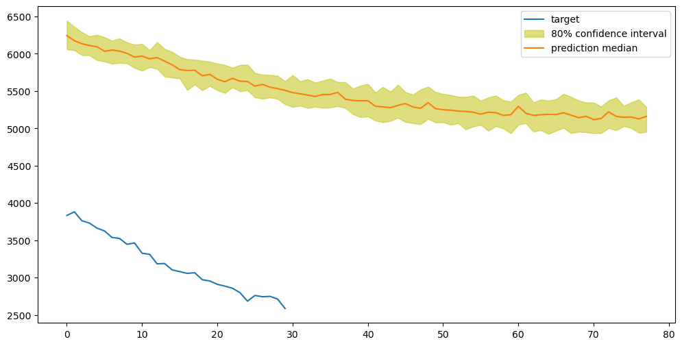
    


    
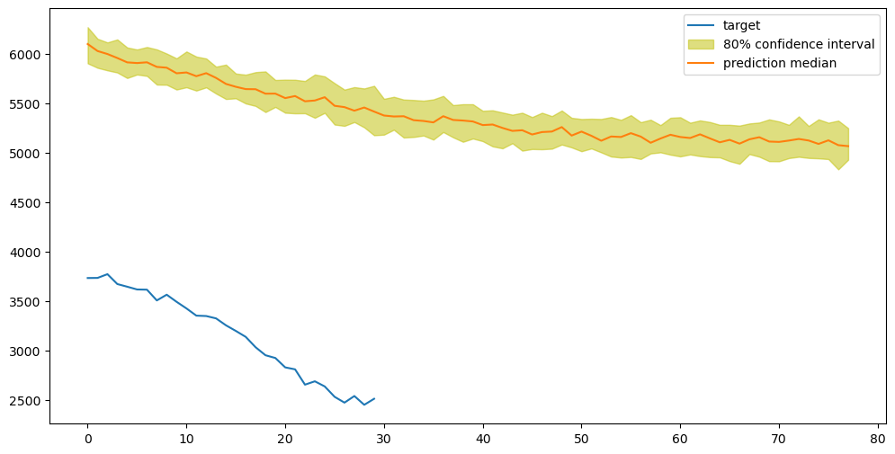
    


    
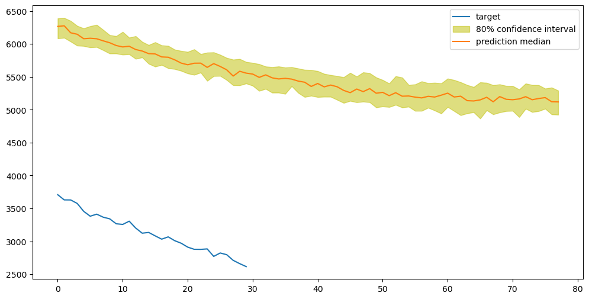
    


    
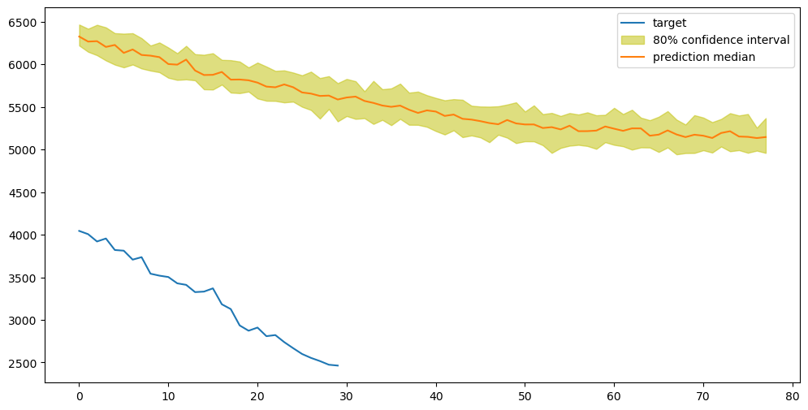
    


    
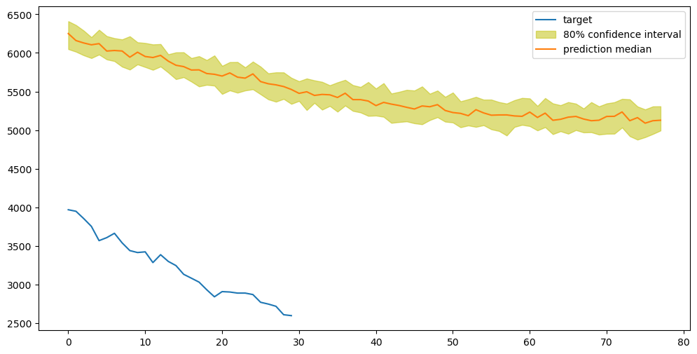
    


    
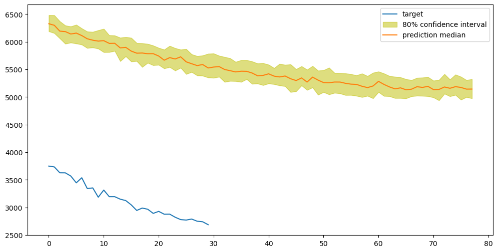
    


    
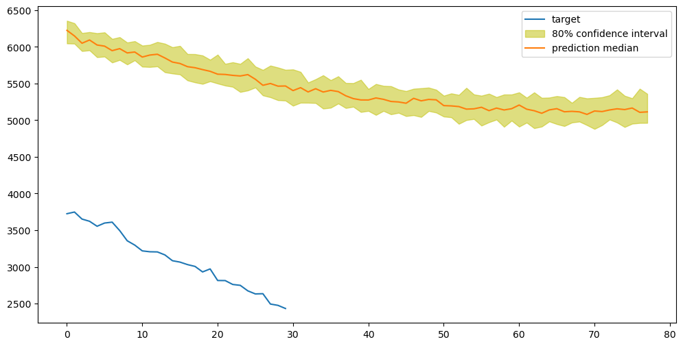
    


    

    


    
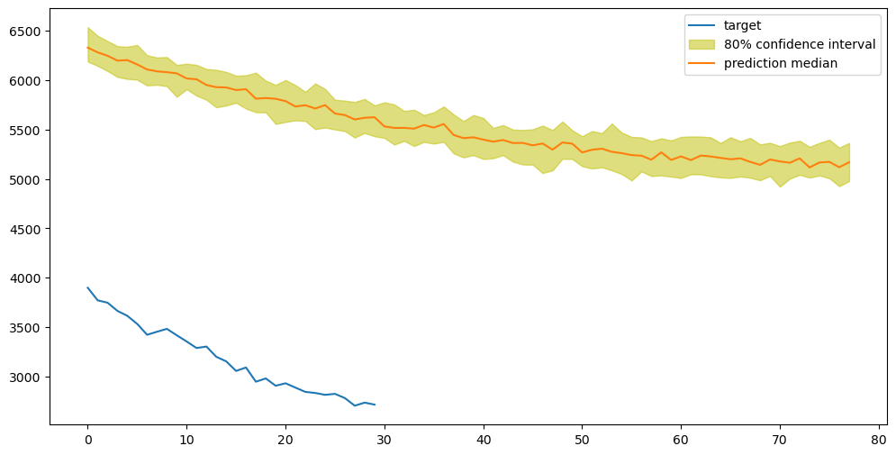
    


    
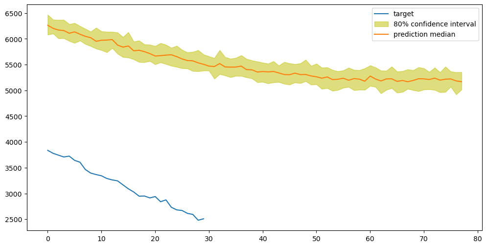
    


    

    


    

    


    
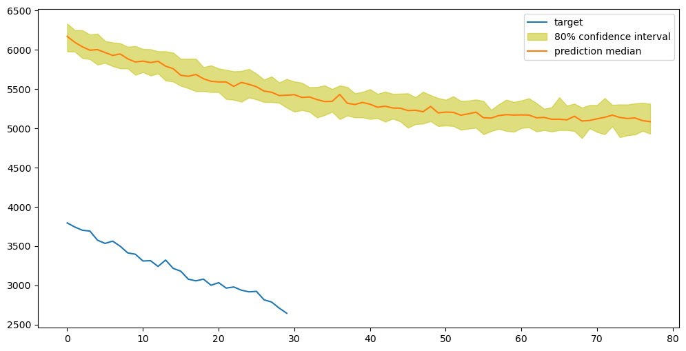
    


    

    


```python
start_date = '2020-01-01'
timestamp = '00:08:00'
request_data = {
    'instances': [
        { 'start': '{} {}'.format(start_date, timestamp), 'target': [] }
    ],
    'configuration': {
        'num_samples': 50,
        'output_types': ['quantiles'],
        'quantiles': ['0.1', '0.5', '0.9']
    }
}

# Remove .encode('utf-8') - just pass the dict
predictions_2020 = decode_prediction(predictor.predict(request_data))
```


```python
pd_series_2020 = pd.Series(data=mean_density_crowd_df.values[1112:],
                           index=pd.date_range(start=start_date,
                                               periods=len(mean_density_crowd_df.values[1112:]),
                                               freq=freq)
                          )

prediction_length = 78

display_quantiles(predictions_2020, [pd_series_2020[0:prediction_length]])
```

    /tmp/ipykernel_26988/2260878678.py:2: FutureWarning: 'T' is deprecated and will be removed in a future version, please use 'min' instead.
      index=pd.date_range(start=start_date,


    
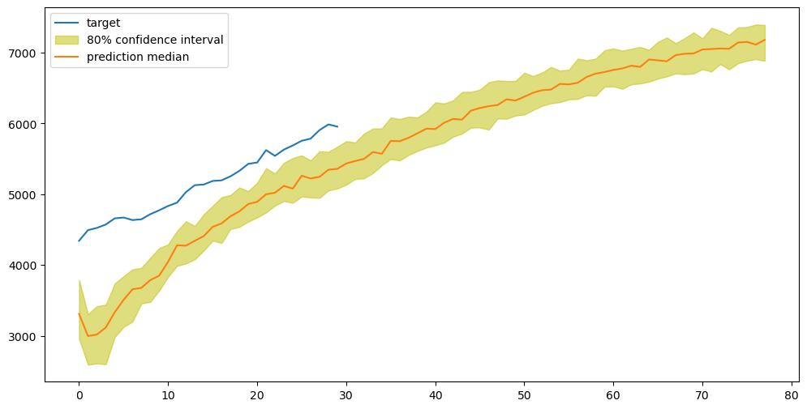
    


```python

```
